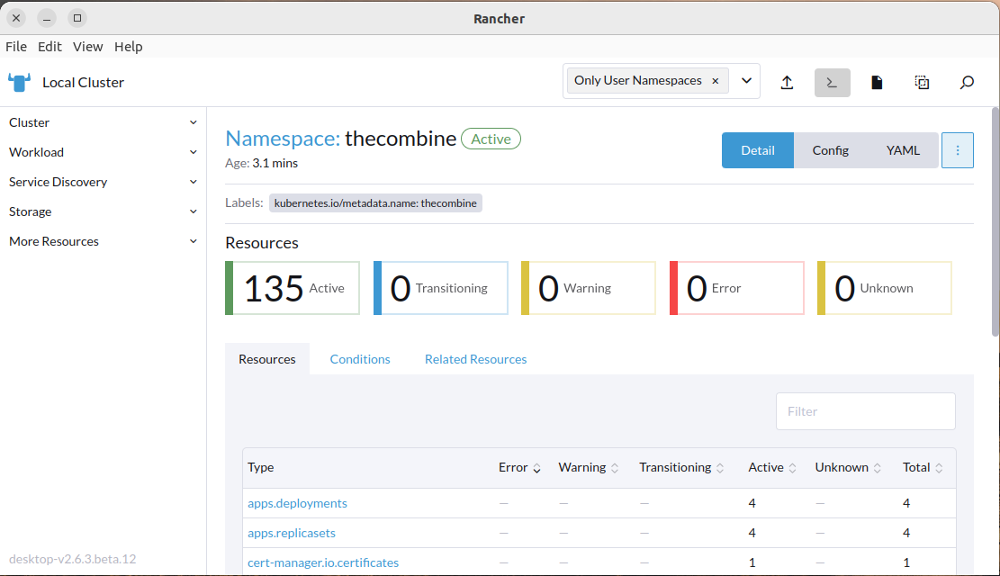
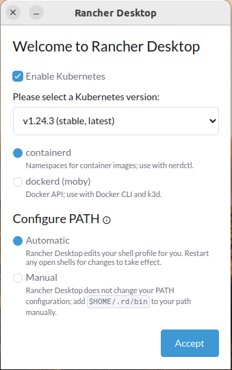
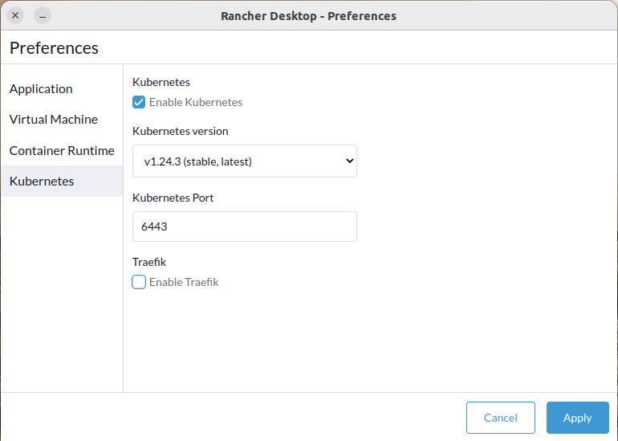
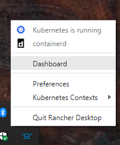

# The Combine

[![Frontend Actions Status][github-actions-frontend-badge]][github-actions]
[![Frontend Coverage][frontend-codecov-badge]][codecov]
[![Backend Actions Status][github-actions-backend-badge]][github-actions]
[![Backend Coverage][backend-codecov-badge]][codecov] [![Language grade: JavaScript][lgtm-js-badge]][lgtm-js]
[![Total alerts][lgtm-alerts-badge]][lgtm-alerts]
[![Python Actions Status][github-actions-python-badge]][github-actions]

[![GitHub release][github-release-badge]][github-version] [![GitHub version][github-version-badge]][github-version]
![Localization][localization-badge] [![GitHub][github-license-badge]][github-license]
[![GitHub contributors][github-contribs-badge]][github-contribs]

[github-actions-frontend-badge]: https://github.com/sillsdev/TheCombine/workflows/frontend/badge.svg
[frontend-codecov-badge]: https://codecov.io/gh/sillsdev/TheCombine/branch/master/graph/badge.svg?flag=frontend
[codecov]: https://codecov.io/gh/sillsdev/TheCombine
[github-actions-backend-badge]: https://github.com/sillsdev/TheCombine/workflows/backend/badge.svg
[backend-codecov-badge]: https://codecov.io/gh/sillsdev/TheCombine/branch/master/graph/badge.svg?flag=backend
[github-actions-python-badge]: https://github.com/sillsdev/TheCombine/workflows/python/badge.svg
[github-actions]: https://github.com/sillsdev/TheCombine/actions
[lgtm-js-badge]: https://img.shields.io/lgtm/grade/javascript/g/sillsdev/TheCombine.svg?logo=lgtm&logoWidth=18
[lgtm-js]: https://lgtm.com/projects/g/sillsdev/TheCombine/context:javascript
[lgtm-alerts-badge]: https://img.shields.io/lgtm/alerts/g/sillsdev/TheCombine.svg?logo=lgtm&logoWidth=18
[lgtm-alerts]: https://lgtm.com/projects/g/sillsdev/TheCombine/alerts
[localization-badge]: https://img.shields.io/badge/localization-En%20Es%20Fr-blue
[github-version-badge]: https://img.shields.io/github/package-json/v/sillsdev/TheCombine
[github-release-badge]: https://img.shields.io/github/v/release/sillsdev/TheCombine
[github-version]: https://github.com/sillsdev/TheCombine/releases
[github-license-badge]: https://img.shields.io/github/license/sillsdev/TheCombine
[github-license]: https://github.com/sillsdev/TheCombine/blob/master/LICENSE
[github-contribs-badge]: https://img.shields.io/github/contributors/sillsdev/TheCombine?cacheSeconds=10000
[github-contribs]: https://github.com/sillsdev/TheCombine/graphs/contributors

A rapid word collection tool. See the [User Guide](https://sillsdev.github.io/TheCombine) for uses and features.

## Table of Contents

1. [Getting Started with Development](#getting-started-with-development)
   1. [Install Required Software](#install-required-software)
   2. [Prepare The Environment](#prepare-the-environment)
   3. [Python](#python)
      1. [Windows Python Installation](#windows-python-installation)
      2. [Linux Python Installation](#linux-python-installation)
      3. [macOS Python Installation](#macos-python-installation)
      4. [Python Packages](#python-packages)
2. [Available Scripts](#available-scripts)
   1. [Running in Development](#running-in-development)
   2. [Using OpenAPI](#using-openapi)
   3. [Running the Automated Tests](#running-the-automated-tests)
   4. [Import Semantic Domains](#import-semantic-domains)
   5. [Generate License Reports](#generate-license-reports)
   6. [Set Project Version](#set-project-version)
   7. [Inspect Database](#inspect-database)
   8. [Cleanup Local Repository](#cleanup-local-repository)
3. [Setup Local Kubernetes Cluster](#setup-local-kubernetes-cluster)
   1. [Install Rancher Desktop](#install-rancher-desktop)
   2. [Install Docker Desktop](#install-docker-desktop)
   3. [Install Kubernetes Tools](#install-kubernetes-tools)
4. [Setup The Combine](#setup-the-combine)
   1. [Install Required Charts](#install-required-charts)
   2. [Build _The Combine_ Containers](#build-the-combine-containers)
   3. [Setup Environment Variables](#setup-environment-variables)
   4. [Install/Update _The Combine_](#installupdate-the-combine)
   5. [Connecting to your Cluster](#connecting-to-your-cluster)
   6. [Rancher Dashboard](#rancher-dashboard)
5. [Maintenance](#maintenance)
   1. [Development Environment](#development-environment)
   2. [Kubernetes Environment](#kubernetes-environment)
6. [User Guide](#user-guide)
7. [Production](#production)
8. [Learn More](#learn-more)

## Getting Started with Development

### Install Required Software

1. Clone this repo:

   ```bash
   git clone https://github.com/sillsdev/TheCombine.git
   ```

2. [Chocolatey][chocolatey]: (Windows only) a Windows package manager.
3. [Node.js 16 (LTS)](https://nodejs.org/en/download/)
   - On Windows, if using [Chocolatey][chocolatey]: `choco install nodejs-lts`
   - On Ubuntu, follow
     [this guide](https://github.com/nodesource/distributions/blob/master/README.md#installation-instructions) using the
     appropriate Node.js version.
4. [.NET Core SDK 6.0](https://dotnet.microsoft.com/download/dotnet/6.0)
   - On Ubuntu, follow these [instructions](https://docs.microsoft.com/en-us/dotnet/core/install/linux-ubuntu).
5. [MongoDB](https://docs.mongodb.com/manual/administration/install-community/) and add /bin to PATH Environment
   Variable
   - On Windows, if using [Chocolatey][chocolatey]: `choco install mongodb`
6. [VS Code](https://code.visualstudio.com/download) and the following extensions:
   - C# (`ms-dotnettools.csharp`)
   - Prettier - Code formatter (`esbenp.prettier-vscode`)
7. [Python](#python): The Python section of this document has instructions for installing _Python 3_ on each of the
   supported platforms and how to setup your virtual environment.
8. [dotnet-format](https://github.com/dotnet/format): `dotnet tool update --global dotnet-format --version 5.1.250801`
9. [dotnet-reportgenerator](https://github.com/danielpalme/ReportGenerator)
   `dotnet tool update --global dotnet-reportgenerator-globaltool --version 5.0.4`
10. [dotnet-project-licenses](https://github.com/tomchavakis/nuget-license)
    `dotnet tool update --global dotnet-project-licenses`

### Prepare the Environment

1. Set the environment variable `COMBINE_JWT_SECRET_KEY` to a string **containing at least 16 characters**, such as
   _This is a secret key_. Set it in your `.profile` (Linux or Mac 10.14-), your `.zprofile` (Mac 10.15+), or the
   _System_ app (Windows).
2. If you want the email services to work you will need to set the following environment variables. These values must be
   kept secret, so ask your email administrator to supply them.

   - `COMBINE_SMTP_SERVER`
   - `COMBINE_SMTP_PORT`
   - `COMBINE_SMTP_USERNAME`
   - `COMBINE_SMTP_PASSWORD`
   - `COMBINE_SMTP_ADDRESS`
   - `COMBINE_SMTP_FROM`

3. _(Optional)_ To opt in to segment.com analytics to test the analytics during development:

   ```bash
   # For Windows, use `copy`.
   cp .env.local.template .env.local
   ```

4. Run `npm start` from the project directory to install dependencies and start the project.

5. Consult our [C#](docs/style_guide/c_sharp_style_guide.md) and [TypeScript](docs/style_guide/ts_style_guide.md) style
   guides for best coding practices in this project.

[chocolatey]: https://chocolatey.org/

### Python

_Python 3_ is required to run the scripts that are used to initialize and maintain the cluster. Note that the commands
for setting up the virtual environment must be run from the top-level directory for _The Combine_ source tree.

#### Windows Python Installation

- Navigate to the [Python Downloads](https://www.python.org/downloads/) page.

- Select the "Download Python" button at the top of the page. This will download the latest appropriate x86-64
  executable installer.

- Once Python is installed, create an isolated Python [virtual environment](https://docs.python.org/3/library/venv.html)
  using the [`py`](https://docs.python.org/3/using/windows.html#getting-started) launcher installed globally into the
  `PATH`.

  ```bash
  py -m venv venv
  venv\Scripts\activate
  ```

#### Linux Python Installation

The `python3` package is included in the Ubuntu distribution. To install the `pip` and `venv` modules for Python 3, run
the following commands:

```bash
sudo apt update
sudo apt install python3-pip python3-venv
```

Create and activate an isolated Python virtual environment

```bash
python3 -m venv venv
# This command is shell-specific, for the common use case of bash:
source venv/bin/activate
```

#### macOS Python Installation

Install [Homebrew](https://brew.sh/).

Install Python 3 using Homebrew:

```bash
brew install python
```

Create and activate isolated Python virtual environment:

```bash
python3 -m venv venv
source venv/bin/activate
```

#### Python Packages

**Important**: All Python commands and scripts should be executed within a terminal using an activated Python virtual
environment. This will be denoted with the `(venv)` prefix on the prompt.

With an active virtual environment, install Python development requirements for this project:

```bash
python -m pip install --upgrade pip pip-tools
python -m piptools sync dev-requirements.txt
```

The following Python scripts can now be run from the virtual environment.

To perform automated code formatting of Python code:

```bash
tox -e fmt
```

To run all Python linting steps:

```bash
tox
```

To upgrade all pinned dependencies:

```bash
python -m piptools compile --upgrade dev-requirements.in
```

To upgrade the pinned dependencies for the Maintenance container:

```bash
cd maintenance
python -m piptools compile --upgrade requirements.in
```

## Available Scripts

### Running in Development

In the project directory, you can run:

#### `npm start`

> Note: To avoid browser tabs from being opened automatically every time the frontend is launched, set
> [`BROWSER=none`](https://create-react-app.dev/docs/advanced-configuration/) environment variable.

Installs the necessary packages and runs the app in the development mode.

Open <http://localhost:3000> to view it in the browser.

#### `npm run frontend`

Runs only the front end of the app in the development mode.

#### `npm run backend`

Runs only the backend.

#### `npm run database`

Runs only the mongo database.

#### `npm run build`

Builds the app for production to the `build` folder.

It correctly bundles React in production mode and optimizes the build for the best performance.

The build is minified and the filenames include the hashes.

Your app is ready to be deployed!

See the section about [deployment](https://facebook.github.io/create-react-app/docs/deployment) for more information.

#### `npm run analyze`

Run after `npm run build` to analyze the contents build bundle chunks.

### Using OpenAPI

You need to have run `npm start` or `npm run backend` first.

To browse the auto-generated OpenAPI UI, browse to [http://localhost:5000/openapi](http://localhost:5000/openapi).

#### Regenerate OpenAPI bindings for frontend

First, you must install the Java Runtime Environment (JRE) 8 or newer as mentioned in the
[`openapi-generator` README](https://github.com/OpenAPITools/openapi-generator#13---download-jar).

- For Windows: Install [OpenJDK](https://www.microsoft.com/openjdk)
- For Ubuntu: `sudo apt install default-jre`
- For macOS: `brew install adoptopenjdk`

After that, run the following script in your Python virtual environment to regenerate the frontend OpenAPI bindings in
place:

```bash
python scripts/generate_openapi.py
```

### Running the Automated Tests

#### `npm test`

Run all backend and frontend tests.

#### `npm run test-backend`

Run all backend unit tests.

To run a subset of tests, use the
[`--filter`](https://docs.microsoft.com/en-us/dotnet/core/testing/selective-unit-tests?pivots=nunit) option.

```bash
# Note the extra -- needed to separate arguments for npm vs script.
npm run test-backend -- --filter FullyQualifiedName~Backend.Tests.Models.ProjectTests
```

#### `npm run test-frontend`

Launches the test runners in the interactive watch mode. See the section about
[running tests](https://facebook.github.io/create-react-app/docs/running-tests) for more information.

To run a subset of tests, pass in the name of a partial file path to filter:

```bash
# Note the extra -- needed to separate arguments for npm vs script.
npm run test-frontend -- DataEntry
```

#### `npm run test-*:coverage`

Launches the test runners to calculate the test coverage of the frontend or backend of the app.

##### Frontend Code Coverage Report

Run:

```bash
npm run test-frontend:coverage
```

To view the frontend code coverage open `coverage/lcov-report/index.html` in a browser.

##### Backend Code Coverage Report

Run:

```bash
npm run test-backend:coverage
```

Generate the HTML coverage report:

```bash
npm run gen-backend-coverage-report
```

Open `coverage-backend/index.html` in a browser.

#### `npm run test-frontend:debug`

Runs Jest tests for debugging, awaiting for an attach from an IDE.

For VSCode, run the **Debug Jest Tests** configuration within the Run tab on the left taskbar.

#### `npm run fmt-backend`

Automatically format the C# source files in the backend.

#### `npm run lint`

Runs ESLint on the codebase to detect code problems that should be fixed.

### `npm run lint:fix-layout`

Run ESLint and apply `suggestion` and `layout` fixes automatically. This will sort and group imports.

#### `npm run fmt-frontend`

Auto-format frontend code in the `src` folder.

### Import Semantic Domains

Imports Semantic Domains from the XML files in `./deploy/scripts/semantic_domains/xml`. Run from within a Python virtual
environment.

1. Generate the files for import into the Mongo database:

   ```bash
   cd ./deploy/scripts
   python sem_dom_import.py <xml_filename> [<xml_filename> ...]
   ```

   where `<xml_filename>` is the name of the file(s) to import. Currently each file contains English and one other
   language.

2. Start the database:

   ```bash
   npm run database
   ```

3. Import the files that were created.

   There are two files that were created for each language in step 1, a `nodes.json` and a `tree.json`. The `nodes.json`
   file contains the detailed data for each node in the semantic domain tree; the `tree.json` file contains the tree
   structure of the semantic domains. To import the semantic domain data, run:

   ```bash
   cd ./deploy/scripts/semantic_domains/json
   mongoimport -d CombineDatabase -c SemanticDomains nodes.json --mode=merge --upsertFields=id,lang,guid
   mongoimport -d CombineDatabase -c SemanticDomainTree tree.json --mode=merge --upsertFields=id,lang,guid
   ```

### Generate License Reports

To generate a summary of licenses used in production

```bash
npm run license-summary-backend
npm run license-summary-frontend
```

To generate a full report of the licenses used in production that is included in the user guide:

```bash
npm run license-report-backend
npm run license-report-frontend
```

> Note: This should be performed each time production dependencies are changed.

### Set Project Version

To update the version of the project:

1. Edit package.json `"version"` to a [semantic versioning](https://docs.npmjs.com/about-semantic-versioning) compatible
   string (e.g. `"0.1.1-alpha.0"`).
2. Run `npm install` to automatically update `package-lock.json`.

To retrieve the current version of the project from the terminal:

```bash
npm run --silent version
```

### Inspect Database

To browse the database locally during development, open MongoDB Compass Community.

1. Under New Connection, enter `mongodb://localhost:27017`
2. Under Databases, select CombineDatabase

### Cleanup Local Repository

It's sometimes possible for a developer's local temporary state to get out of sync with other developers or CI. This
script removes temporary files and packages while leaving database data intact. This can help troubleshoot certain types
of development setup errors. Run from within a Python virtual environment.

```bash
python scripts/cleanup_local_repo.py
```

## Setup Local Kubernetes Cluster

This section describes how to create a local Kubernetes cluster using either _Rancher Desktop_ or _Docker Desktop_.

Advantages of _Rancher Desktop_:

1. runs the same Kubernetes engine, `k3s`, that is used by _The Combine_ when installed on a NUC; and
2. includes the Rancher User Interface for easy inspection and management of Kubernetes resources:



Advantages of _Docker Desktop_:

1. can run with fewer memory resources; and
2. simpler to navigate to the running application from your web browser.

The steps to install _The Combine_ in a local Kubernetes client are:

1. [Install Rancher Desktop](#install-rancher-desktop) OR [Install Docker Desktop](#install-docker-desktop)
2. [Install Kubernetes Tools](#install-kubernetes-tools)
3. [Setup The Combine](#setup-the-combine)

### Install Rancher Desktop

Install [Rancher Desktop](https://rancherdesktop.io/) to create a local Kubernetes cluster to test _The Combine_ when
running in containers. (_Optional. Only needed for running under Kubernetes._)

When _Rancher Desktop_ is first run, you will be prompted to select a few initial configuration items:



1. Verify that _Enable Kubernetes_ is checked.
2. Select the Kubernetes version marked as _stable, latest_.
3. Select your container runtime, either _containerd_ or _dockerd (moby)_:
   - _containerd_ matches what is used on the NUC and uses the `k3s` Kubernetes engint. It requires that you run the
     `build.py` script with the `--nerdctl` option.
   - _dockerd_ uses the `k3d` (`k3s` in docker).
4. Select _Automatic_ or _Manual_ path setup.
5. Click _Accept_.

The _Rancher Desktop_ Main Window will be displayed as it loads the Kubernetes environment. While the page is displayed,
click the _Settings_ icon (gear icon in the upper-right corner). The settings dialog will be displayed:


1. Click _Kubernetes_ in the left-hand pane.
2. Uncheck the _Enable Traefik_ checkbox.

### Install Docker Desktop

Install _Docker Desktop_ from <https://docs.docker.com/get-docker/>.

Notes for installing _Docker Desktop_ in Linux:

1. _Docker Desktop_ requires a distribution running the GNOME or KDE Desktop environment.
2. If you installed `docker` or `docker-compose` previously, remove them:

   ```bash
   sudo apt purge docker-ce docker-ce-cli containerd.io
   sudo apt autoremove
   if [ -L /usr/bin/docker-compose ] ; then sudo rm /usr/bin/docker-compose ; fi
   if [ -x /usr/local/bin/docker-compose ] ; then sudo rm /usr/local/bin/docker-compose ; fi
   ```

Once _Docker Desktop_ has been installed, start it, and set it up as follows:

1. Click the gear icon in the upper right to open the settings dialog;
2. Click on the _Resources_ link on the left-hand side and set the Memory to at least 4 GB (see Note);
3. Click on the _Kubernetes_ link on the left-hand side;
4. Select _Enable Kubernetes_ and click _Apply & Restart_;
5. Click _Install_ on the dialog that is displayed.

Note:

Normally, there is a slider to adjust the Memory size for the _Docker Desktop_ virtual machine. On Windows systems using
the WSL 2 backend, there are instructions for setting the resources outside of the _Docker Desktop_ application.

### Install Kubernetes Tools

If the following tools were not installed with either _Rancher Desktop_ or _Docker Desktop_, install them from these
links:

1. [kubectl](https://kubernetes.io/docs/tasks/tools/)
   - On Windows, if using [Chocolatey][chocolatey]: `choco install kubernete-cli`
2. [helm](https://helm.sh/docs/intro/install/)
   - On Windows, if using [Chocolatey][chocolatey]: `choco install kubernete-helm`

## Setup The Combine

This section describes how to build and deploy _The Combine_ to your Kubernetes cluster. Unless specified otherwise, all
of the commands below are run from _The Combine's_ project directory and are run in an activated Python virtual
environment. (See the [Python](#python) section to create the virtual environment.)

### Install Required Charts

Install the required charts by running:

```bash
python deploy/scripts/setup_cluster.py
```

`deploy/scripts/setup_cluster.py` assumes that the `kubectl` configuration file is setup to manage the desired
Kubernetes cluster. For most development users, there will only be the _Rancher Desktop_/_Docker Desktop_ cluster to
manage and the installation process will set that up correctly. If there are multiple clusters to manage, the
`--kubeconfig` and `--context` options will let you specify a different cluster.

Run the script with the `--help` option to see possible options for the script.

### Build _The Combine_ Containers

Build _The Combine_ containers by running the build script in an activated Python virtual environment from
_TheCombine_'s project directory. (See the [Python](#python) section to create the virtual environment.)

```bash
python deploy/scripts/build.py [--nerdctl]
```

Notes:

- Use the `--nerdctl` option if you are using _Rancher Desktop_ with the `containerd` for the container runtime. If you
  are using _Docker Desktop_ or _Rancher Desktop_ with the `dockerd` container runtime, omit this option.
- Run with the `--help` option to see all available options.
- If you see errors like:

  ```console
  => ERROR [internal] load metadata for docker.io/library/nginx:1.21        0.5s
  ```

  pull the image directly and re-run the build. In this case, you would run:

  ```console
  docker pull nginx:1.21
  ```

- If `--tag` is not used, the image will be untagged. When running or pulling an image with the tag `latest`, the
  newest, untagged image will be pulled.
- `--repo` and `--tag` are not specified under normal development use.

### Setup Environment Variables

_Note: This is optional for Development Environments._

In addition to the environment variables defined in [Prepare the Environment](#prepare-the-environment), you may setup
the following environment variables:

- `AWS_ACCOUNT`
- `AWS_DEFAULT_REGION`
- `AWS_ACCESS_KEY_ID`
- `AWS_SECRET_ACCESS_KEY`

These variables will allow the Combine to:

- pull released and QA software images from AWS Elastic Container Registry (ECR);
- create backups and push them to AWS S3 storage; and
- restore _The Combine's_ database and backend files from a backup stored in AWS S3 storage.

The Combine application will function in a local cluster without these variables set.

These can be set in your `.profile` (Linux or Mac 10.14-), your `.zprofile` (Mac 10.15+), or the _System_ app (Windows).

### Install/Update _The Combine_

Install the Kubernetes resources to run _The Combine_ by running:

```bash
python deploy/scripts/setup_combine.py [--target <target_name>] [--tag <image_tag>]
```

The default target is `localhost`; the default tag is `latest`. For development testing the script will usually be run
with no arguments.

If an invalid target is entered, the script will list available targets and prompt the user his/her selection.
`deploy/scripts/setup_combine.py` assumes that the `kubectl` configuration file is setup to manage the desired
Kubernetes cluster. For most development users, there will only be the _Rancher Desktop/Docker Desktop_ cluster to
manage and the installation process will set that up correctly. If there are multiple clusters to manage, the
`--kubeconfig` and `--context` options will let you specify a different cluster.

Run the script with the `--help` option to see possible options for the script.

When the script completes, the resources will be installed on the specified cluster. It may take a few moments before
all the containers are up and running. If you are using _Rancher Desktop_, you can use the
[Rancher Dashboard](#rancher-dashboard) to see when the cluster is ready. Otherwise, run
`kubectl -n thecombine get deployments` or `kubectl -n thecombine get pods`. For example,

```console
$ kubectl -n thecombine get deployments
NAME          READY   UP-TO-DATE   AVAILABLE   AGE
backend       1/1     1            1           10m
database      1/1     1            1           10m
frontend      1/1     1            1           10m
maintenance   1/1     1            1           10m
```

or

```console
$ kubectl -n thecombine get pods
NAME                           READY   STATUS    RESTARTS   AGE
backend-5657559949-z2flp       1/1     Running   0          10m
database-794b4d956f-zjszm      1/1     Running   0          10m
frontend-7d6d79f8c5-lkhhz      1/1     Running   0          10m
maintenance-7f4b5b89b8-rhgk9   1/1     Running   0          10m
```

### Connecting to Your Cluster

#### Network Hosts Configuration

The cluster's ingress controller uses the hostname `thecombine.local` to _The Combine_. To direct traffic for this host
to the ingress controller, add:

```textfile
127.0.0.1  thecombine.local
```

to your network hosts file:

- Windows: `%windir%\System32\drivers\etc\hosts`
- Linux/macOS: `/etc/hosts`

#### Setup Port Forwarding

_Rancher Desktop only!_

To connect to _The Combine_ user interface on _Rancher Desktop_, you need to setup port forwarding.

1. From the _Rancher Desktop_ main window, click on _Port Forwarding_ on the left-hand side.
2. Click the _Forward_ button to the left of the `https` port for `ingress-controller-ingress-nginx-controller` in the
   `ingress-nginx` namespace: 
3. A random port number is displayed. You may change it or accept the value and click the checkmark.

Note that the port forwarding is not persistent; you need to set it up whenever _Rancher Desktop_ is restarted.

#### Connecting to _The Combine_

Once your host configuration has been setup, you can connect to _The Combine_ by entering the URL
`https://thecombine.local` in the address bar of your web browser. (`https://thecombine.local:<portnumber>` for _Rancher
Desktop_)

Notes:

1. If you do not specify the `https://`, your browser may do a web search instead of navigating to _The Combine_.
2. _By default self-signed certificates are used, so you will need to accept a warning in the browser._

### Rancher Dashboard

The Rancher Dashboard shows an overview of your Kubernetes cluster. The left-hand pane allows you to explore the
different Kubernetes resources that are deployed in the cluster. This includes viewing configuration, current states,
and logs:


To open the _Rancher Dashboard_, right-click on the Rancher Desktop icon in the system tray and select `Dashboard` from
the pop-up menu:



## Maintenance

The maintenance scripts enable certain maintenance tasks on your instance of _TheCombine_. _TheCombine_ may be running
in either a development environment or the production/qa environment.

### Development Environment

The following maintenance tasks can be performed in the development environment. To run _TheCombine_ in the development
environment, run `npm start` from the project directory. Unless specified otherwise, each of the maintenance commands
are to be run from the project directory.

#### Create a New Admin User (Development)

Task: create a new user who is a site administrator

Commands

- set/export `COMBINE_ADMIN_PASSWORD`
- set/export `COMBINE_ADMIN_EMAIL`
- run

  ```bash
  cd Backend
  dotnet run create-admin-username=admin
  ```

#### Drop Database

Task: completely erase the current Mongo database

Run:

```bash
npm run drop-database
```

#### Grant Admin Rights

Task: grant site admin rights for an existing user

Run:

```bash
# Note the '--' before the user name
npm run set-admin-user -- <USERNAME>
```

### Kubernetes Environment

The following maintenance tasks can be performed in the Kubernetes environment. The Kubernetes cluster may be one of the
production or QA clusters or the local development cluster. For most of these tasks, the _Rancher Dashboard_ provides a
more user-friendly way to maintain and manage the cluster.

For each of the `kubectl` commands below:

- you must have a `kubectl` configuration file that configures the connection to the kubernetes cluster to be
  maintained. The configuration file needs to installed at `${HOME}/.kube/config` or specified in the `KUBECONFIG`
  environment variable.
- the `kubectl` commands can be run from any directory
- any of the Python scripts (local or remote using `kubectl`) can be run with the `--help` option to see more usage
  options.

#### Stopping _The Combine_

To stop _The Combine_ without deleting it, you scale it back to 0 replicas running:

```bash
kubectl -n thecombine scale --replicas=0 deployments frontend backend maintenance database
```

You can restart the deployments by setting `--replicas=1`.

#### Deleting Helm Charts

Deleting a helm chart will delete all Kubernetes resources including any persistent data or any data stored in a
container.

In addition to clearing out old data, there may be cases where existing charts need to be deleted and re-installed
instead of upgraded, for example, when a configuration change requires changes to an immutable attribute of a resource.

To delete a chart, first list all of the existing charts:

```console
$ helm list -A
NAME                NAMESPACE       REVISION    UPDATED                                 STATUS      CHART                   APP VERSION
cert-manager        cert-manager    3           2022-02-28 11:27:12.141797222 -0500 EST deployed    cert-manager-v1.7.1     v1.7.1
ingress-controller  ingress-nginx   3           2022-02-28 11:27:15.729203306 -0500 EST deployed    ingress-nginx-4.0.17    1.1.1
rancher             cattle-system   1           2022-03-11 12:46:06.962438027 -0500 EST deployed    rancher-2.6.3           v2.6.3
thecombine          thecombine      2           2022-03-11 11:41:38.304404635 -0500 EST deployed    thecombine-0.7.14       1.0.0
```

Using the chart name and namespace, you can then delete the chart:

```bash
helm -n <chart_namespace> delete <chart_name>
```

where `<chart_namespace>` and `<chart_name>` are the `NAMESPACE` and `NAME` respectively of the chart you want to
delete. These are listed in the output of `helm list -A`.

#### Checking The System Status

Once _The Combine_ is installed, it is useful to be able to see the state of the system and to look at the logs. _The
Combine_ is setup as four deployments:

- frontend
- backend
- database
- maintenance

Each deployment definition is used to create a _pod_ that runs the docker image.

To see the state of the deployments, run:

```console
$ kubectl -n thecombine get deployments
NAME          READY   UP-TO-DATE   AVAILABLE   AGE
database      1/1     1            1           3h41m
maintenance   1/1     1            1           3h41m
backend       1/1     1            1           3h41m
frontend      1/1     1            1           3h41m
```

Similarly, you can view the state of the pods:

```console
$ kubectl -n thecombine get pods
NAME                           READY   STATUS      RESTARTS        AGE
database-794b4d956f-g2n5k      1/1     Running     1 (3h51m ago)   3h58m
ecr-cred-helper--1-w9xxp       0/1     Completed   0               164m
maintenance-85644b9c76-55pz8   1/1     Running     0               130m
backend-69b77c46c5-8dqlv       1/1     Running     0               130m
frontend-c94c5747c-pz6cc       1/1     Running     0               60m
```

Use the `logs` command to view the log file of a pod; you can specify the pod name listed in the output of the
`kubectl -n thecombine get pods` command or the deployment, for example, to view the logs of the frontend, you would
run:

```bash
kubectl -n thecombine logs frontend-c94c5747c-pz6cc
```

or

```bash
kubectl -n thecombine logs deployment/frontend
```

If you want to monitor the logs while the system is running, add the `--follow` option to the command.

#### Add a User to a Project

Task: add an existing user to a project

Run:

```bash
kubectl exec -it deployment/maintenance -- add_user_to_proj.py --project <PROJECT_NAME> --user <USER>
```

Notes:

1. The `--project` and `--user` options may be shortened to `--p` and `--u` respectively.
2. The user is added to the project with normal project member permissions (`MergeAndReviewEntries`, and `WordEntry`).
   Add the `--admin` option to add the user with project administrator permissions (`DeleteEditSettingsAndUsers`,
   `ImportExport`, `MergeAndReviewEntries`, and `WordEntry`)

#### Backup _TheCombine_

Task: Backup the CombineDatabase and the Backend files to the Amazon Simple Storage Service (S3).

Run:

```bash
kubectl exec -it deployment/maintenance -- combine_backup.py [--verbose]
```

Notes:

1. The backup command can be run from any directory.
2. The daily backup job on the server will also clean up old backup for the machine that is being backed up. This is not
   part of `combine_backup.py`; backups made with this script must be managed manually. See the
   [AWS CLI Command Reference (s3)](https://awscli.amazonaws.com/v2/documentation/api/latest/reference/s3/index.html)
   for documentation on how to use the command line to list and to manage the backup objects.

#### Create a New Admin User (Production)

Task: create a new user who is a site administrator

Run:

```bash
# Run from the `deploy` directory in the project on the host machine
ansible-playbook playbook_admin_user.yaml --limit <target_name> -u sillsdev -K
```

#### Delete a Project

Task: Delete a project

Run:

```bash
kubectl exec -it deployment/maintenance -- rm_project.py <PROJECT_NAME>
```

You may specify more than one `<PROJECT_NAME>` to delete multiple projects.

#### Restore _TheCombine_

Task: Restore the CombineDatabase and the Backend files from a backup stored on the Amazon Simple Storage Service (S3).

Run:

```bash
kubectl exec -it deployment/maintenance -- combine_restore.py [--verbose] [BACKUP_NAME]
```

Note:

The restore script takes an optional backup name. This is the name of the backup in the AWS S3 bucket, not a local file.
If the backup name is not provided, the restore script will list the available backups and allow you to choose one for
the restore operation.

## User Guide

The User Guide found at <https://sillsdev.github.io/TheCombine> is automatically built from the `master` branch.

To locally build the user guide and serve it dynamically (automatically reloading on change), run the following from
your Python virtual environment:

```bash
tox -e user-guide-serve
```

To locally build the user guide statically into `docs/user-guide/site`:

```bash
tox -e user-guide
```

## Production

The process for configuring and deploying _TheCombine_ for production targets is described in
[docs/deploy/README.md](docs/deploy/README.md).

## Learn More

### Development Tools

- [Git branching tutorial](https://learngitbranching.js.org)

### Database (MongoDB)

- [MongoDB](https://docs.mongodb.com/manual/introduction)
- [MongoDB tutorial](https://university.mongodb.com/courses/M001/about)

### Backend (C# + ASP.NET)

- [C#](https://www.w3schools.com/cs/default.asp)
- [Our style guide](docs/style_guide/c_sharp_style_guide.md)
- [ASP.NET](https://docs.microsoft.com/en-us/aspnet/core/getting-started)
- [NUnit](https://docs.nunit.org/articles/nunit/intro.html) (unit testing)

### Frontend (Typescript + React + Redux)

- [JS](https://www.w3schools.com/js/default.asp)
- [TS](https://www.typescriptlang.org/docs/handbook/typescript-in-5-minutes.html)
- [Our style guide](docs/style_guide/ts_style_guide.md)
- [React](https://reactjs.org/)
- [React Hooks](https://reactjs.org/docs/hooks-intro.html)
- [Redux concepts](https://redux.js.org/tutorials/fundamentals/part-2-concepts-data-flow)
- [Redux tutorials](https://redux.js.org/tutorials/typescript-quick-start)
- [React-i18next](https://react.i18next.com/) (text localization)
- [Jest](https://jestjs.io/docs/getting-started) (unit testing)
- [React-Test-Renderer](https://reactjs.org/docs/test-renderer.html) (unit testing)

### Kubernetes/Helm

- [Kubernetes Concepts](https://kubernetes.io/docs/concepts/)
- [Kubernetes Tutorials](https://kubernetes.io/docs/tutorials/)
- [kubectl Cheat Sheet](https://kubernetes.io/docs/reference/kubectl/cheatsheet/)
- [Helm Documentation](https://helm.sh/docs/) has links for:

  - [Introduction](https://helm.sh/docs/intro/),
  - [Topic Guides](https://helm.sh/docs/topics/),
  - [Best Practices](https://helm.sh/docs/chart_best_practices),
  - [Chart Template Guide](https://helm.sh/docs/chart_template_guide),
  - [Helm Commands](https://helm.sh/docs/helm),

  and more.
