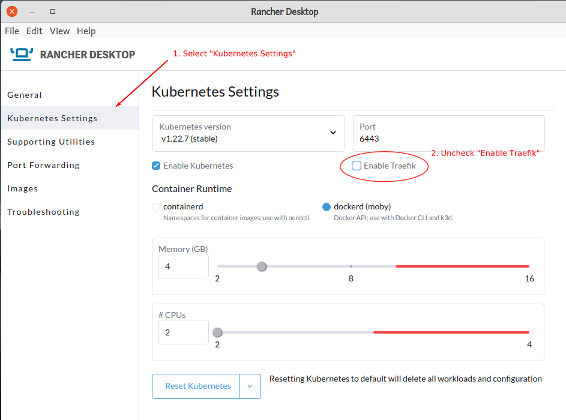
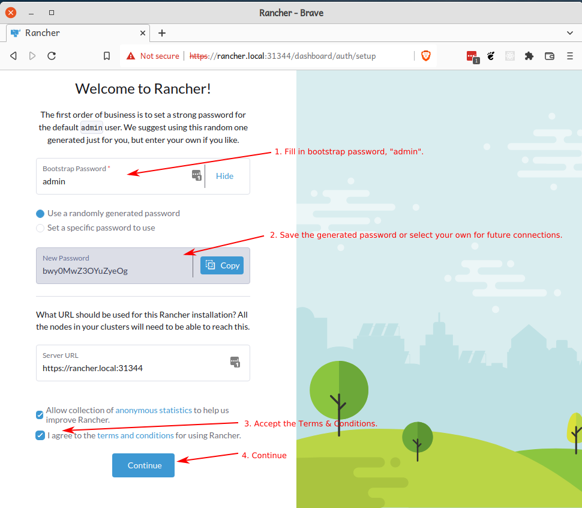
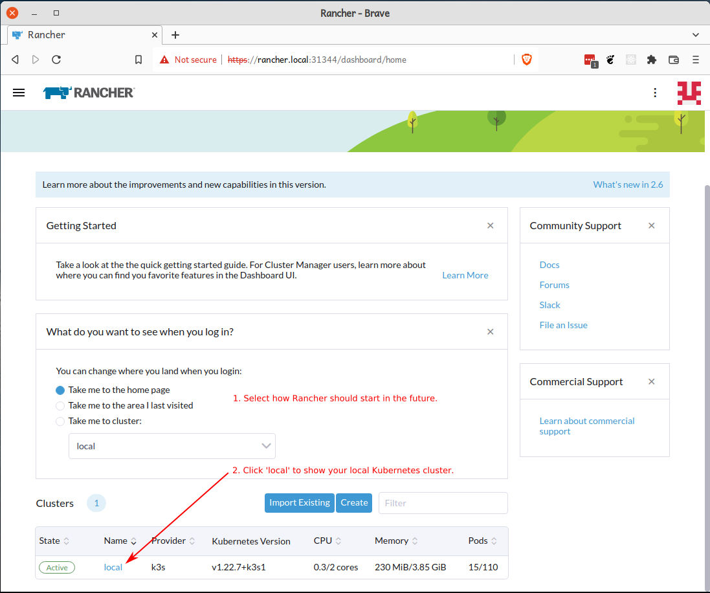
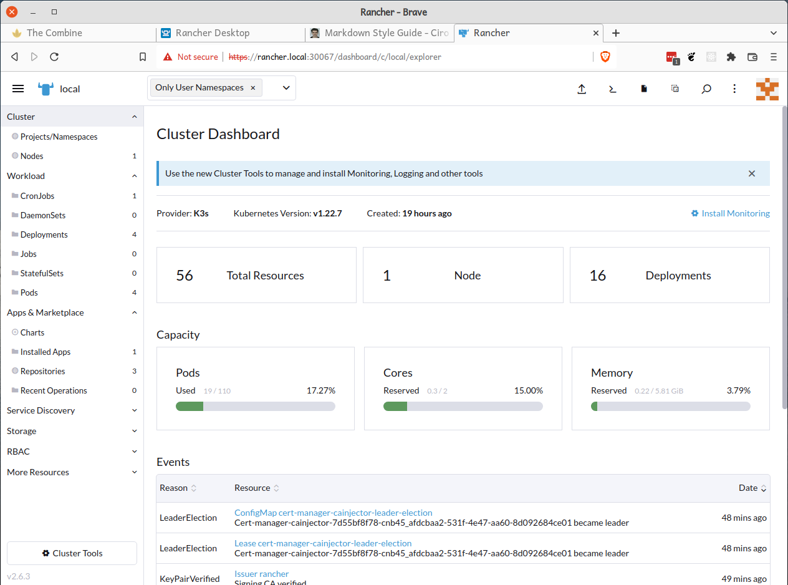

# The Combine

[![Frontend Actions Status][github-actions-frontend-badge]][github-actions]
[![Frontend Coverage][frontend-codecov-badge]][codecov]
[![Backend Actions Status][github-actions-backend-badge]][github-actions]
[![Backend Coverage][backend-codecov-badge]][codecov] [![Language grade: JavaScript][lgtm-js-badge]][lgtm-js]
[![Total alerts][lgtm-alerts-badge]][lgtm-alerts]
[![Python Actions Status][github-actions-python-badge]][github-actions]

[![GitHub release][github-release-badge]][github-version] [![GitHub version][github-version-badge]][github-version]
![Localization][localization-badge] [![GitHub][github-license-badge]][github-license]
[![GitHub contributors][github-contribs-badge]][github-contribs]

[github-actions-frontend-badge]: https://github.com/sillsdev/TheCombine/workflows/frontend/badge.svg
[frontend-codecov-badge]: https://codecov.io/gh/sillsdev/TheCombine/branch/master/graph/badge.svg?flag=frontend
[codecov]: https://codecov.io/gh/sillsdev/TheCombine
[github-actions-backend-badge]: https://github.com/sillsdev/TheCombine/workflows/backend/badge.svg
[backend-codecov-badge]: https://codecov.io/gh/sillsdev/TheCombine/branch/master/graph/badge.svg?flag=backend
[github-actions-python-badge]: https://github.com/sillsdev/TheCombine/workflows/python/badge.svg
[github-actions]: https://github.com/sillsdev/TheCombine/actions
[lgtm-js-badge]: https://img.shields.io/lgtm/grade/javascript/g/sillsdev/TheCombine.svg?logo=lgtm&logoWidth=18
[lgtm-js]: https://lgtm.com/projects/g/sillsdev/TheCombine/context:javascript
[lgtm-alerts-badge]: https://img.shields.io/lgtm/alerts/g/sillsdev/TheCombine.svg?logo=lgtm&logoWidth=18
[lgtm-alerts]: https://lgtm.com/projects/g/sillsdev/TheCombine/alerts
[localization-badge]: https://img.shields.io/badge/localization-En%20Es%20Fr-blue
[github-version-badge]: https://img.shields.io/github/package-json/v/sillsdev/TheCombine
[github-release-badge]: https://img.shields.io/github/v/release/sillsdev/TheCombine
[github-version]: https://github.com/sillsdev/TheCombine/releases
[github-license-badge]: https://img.shields.io/github/license/sillsdev/TheCombine
[github-license]: https://github.com/sillsdev/TheCombine/blob/master/LICENSE
[github-contribs-badge]: https://img.shields.io/github/contributors/sillsdev/TheCombine?cacheSeconds=10000
[github-contribs]: https://github.com/sillsdev/TheCombine/graphs/contributors

A rapid word collection tool. See the [User Guide](https://sillsdev.github.io/TheCombine) for uses and features.

## Table of Contents

1. [Getting Started with Development](#getting-started-with-development)
   1. [Install Required Software](#install-required-software)
   2. [Prepare The Environment](#prepare-the-environment)
   3. [Python](#python)
      1. [Windows Python Installation](#windows-python-installation)
      2. [Linux Python Installation](#linux-python-installation)
      3. [macOS Python Installation](#macos-python-installation)
      4. [Python Packages](#python-packages)
2. [Available Scripts](#available-scripts)
   1. [Running in Development](#running-in-development)
   2. [Using OpenAPI](#using-openapi)
   3. [Running the Automated Tests](#running-the-automated-tests)
   4. [Import Semantic Domains](#import-semantic-domains)
   5. [Generate License Reports](#generate-license-reports)
   6. [Set Project Version](#set-project-version)
   7. [Inspect Database](#inspect-database)
   8. [Cleanup Local Repository](#cleanup-local-repository)
3. [Setup Local Kubernetes Cluster](#setup-local-kubernetes-cluster)
   1. [Install Rancher Desktop](#install-rancher-desktop)
   2. [Install Required Charts](#install-required-charts)
   3. [Install the Rancher User Interface](#install-the-rancher-user-interface)
   4. [Build _The Combine_ Containers](#build-the-combine-containers)
   5. [Setup Environment Variables](#setup-environment-variables)
   6. [Install/Update _The Combine_](#installupdate-the-combine)
   7. [Connecting to your Cluster](#connecting-to-your-cluster)
   8. [Stopping _The Combine_](#stopping-the-combine)
4. [Maintenance Scripts for TheCombine](#maintenance-scripts-for-thecombine)
   1. [Development Environment](#development-environment)
   2. [Kubernetes Environment](#kubernetes-environment)
5. [User Guide](#user-guide)
6. [Production](#production)
7. [Learn More](#learn-more)

## Getting Started with Development

### Install Required Software

1. Clone this repo:

   ```bash
   git clone https://github.com/sillsdev/TheCombine.git
   ```

2. [Chocolatey][chocolatey]: (Windows only) a Windows package manager.
3. [Node.js 16 (LTS)](https://nodejs.org/en/download/)
   - On Windows, if using [Chocolatey][chocolatey]: `choco install nodejs-lts`
   - On Ubuntu, follow
     [this guide](https://github.com/nodesource/distributions/blob/master/README.md#installation-instructions) using the
     appropriate Node.js version.
4. [.NET Core SDK 6.0](https://dotnet.microsoft.com/download/dotnet/6.0)
   - On Ubuntu, follow these [instructions](https://docs.microsoft.com/en-us/dotnet/core/install/linux-ubuntu).
5. [MongoDB](https://docs.mongodb.com/manual/administration/install-community/) and add /bin to PATH Environment
   Variable
   - On Windows, if using [Chocolatey][chocolatey]: `choco install mongodb`
6. [VS Code](https://code.visualstudio.com/download) and the following extensions:
   - C# (`ms-dotnettools.csharp`)
   - Prettier - Code formatter (`esbenp.prettier-vscode`)
7. [Python](#python): The Python section of this document has instructions for installing _Python 3_ on each of the
   supported platforms and how to setup your virtual environment.
8. [dotnet-format](https://github.com/dotnet/format): `dotnet tool update --global dotnet-format --version 5.1.250801`
9. [dotnet-reportgenerator](https://github.com/danielpalme/ReportGenerator)
   `dotnet tool update --global dotnet-reportgenerator-globaltool --version 5.0.4`
10. [dotnet-project-licenses](https://github.com/tomchavakis/nuget-license)
    `dotnet tool update --global dotnet-project-licenses`

### Prepare the Environment

1. (Windows Only) Run `dotnet dev-certs https` and `dotnet dev-certs https --trust` to generate and trust an SSL
   certificate.
2. Set the environment variable `COMBINE_JWT_SECRET_KEY` to a string **containing at least 16 characters**, such as
   _This is a secret key_. Set it in your `.profile` (Linux or Mac 10.14-), your `.zprofile` (Mac 10.15+), or the
   _System_ app (Windows).
3. If you want the email services to work you will need to set the following environment variables. These values must be
   kept secret, so ask your email administrator to supply them.

   - `COMBINE_SMTP_SERVER`
   - `COMBINE_SMTP_PORT`
   - `COMBINE_SMTP_USERNAME`
   - `COMBINE_SMTP_PASSWORD`
   - `COMBINE_SMTP_ADDRESS`
   - `COMBINE_SMTP_FROM`

4. _(Optional)_ To opt in to segment.com analytics to test the analytics during development:

   ```bash
   # For Windows, use `copy`.
   cp .env.local.template .env.local
   ```

5. Run `npm start` from the project directory to install dependencies and start the project.

6. Consult our [C#](docs/style_guide/c_sharp_style_guide.md) and [TypeScript](docs/style_guide/ts_style_guide.md) style
   guides for best coding practices in this project.

[chocolatey]: https://chocolatey.org/

### Python

_Python 3_ is required to run the scripts that are used to initialize and maintain the cluster.

#### Windows Python Installation

- Navigate to the [Python Downloads](https://www.python.org/downloads/) page.

- Select the "Download Python" button at the top of the page. This will download the latest appropriate x86-64
  executable installer.

- Once Python is installed, create an isolated Python [virtual environment](https://docs.python.org/3/library/venv.html)
  using the [`py`](https://docs.python.org/3/using/windows.html#getting-started) launcher installed globally into the
  `PATH`.

  ```bash
  py -m venv venv
  venv\Scripts\activate
  ```

#### Linux Python Installation

The `python3` package is included in the Ubuntu distribution. To install the `pip` and `venv` modules for Python 3, run
the following commands:

```bash
sudo apt update
sudo apt install python3-pip python3-venv
```

Create and activate an isolated Python virtual environment

```bash
python3 -m venv venv
# This command is shell-specific, for the common use case of bash:
source venv/bin/activate
```

#### macOS Python Installation

Install [Homebrew](https://brew.sh/).

Install Python 3 using Homebrew:

```bash
brew install python
```

Create and activate isolated Python virtual environment:

```bash
python3 -m venv venv
source venv/bin/activate
```

#### Python Packages

**Important**: All Python commands and scripts should be executed within a terminal using an activated Python virtual
environment. This will be denoted with the `(venv)` prefix on the prompt.

With an active virtual environment, install Python development requirements for this project:

```bash
python -m pip install --upgrade pip pip-tools
python -m piptools sync dev-requirements.txt
```

The following Python scripts can now be run from the virtual environment.

To perform automated code formatting of Python code:

```bash
tox -e fmt
```

To run all Python linting steps:

```bash
tox
```

To upgrade all pinned dependencies:

```bash
python -m piptools compile --upgrade dev-requirements.in
```

## Available Scripts

### Running in Development

In the project directory, you can run:

#### `npm start`

> Note: To avoid browser tabs from being opened automatically every time the frontend is launched, set
> [`BROWSER=none`](https://create-react-app.dev/docs/advanced-configuration/) environment variable.

Installs the necessary packages and runs the app in the development mode.

Open <http://localhost:3000> to view it in the browser.

#### `npm run frontend`

Runs only the front end of the app in the development mode.

#### `npm run backend`

Runs only the backend.

#### `npm run database`

Runs only the mongo database.

#### `npm run build`

Builds the app for production to the `build` folder.

It correctly bundles React in production mode and optimizes the build for the best performance.

The build is minified and the filenames include the hashes.

Your app is ready to be deployed!

See the section about [deployment](https://facebook.github.io/create-react-app/docs/deployment) for more information.

#### `npm run analyze`

Run after `npm run build` to analyze the contents build bundle chunks.

### Using OpenAPI

You need to have run `npm start` or `npm run backend` first.

To browse the auto-generated OpenAPI UI, browse to [http://localhost:5000/openapi](http://localhost:5000/openapi).

#### Regenerate OpenAPI bindings for frontend

First, you must install the Java Runtime Environment (JRE) 8 or newer as mentioned in the
[`openapi-generator` README](https://github.com/OpenAPITools/openapi-generator#13---download-jar).

- For Windows: Install [OpenJDK](https://www.microsoft.com/openjdk)
- For Ubuntu: `sudo apt install default-jre`
- For macOS: `brew install adoptopenjdk`

After that, run the following script in your Python virtual environment to regenerate the frontend OpenAPI bindings in
place:

```bash
python scripts/generate_openapi.py
```

### Running the Automated Tests

#### `npm test`

Run all backend and frontend tests.

#### `npm run test-backend`

Run all backend unit tests.

To run a subset of tests, use the
[`--filter`](https://docs.microsoft.com/en-us/dotnet/core/testing/selective-unit-tests?pivots=nunit) option.

```bash
# Note the extra -- needed to separate arguments for npm vs script.
npm run test-backend -- --filter FullyQualifiedName~Backend.Tests.Models.ProjectTests
```

#### `npm run test-frontend`

Launches the test runners in the interactive watch mode. See the section about
[running tests](https://facebook.github.io/create-react-app/docs/running-tests) for more information.

To run a subset of tests, pass in the name of a partial file path to filter:

```bash
# Note the extra -- needed to separate arguments for npm vs script.
npm run test-frontend -- DataEntry
```

#### `npm run test-*:coverage`

Launches the test runners to calculate the test coverage of the frontend or backend of the app.

##### Frontend Code Coverage Report

Run:

```bash
npm run test-frontend:coverage
```

To view the frontend code coverage open `coverage/lcov-report/index.html` in a browser.

##### Backend Code Coverage Report

Run:

```bash
npm run test-backend:coverage
```

Generate the HTML coverage report:

```bash
npm run gen-backend-coverage-report
```

Open `coverage-backend/index.html` in a browser.

#### `npm run test-frontend:debug`

Runs Jest tests for debugging, awaiting for an attach from an IDE.

For VSCode, run the **Debug Jest Tests** configuration within the Run tab on the left taskbar.

#### `npm run fmt-backend`

Automatically format the C# source files in the backend.

#### `npm run lint`

Runs ESLint on the codebase to detect code problems that should be fixed.

### `npm run lint:fix-layout`

Run ESLint and apply `suggestion` and `layout` fixes automatically. This will sort and group imports.

#### `npm run fmt-frontend`

Auto-format frontend code in the `src` folder.

### Import Semantic Domains

Imports Semantic Domains from the provided xml file.

```bash
npm run import-sem-doms -- <XML_FILE_PATH>
```

### Generate License Reports

To generate a summary of licenses used in production

```bash
npm run license-summary-backend
npm run license-summary-frontend
```

To generate a full report of the licenses used in production that is included in the user guide:

```bash
npm run license-report-backend
npm run license-report-frontend
```

> Note: This should be performed each time production dependencies are changed.

### Set Project Version

To update the version of the project:

1. Edit package.json `"version"` to a [semantic versioning](https://docs.npmjs.com/about-semantic-versioning) compatible
   string (e.g. `"0.1.1-alpha.0"`).
2. Run `npm install` to automatically update `package-lock.json`.

To retrieve the current version of the project from the terminal:

```bash
npm run --silent version
```

### Inspect Database

To browse the database locally during development, open MongoDB Compass Community.

1. Under New Connection, enter `mongodb://localhost:27017`
2. Under Databases, select CombineDatabase

### Cleanup Local Repository

It's sometimes possible for a developer's local temporary state to get out of sync with other developers or CI. This
script removes temporary files and packages while leaving database data intact. This can help troubleshoot certain types
of development setup errors.

```bash
# On Windows, use `py` instead of `python3`.
python3 scripts/cleanup_local_repo.py
```

## Setup Local Kubernetes Cluster

This section describes how to create a local Kubernetes cluster using _Rancher Desktop_ and how to build and deploy _The
Combine_ to the cluster. Unless specified otherwise, all of the commands below are run from _The Combine's_ project
directory and are run in an activated Python virtual environment. (See the [Python](#python) section to create the
virtual environment.)

### Install Rancher Desktop

Install [Rancher Desktop](https://rancherdesktop.io/) to create a local Kubernetes cluster to test _The Combine_ when
running in containers. (_Optional. Only needed for running under Kubernetes._)

When _Rancher Desktop_ is first run, you will be prompted to select the container runtime:


Select _dockerd (moby)_ and click _Accept_.

The _Rancher Desktop Preferences_ dialog will be displayed as it loads the Kubernetes environment. While the page is
displayed,

1. select the _Kubernetes Settings_, and
2. uncheck the _Enable Traefik_ checkbox (you do not need to wait until Kubernetes finishes loading).



### Install Required Charts

Install the required charts by running:

```bash
python scripts/setup_cluster.py -v
```

`scripts/setup_cluster.py` assumes that the `kubectl` configuration file is setup to manage the desired Kubernetes
cluster. For most development users, there will only be the _Rancher Desktop_ cluster to manage and the _Rancher
Desktop_ installation process will set that up correctly. If there are multiple clusters to manage, the `--kubeconfig`
and `--context` options will let you specify a different cluster.

Run the script with the `--help` option to see possible options for the script.

### Install the Rancher User Interface

Install the Rancher User Interface by running:

```bash
python scripts/setup_cluster.py --type rancher -v
```

### Build _The Combine_ Containers

Build _The Combine_ containers by running the build script in an activated Python virtual environment from
_TheCombine_'s project directory. (See the [Python](#python) section to create the virtual environment.)

```bash
python scripts/build.py
```

The `build.py` script takes the following arguments:

| argument | use                                                                   |
| -------- | --------------------------------------------------------------------- |
| `--help` | Print script usage message                                            |
| `--repo` | Tag the image with the specified repo and push the image to the repo. |
| `--tag`  | Version tag for the created image.                                    |

Notes:

- If `--tag` is not used, the image will be untagged. When running or pulling an image with the tag `latest`, the
  newest, untagged image will be pulled.
- `--repo` and `--tag` are not specified under normal development use.

### Setup Environment Variables

In addition to the environment variables defined in [Prepare the Environment](#prepare-the-environment), you may setup
the following environment variables:

- AWS_ACCOUNT
- AWS_DEFAULT_REGION
- AWS_ECR_ACCESS_KEY_ID
- AWS_ECR_SECRET_ACCESS_KEY
- AWS_S3_ACCESS_KEY_ID
- AWS_S3_SECRET_ACCESS_KEY

These variables will allow the Combine to:

- pull released and QA software images from AWS Elastic Container Registry (ECR);
- create backups and push them to AWS S3 storage; and
- restore _The Combine's_ database and backend files from a backup stored in AWS S3 storage.

The Combine application will function in a local cluster without these variables set.

These can be set in your `.profile` (Linux or Mac 10.14-), your `.zprofile` (Mac 10.15+), or the _System_ app (Windows).

### Install/Update _The Combine_

Install the Kubernetes resources to run _The Combine_ by running:

```bash
python scripts/setup_combine.py
```

The script will list available targets and prompt the user for the target system followed by a prompt for the image tag
of _The Combine_ software to be loaded:

```console
(venv) user@host:~/projects/combine$ python scripts/setup_combine.py
Available targets:
   localhost
   nuc1
   nuc2
   qa
   prod
Enter the target name:localhost
Enter image tag to install:latest
Hang tight while we grab the latest from your chart repositories...
...Successfully got an update from the "ingress-nginx" chart repository
...Successfully got an update from the "jetstack" chart repository
...Successfully got an update from the "bitnami" chart repository
...Successfully got an update from the "stable" chart repository
Update Complete. ⎈Happy Helming!⎈
Saving 2 charts
Deleting outdated charts

NAME: thecombine
LAST DEPLOYED: Fri Feb 25 09:41:00 2022
NAMESPACE: thecombine
STATUS: deployed
REVISION: 1
TEST SUITE: None
```

For development testing, the target system is `localhost`.

The usual image tag is `latest`; it will use the most recent untagged image.

`scripts/setup_combine.py` assumes that the `kubectl` configuration file is setup to manage the desired Kubernetes
cluster. For most development users, there will only be the _Rancher Desktop_ cluster to manage and the _Rancher
Desktop_ installation process will set that up correctly. If there are multiple clusters to manage, the `--kubeconfig`
and `--context` options will let you specify a different cluster.

Run the script with the `--help` option to see possible options for the script.

When the script completes, the resources will be installed on the specified cluster. It may take a few moments before
all the containers are up and running. Run `kubectl -n thecombine get deployments` or `kubectl -n thecombine get pods`
to see when the cluster is ready. For example,

```bash
$ kubectl -n thecombine get deployments
NAME          READY   UP-TO-DATE   AVAILABLE   AGE
backend       1/1     1            1           10m
database      1/1     1            1           10m
frontend      1/1     1            1           10m
maintenance   1/1     1            1           10m
$ kubectl -n thecombine get pods
NAME                           READY   STATUS    RESTARTS   AGE
backend-5657559949-z2flp       1/1     Running   0          10m
database-794b4d956f-zjszm      1/1     Running   0          10m
frontend-7d6d79f8c5-lkhhz      1/1     Running   0          10m
maintenance-7f4b5b89b8-rhgk9   1/1     Running   0          10m
```

### Connecting to Your Cluster

To find the IP address of the Kubernetes cluster, run:

```bash
$ kubectl -n ingress-nginx get services
NAME                                                    TYPE           CLUSTER-IP      EXTERNAL-IP     PORT(S)                      AGE
ingress-controller-ingress-nginx-controller-admission   ClusterIP      10.43.238.232   <none>          443/TCP                      54s
ingress-controller-ingress-nginx-controller             LoadBalancer   10.43.228.138   172.21.53.205   80:31284/TCP,443:32765/TCP   54s
```

#### Windows Hosts Configuration

On Windows, _Rancher Desktop_ creates a virtual ethernet interface for the `EXTERNAL-IP` address in the `kubectl` output
above. You want to add entries in your network hosts file to equate this IP address with `thecombine.local` and
`rancher.local`:

```textfile
172.21.53.205 thecombine.local rancher.local
```

#### Linux Hosts Configuration

On Linux, no virtual ethernet interface is created. You can, however, connect to the cluster using the ports specified
in `get services` output. For Linux, add entries to `/etc/hosts` to equate the localhost IP address, `127.0.0.1` with
`thecombine.local` and `rancher.local`.

#### Connecting to _The Combine_

Once your host configuration has been setup, you can connect to _The Combine_ by entering the URL
`https://thecombine.local` in the address bar of your web browser. (`https://thecombine.local:<portnumber>` for Linux)

Notes:

1. You must specify the `https://` or your browser will probably do a web search.
2. On Linux, the port number will change whenever the cluster is restarted.
3. _By default self-signed certificates are used, so you will need to accept a warning in the browser._

#### Connecting to _Rancher_

You can connect to the _Rancher UI_ by entering the URL `https://rancher.local` in the address bar of your web browser.
(`https://rancher.local:<portnumber>` for Linux)

##### First Time Sign-In to Rancher

The first time that you connect to the _Rancher UI_ you will be shown the following screen:



At this page, you will:

1. Enter the bootstrap password - `admin`. This password is changed for subsequent logins.
2. Select your password for future logins. You can either accept the randomly generated one (save it) or provide your
   own. The user name will be `admin`.
3. Accept the Terms & Conditions.
4. Click _Continue_.

When you click _Continue_, the _Getting Started_ page is displayed:



This page allows you to:

1. Select how the UI should open in the future; and
2. Click on a link to display the dashboard for your Kubernetes cluster.

##### Rancher UI Dashboard

The Rancher Dashboard shows an overview of your Kubernetes cluster. The left-hand pane allows you to explore the
different Kubernetes resources that are deployed in the cluster. This includes viewing configuration, current states,
and logs:



### Stopping _The Combine_

To stop _The Combine_, you can do one of the following:

- stop _The Combine_ deployments:

  ```bash
  kubectl -n thecombine scale --replicas=0 deployments frontend backend maintenance database
  ```

  You can restart the deployments by setting `--replicas=1`.

- uninstall the helm chart:

  ```bash
  helm -n thecombine uninstall thecombine
  ```

## Maintenance Scripts for TheCombine

The maintenance scripts enable certain maintenance tasks on your instance of _TheCombine_. _TheCombine_ may be running
in either a development environment or the production/qa environment.

### Development Environment

The following maintenance tasks can be performed in the development environment. To run _TheCombine_ in the development
environment, run `npm start` from the project directory. Unless specified otherwise, each of the maintenance commands
are to be run from the project directory.

#### Create a New Admin User (Development)

Task: create a new user who is a site administrator

Commands

- set/export `COMBINE_ADMIN_PASSWORD`
- set/export `COMBINE_ADMIN_EMAIL`
- run

  ```bash
  cd Backend
  dotnet run create-admin-username=admin
  ```

#### Drop Database

Task: completely erase the current Mongo database

Run:

```bash
npm run drop-database
```

#### Grant Admin Rights

Task: grant site admin rights for an existing user

Run:

```bash
# Note the '--' before the user name
npm run set-admin-user -- <USERNAME>
```

### Kubernetes Environment

The following maintenance tasks can be performed in the Kubernetes environment. The Kubernetes cluster may be one of the
production or QA clusters or the local development cluster.

For each of the `kubectl` commands below:

- you must have a `kubectl` configuration file that configures the connection to the kubernetes cluster to be
  maintained. The configuration file needs to installed at `${HOME}/.kube/config` or specified in the `KUBECONFIG`
  environment variable.
- the `kubectl` commands can be run from any directory
- any of the Python scripts (local or remote using `kubectl`) can be run with the `--help` option to see more usage
  options.

#### Add a User to a Project

Task: add an existing user to a project

Run:

```bash
kubectl exec -it deployment/maintenance -- add_user_to_proj.py --project <PROJECT_NAME> --user <USER>
```

Notes:

1. The `--project` and `--user` options may be shortened to `--p` and `--u` respectively.
2. The user is added to the project with normal project member permissions (`MergeAndReviewEntries`, and `WordEntry`).
   Add the `--admin` option to add the user with project administrator permissions (`DeleteEditSettingsAndUsers`,
   `ImportExport`, `MergeAndReviewEntries`, and `WordEntry`)

#### Backup _TheCombine_

Task: Backup the CombineDatabase and the Backend files to the Amazon Simple Storage Service (S3).

Run:

```bash
kubectl exec -it deployment/maintenance -- combine_backup.py [--verbose]
```

Notes:

1. The backup script requires that the `aws-cli` version 2 is installed. The [Amazon Web Services](#amazon-web-services)
   section describes how to install and configure `aws-cli`.
2. The backup script can be run from any directory.
3. The backup script is configured using `script_conf.json` in the same directory as the script. You may edit this file
   to change the configuration, such as, to use a different AWS S3 bucket, or a different hostname (the hostname is used
   to tag the backup)
4. The daily backup job on the server will also clean up old backup for the machine that is being backed up. This is not
   part of `combine_backup.py`; backups made with this script must be managed manually. See the
   [AWS CLI Command Reference (s3)](https://awscli.amazonaws.com/v2/documentation/api/latest/reference/s3/index.html)
   for documentation on how to use the command line to list and to manage the backup objects.

#### Create a New Admin User (Production)

Task: create a new user who is a site administrator

Run:

```bash
# Run from the `deploy` directory in the project on the host machine
ansible-playbook playbook_admin_user.yaml --limit <target_name> -u sillsdev -K
```

#### Delete a Project

Task: Delete a project

Run:

```bash
kubectl exec -it deployment/maintenance -- rm_project.py <PROJECT_NAME>
```

You may specify more than one `<PROJECT_NAME>` to delete multiple projects.

#### Restore _TheCombine_

Task: Restore the CombineDatabase and the Backend files from a backup stored on the Amazon Simple Storage Service (S3).

Run:

```bash
kubectl exec -it deployment/maintenance -- combine_restore.py [--verbose] [BACKUP_NAME]
```

Note:

The restore script takes an optional backup name. This is the name of the backup in the AWS S3 bucket, not a local file.
If the backup name is not provided, the restore script will list the available backups and allow you to choose one for
the restore operation.

## User Guide

The User Guide found at <https://sillsdev.github.io/TheCombine> is automatically built from the `master` branch.

To locally build the user guide and serve it dynamically (automatically reloading on change), run the following from
your Python virtual environment:

```bash
tox -e user-guide-serve
```

To locally build the user guide statically into `docs/user-guide/site`:

```bash
tox -e user-guide
```

## Production

The process for configuring and deploying _TheCombine_ for production targets is described in
[docs/deploy/README.md](docs/deploy/README.md).

## Learn More

### Development Tools

- [Git branching tutorial](https://learngitbranching.js.org)

### Database (MongoDB)

- [MongoDB](https://docs.mongodb.com/manual/introduction)
- [MongoDB tutorial](https://university.mongodb.com/courses/M001/about)

### Backend (C# + ASP.NET)

- [C#](https://www.w3schools.com/cs/default.asp)
- [Our style guide](docs/style_guide/c_sharp_style_guide.md)
- [ASP.NET](https://docs.microsoft.com/en-us/aspnet/core/getting-started)
- [NUnit](https://docs.nunit.org/articles/nunit/intro.html) (unit testing)

### Frontend (Typescript + React + Redux)

- [JS](https://www.w3schools.com/js/default.asp)
- [TS](https://www.typescriptlang.org/docs/handbook/typescript-in-5-minutes.html)
- [Our style guide](docs/style_guide/ts_style_guide.md)
- [React](https://reactjs.org/)
- [React Hooks](https://reactjs.org/docs/hooks-intro.html)
- [Redux concepts](https://redux.js.org/tutorials/fundamentals/part-2-concepts-data-flow)
- [Redux tutorials](https://redux.js.org/tutorials/typescript-quick-start)
- [React-Localize-Redux](https://ryandrewjohnson.github.io/react-localize-redux/) (text localization)
- [Jest](https://jestjs.io/docs/getting-started) (unit testing)
- [React-Test-Renderer](https://reactjs.org/docs/test-renderer.html) (unit testing)

### Kubernetes/Helm

- [Kubernetes Concepts](https://kubernetes.io/docs/concepts/)
- [Kubernetes Tutorials](https://kubernetes.io/docs/tutorials/)
- [kubectl Cheat Sheet](https://kubernetes.io/docs/reference/kubectl/cheatsheet/)
- [Helm Documentation](https://helm.sh/docs/) has links for:

  - [Introduction](https://helm.sh/docs/intro/),
  - [Topic Guides](https://helm.sh/docs/topics/),
  - [Best Practices](https://helm.sh/docs/chart_best_practices),
  - [Chart Template Guide](https://helm.sh/docs/chart_template_guide),
  - [Helm Commands](https://helm.sh/docs/helm),

  and more.
