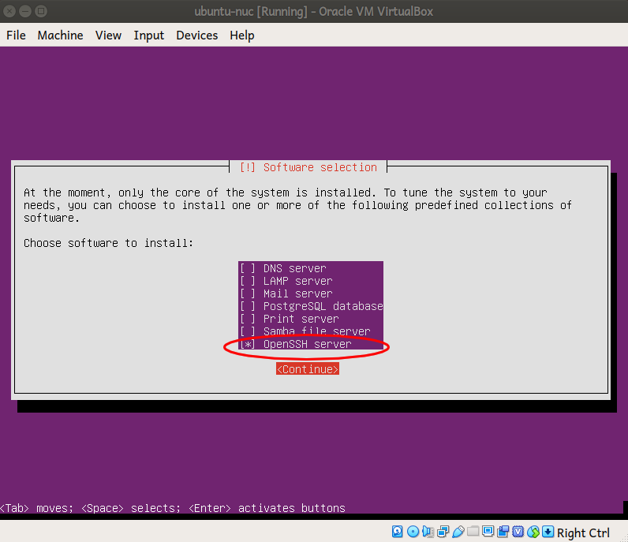

# How To Deploy TheCombine Application #

The ```deploy``` folder of TheCombine project is a collection of Ansible playbooks that can be use to configure a new installation of Ubuntu Server.  Each playbook uses a set of Ansible roles to drive the configurations.

## Running the playbook ##
A setup script, ```setup-target.sh```, is provided to perform the installation.  Its usage is:
```
./setup-target.sh [options] user@machinename
```

### options: ###

**```-c or --copyid```** causes the script to use ```ssh-copy-id``` to copy your ssh id to the target machine before running the playbook to setup the machine.  This obviates the need to enter your password every time that you connect to the machine.

**```-h or --help```** print the basic usage message.  The usage message is also printed if the script is run without a user@machine name argument.

**```-i or --install``` only run the tasks for installing TheCombine

**```-t or --test```**  only run the tasks for testing the installation of TheCombine.

*if neither the -i nor the -t options are specified, the install and the test tasks will be run.*

## Setting up a Virtual Machine ##

```setup-target.sh``` can be used setup a Virtual Machine (VM) as well.  The following instructions describe how to install Ubuntu Server on a virtual machine and how to set it up so that you can use ```ssh``` to connect to it:

  1. Download the ISO image for Ubuntu Server from Ubuntu (currently at http://cdimage.ubuntu.com/releases/18.04.2/release/ubuntu-18.04.2-server-amd64.iso)

  1. Open Oracle's *VirtualBox*.

  1. Create a virual network interface:

     1. Click on the *File* menu and select *Host Network Manager...*

     1. Click the *Create* button to create a new Host Network Adapter.  If it is the first such adapter created it will have the following attributes:

        | Field         | Value           |
        | ------------- | :-------------: |
        | Name:         | vboxnet0        |
        | Addresses:    | 192.168.56.1/24 |
        | DHCP Enabled: | No              |

  1. Create the VM
     1.  Click the *New* button to create a new VM.

     1. Give the new VM a name and set the OS Type to ```Linux``` and the Version to ```Ubuntu (64-bit)```; click *Next*.

     1. Select the amount of memory you want for your VM; click *Next*.

     1. In the next few screens, you will setup the hard disk:
        1. Create a new virtual hard disk,
        1. Use a VirtualBox Disk Image (VDI),
        1. Select dynamically allocated,
        1. and set the size to 10 GB.

  1. Setup DVD image and Networking

     1. Select the new VM and click on the *Settings* button;

     1. Load the Ubuntu Server ISO image into the optical drive:
        1. Click on the *Storage* section in the pane on the left side;
        1. click on the optical disk drive under *Controller: IDE* in the storage devices;
        1. Click on the optical disk icon on the dropdown menu (circled in red in the image below) and select the Ubuntu Server ISO image downloaded above.
           

     1. Click on the *Network* section.

     1. Click on the Adapter 2 tab and set it up as follows:

         | Field                   | Value             |
         | ----------------------- | :---------------: |
         | Enable Network Adapter: | Checked           |
         | Attached to:            | Host-only Adapter |
         | Name:                   | vboxnet0          |

     1. Start the virtual machine and follow the prompts to install Ubuntu Server.  Some things to note are:

        1. You will want the installer to format the entire (virtual) disk and use LVM (that's the default)

        1. *Make sure that you select the OpenSSH server when prompted to select the software for your server:*
        


  6. When installation is complete, log in to the virtual machine and setup the network connection for the second adapter.

     1. Run ```ip address``` to list the available interfaces.  There will be one ethernet interface that is up and has an IP address, e.g. enp0s3.  There will be a second ethernet interface that is down, e.g. enp0s8.  Note the name of this interface.

     1. Edit /etc/netplan/01-netcfg.yaml
        ```sudo nano /etc/netplan/01-netcfg.yaml```

     1. Edit the file so that it contains:
        ```
        # This file describes the network interfaces available on your system
        # For more information, see netplan(5).
        network:
          version: 2
          renderer: networkd
          ethernets:
            enp0s3:
              dhcp4: yes
            enp0s8:
              addresses: [192.168.56.10/24]
              gateway4: 192.168.1.1
              nameservers:
                addresses: [8.8.8.8,8.8.4.4]
              dhcp4: no
        ```
        ... substituting the names of your adapters, of course.  Also make sure that the address you assign is in the subnet specified by the Host Network Adapter.  Unfortunately, you will have to type it.  You will not be able to cut & paste to the VM.

     1. Run: ```sudo netplan apply```

     1. Add the VM's IP address to the ```/etc/hosts``` file on the host computer *(optional)*:

       ```
       # Virtual Machines
       192.168.56.10	nuc-vm

       ```

  1. Now you can run the setup-target.sh to install the required packages.  Use ```192.168.56.10``` as the target IP address.


## Roles ##

If you need to create a playbook to run individual roles, the following roles are available in this project.

  **ansible-depends** - installs the packages required to run subsequent Ansible
  modules

  **headless** - sets configuration options that make sense when the device will be used as a headless node.  It currently updates the ```grub``` configuration so that there is not a 30 second wait during bootup when Ubuntu is installed with the Logical Volume Manager.  This is intended for a Server installation.

  **nodejs** - installs node.js, npm, and yarn

  **setup_apache** - installs the apache2 web server

  **setup_application** - installs TheCombine application from the ```build``` directory.  The application must be built first; it is not built by the ansible playbook.

  **setup_dotnet_core** - installs the ASP.NET Core 2.2 Runtime.  It does *not* install the SDK.

  **setup_mongodb** - installs the MongoDB database (from mongodb.org, *not* the Ubuntu package) and installs it as a service

  **wifi_ap** - sets up the wifi interface as a wifi access point (hotspot)
