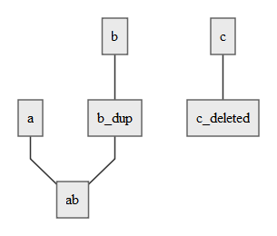

# Get frontier words

The frontier is a list of all the words that haven't been merged.

In Figure1 the frontier would return `ab` and `c_deleted`

**URL** : `/v1/projects/{project}/words/frontier`

**Method** : `GET`

**Auth required** :

## Success Response

**Code** : `200 OK`

**Data Content** : [`Word`](word.md)`[]`
