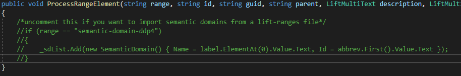
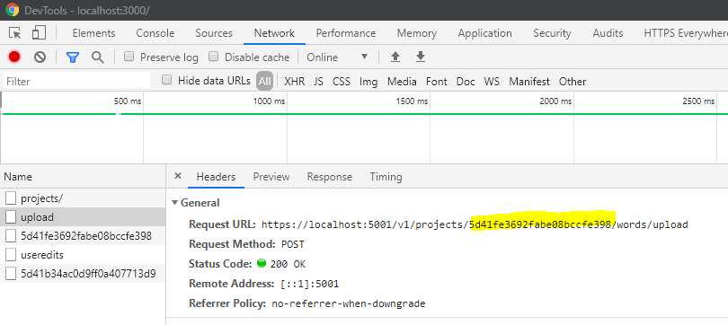
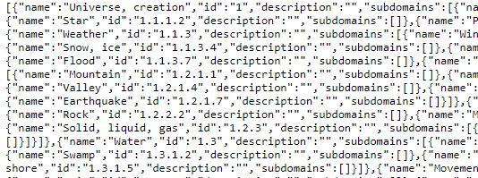

# Parse Semantic Domains of Project

Takes the sematic domains of your project and returns a JSON object in the structure needed by the Tree View component.
The app currently has copies of the semantic domains in English, Spanish, and French. This tool can be used to localize
the Tree View component to other languages. This function is not currently operating, so the source code must be
changed.

1. In the file [~/TheCombine/Backend/Services/LiftApiServices.cs](../../../Backend/Services/LiftApiServices.cs),
   uncomment the code in the method `ProcessRangeElement()`.

2. Start the Combine.
3. Open the DevTools menu in your browser (<kbd>F12</kbd> or <kbd>CTRL</kbd> + <kbd>SHIFT</kbd> + <kbd>I</kbd>).
4. Import the project with the semantic domains of the desired language.
5. Locate the project id in the Network tab from your `upload` request. You can find it here:

6. Navigate in-browser to `localhost:5001/v1/projeccts/{projectId}/semanticdomains` with the project id you found, which
   will give you the plaintext result. It should look something like this:

7.  Save this data to a JSON file in
    [~/TheCombine/src/resources/semantic-domains](../../../src/resources/semantic-domains) with the language code as its
    name (e.g. `en.json` for English) will allow the data from this language to be used in the Tree View component.

**URL** : `/v1/projects/{projectId}/semanticdomains`

**Method** : `GET`

**Auth required** : No

## Success response

**Code** : `200 OK`

**Data Content** : `string`

## Error response

**Condition** : Project not found

**Code** : `404 NOT FOUND`
