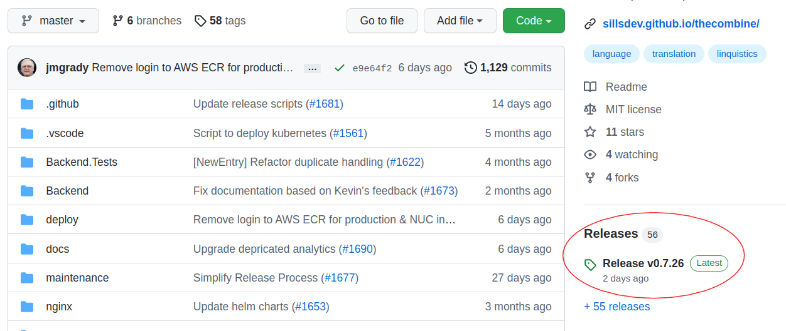

# How To Deploy _The Combine_

This document describes how to deploy _The Combine_ to a target Kubernetes cluster.

## Conventions

- the _host_ machine is the machine that is used to perform the installation. It may be a Linux, Windows, or MacOS
  machine.
- the _target_ machine is the machine where _The Combine_ is to be installed. It shall be referred to as _\<target\>_.
- some of the commands described in this document are to be run from within the `git` repository for _The Combine_ that
  has been cloned on the host machine. This directory shall be referred to as `<COMBINE>`.

## Contents

1. [System Design](#system-design)
2. [Deployment Scenarios](#deployment-scenarios)
   1. [Development Environment](#development-environment)
   2. [QA/Production Server](#qaproduction-server)
   3. [NUC](#nuc)
3. [Install Ubuntu Server](#install-ubuntu-server)
4. [Install Kubernetes Engine](#install-kubernetes-engine)
5. [Setup Kubectl and Environment](#setup-kubectl-and-environment)
   1. [Setup Kubectl](#setup-kubectl)
   2. [Setup Environment](#setup-environment)
6. [Install Helm Charts Required by _The Combine_](#install-helm-charts-required-by-the-combine)
7. [Install _The Combine_](#install-the-combine)
8. [Maintenance](#maintenance)
   1. [Maintenance Scripts for Kubernetes](#maintenance-scripts-for-kubernetes)
   2. [Checking Certificate Expiration](#checking-certificate-expiration)
   3. [Creating your own Configurations](#creating-your-own-configurations)

## System Design

_The Combine_ is designed as a collection of helm charts to be installed on a Kubernetes cluster. _The Combine's_
Kubernetes resources are described in the design document at
[./kubernetes_design/README.md](./kubernetes_design/README.md).

## Deployment Scenarios

The tools and methods for deploying _The Combine_ are a function of the type of system you wish to deploy, the
_deployment scenario_, and the operating system of the host machine.

### Development Environment

The _Development Environment_ scenario is for software developers who need to test out changes to the application in
development before they are deployed. This allows the developer to deploy _The Combine_ to a local Kubernetes
environment that is closer to the production environment. The tools and methods for deploying _The Combine_ in a
development environment are described in the
[Setup Local Kubernetes Cluster](https://github.com/sillsdev/TheCombine#setup-local-kubernetes-cluster) section of the
project README.md file.

### QA/Production Server

For _The Combine_, the QA and Production servers are servers where the Kubernetes Cluster is created and maintained by a
separate organization. The characteristics of these systems are:

- The Kubernetes cluster has been created as follows:

  - [cert-manager](https://cert-manager.io/) is installed
  - an NGINX ingress controller is installed
  - the namespace `thecombine` is created
  - the TLS certificate for the server is installed in `thecombine` namespace as a `kubernetes.io/tls` secret with the
    name `thecombine-app-tls`

- The QA server has services to login to a private AWS Elastic Container Registry to run private images for _The
  Combine_. In contrast, the Production server only runs public images.
- On the Production server an additional namespace `combine-cert-proxy`.

#### Tools Required for a QA/Production Server Installation

The host tools required to install _The Combine_ on a QA or Production server are described in
[Install Kubernetes Tools](https://github.com/sillsdev/TheCombine#install-kubernetes-tools) in the project README.md
file.

#### Steps to Install on a QA/Production Server

To install _The Combine_ on one of these systems, follow the steps in

- [Setup Kubectl and Environment](#setup-kubectl-and-environment)
- [Install _The Combine_](#install-the-combine)

### NUC

_The Combine_ is designed to be installed on an _Intel NUC_ or other mini-computer and to operate where no internet is
available. The installation process assumes that a WiFi interface is available as well as a wired Ethernet interface.

#### Tools Required to Install on a NUC

There are two options for toolsets to install _The Combine_ on a NUC:

##### Locally Installed Tools

Locally installed tools can be used to install from a Linux, MacOS, or Windows Subsystem for Linux host machine. The
required tools are:

- _The Combine_ source tree

  Clone the repo:

  ```bash
  git clone https://github.com/sillsdev/TheCombine.git
  ```

- [Ansible](https://docs.ansible.com/ansible/latest/installation_guide/intro_installation.html#latest-releases-via-apt-ubuntu)
- Python: See the instructions for installing Python and dependent libraries in the project
  [README.md](https://github.com/sillsdev/TheCombine#python)
- [Docker Engine](https://docs.docker.com/engine/install/) or [Docker Desktop](https://docs.docker.com/get-docker/)

##### Install From Docker Image

You can use a Docker image to install _The Combine_ using a host machine running Windows, Linux, or MacOS. The only tool
that is needed is Docker. You can install either [Docker Engine](https://docs.docker.com/engine/install/) or
[Docker Desktop](https://docs.docker.com/get-docker/)

Once you have installed _Docker_, pull the `combine_deploy` image. Open a terminal window (PowerShell, Command Prompt,
or Unix shell) and run:

```console
docker pull public.ecr.aws/thecombine/combine_deploy:latest
```

The Docker image contains all the additional tools that are needed. It also has all of the installation scripts so that
you do not need to clone _The Combine's_ GitHub repo. The disadvantage of using the Docker image is that any changes to
_The Combine_ configuration files will not be preserved. This is not a concern for most users.

#### Steps to Install on a NUC

To install _The Combine_ on one of these systems, follow the steps in

- [Install Ubuntu Server](#install-ubuntu-server)
- [Install Kubernetes Engine](#install-kubernetes-engine)
- [Setup Kubectl and Environment](#setup-kubectl-and-environment)
- [Install Helm Charts Required by _The Combine_](#install-helm-charts-required-by-the-combine)
- [Install _The Combine_](#install-the-combine)

## Install Ubuntu Server

Note: In the instructions below, each step indicates whether the step is to be performed on the Host PC (_[Host]_) or
the target PC (_[NUC]_).

To install the OS on a new target machine, such as, a new NUC, follow these steps:

1. _[Host]_ Download the ISO image for Ubuntu Server from Ubuntu (currently at <https://ubuntu.com/download/server>;
   click on _Option 2 - Manual server installation_ and then _Download Ubuntu Server 22.04 LTS_)

2. _[Host]_ copy the .iso file to a bootable USB stick:

   1. Ubuntu host: Use the _Startup Disk Creator_, or
   2. Windows host: follow the
      [tutorial](https://ubuntu.com/tutorials/tutorial-create-a-usb-stick-on-windows#1-overview) on ubuntu.com.

3. _[NUC]_ Connect the NUC to a wired, Ethernet network connection, an HDMI Display and a USB Keyboard.

4. _[NUC]_ Boot the NUC from the bootable media and follow the installation instructions. In particular,

   1. You will want the installer to format the entire disk. Using LVM is not recommended.

   2. Profile setup

      The instructions assume the following profile entries during installation:

      | Item             | Value                             |
      | ---------------- | --------------------------------- |
      | Your Name        | SIL Language Software Development |
      | Your Server Name | nuc1, nuc2, or nuc3               |
      | Pick a username  | sillsdev                          |

      You may choose any name, username that you like. If you use a different servername than one of the three listed,
      you will need to provide alternate configuration files. See the
      [Creating your own Configurations](#creating-your-own-configurations) section. This is not recommended when
      running the installation from a Docker image.

   3. Make sure that you install the OpenSSH server when prompted:

      

      In addition, you may have your SSH keys from _Github_ or _Launchpad_ preinstalled as authorized keys.

   4. You do not need to install any additional snaps; the _Ansible_ playbooks will install any needed software.

5. _[NUC]_ When installation is complete, log into the NUC using the username and password provided during installation
   and update all packages:

   ```console
   sudo apt update && sudo apt upgrade -y
   ```

6. _[NUC]_ Reboot:

   ```console
   sudo reboot
   ```

7. _[NUC]_ Lookup IP Address for the NUC:

   From the NUC, run the command `ip address`. Record the current IP address for the Ethernet interface; the Ethernet
   interface starts with `en`, followed by a letter and then a digit (`en[a-z][0-9]`).

8. _[Host]_ Setup your host's connection to the NUC:

   - if using the Docker image open a terminal window and run:

     ```console
     docker run -it -v nuc-config:/config public.ecr.aws/thecombine/combine_deploy:latest
     setup_target.py <ip_addr> <target>
     ```

     Where `<ip_addr>` is the IP address found in step 7 and `<target>` is the server name specified when Ubuntu was
     installed.

   - if using local tools, open a terminal window and run:

     ```console
     cd <COMBINE>/deploy/scripts
     sudo ./setup_target.py <ip_addr> <target> -l <username>
     ```

     Where `<ip_addr>` is the IP address found in step 7, `<target>` is the server name specified when Ubuntu was
     installed, and `<username>` is your current username.

   The `setup_target.py` script will do the following:

   - Add the NUC's IP address to your `/etc/hosts` file
   - Generate an SSH key for you
   - Copy your SSH public key to the NUC

   Note that if an SSH key exists, you will have the option to overwrite it or skip the key generation. When your SSH
   key is copied to the NUC, it will copy the default key, `${HOME}/.ssh/id_rsa.pub`.

## Install Kubernetes Engine

This step does more than just install the Kubernetes engine. It performs the following tasks:

- Updates and upgrades all the packages installed on the target;
- Sets up the WiFi interface as a WiFi Access Point;
- Configures the network interfaces;
- Installs `containerd` for managing containers;
- Installs `k3s` Kubernetes engine; and
- Sets up a local configuration file for `kubectl` to access the cluster.

To run this step:

- if using the Docker image open a terminal window and run:

  ```console
  docker run -it -v nuc-config:/config public.ecr.aws/thecombine/combine_deploy:latest
  cd ~/ansible
  ansible-playbook -i hosts playbook_kube_install.yml --limit <target> -u <user> -K -e link_kubeconfig=true
  ```

- if using local tools, open a terminal window and run:

  ```console
  cd <COMBINE>/deploy/ansible
  ansible-playbook -i hosts playbook_kube_install.yml --limit <target> -u <user> -K
  ```

  Where

  - `<target>` is the server name specified when Ubuntu was installed, e.g. `nuc1`; and
  - `<user>` is the user name specified when Ubuntu was installed, e.g. `sillsdev`.

## Setup Kubectl and Environment

### Setup Kubectl

If you do not have a `kubectl` configuration file for the `<target>` system, you need to install it. For the NUCs, it is
setup automatically by the Ansible playbook run in the previous section.

For the Production or QA server,

1. login to the Rancher Dashboard for the Production (or QA) server. You need to have an account on the server that was
   created by the operations group.
2. Copy your `kubectl` configuration to the clipboard and paste it into a file on your host machine, e.g.
   `${HOME}/.kube/prod/config` for the production server.

### Setup Environment

The setup scripts require the following environment variables to be set:

- AWS_ACCOUNT
- AWS_DEFAULT_REGION
- AWS_ACCESS_KEY_ID
- AWS_SECRET_ACCESS_KEY
- COMBINE_JWT_SECRET_KEY
- COMBINE_SMTP_USERNAME
- COMBINE_SMTP_PASSWORD
- COMBINE_ADMIN_USERNAME
- COMBINE_ADMIN_PASSWORD
- COMBINE_ADMIN_EMAIL

You may also set the KUBECONFIG environment variable to the location of the `kubectl` configuration file. This is not
necessary if the configuration file is at `${HOME}/.kube/config`.

If using local tools, these can be set in your `.profile` (Linux or Mac 10.14-), your `.zprofile` (Mac 10.15+), or the
_System_ app (Windows).

If using the docker image,

1. Start the `combine_deploy` image:

   ```console
   docker run -it -v nuc-config:/config public.ecr.aws/thecombine/combine_deploy:latest
   ```

2. In the docker image terminal window, run:

   ```console
   nano ~/.env
   ```

3. Enter the variable definitions using the form:

   ```config
   export VARIABLE=VALUE
   ```

4. Enter `Ctrl-X` to exit and save the changes.
5. Apply the definitions to the current session by running:

   ```console
   . ~/.env
   ```

Once this is done, the environment variables will be set whenever the docker image is started with the volume specified
by the `-v` option.

If you are a member of the development team and need the environment variable values, send a request explaining your
need to [admin@thecombine.app](mailto:admin@thecombine.app).

## Install Helm Charts Required by _The Combine_

This step sets up the NGINX Ingress Controller and the Certificate Manager, [cert-manager.io](https://cert-manager.io/).

- if using the Docker image open a terminal window and run:

  ```console
  docker run -it -v nuc-config:/config public.ecr.aws/thecombine/combine_deploy:latest
  setup_cluster.py
  ```

- if using local tools, open a terminal window and run:

  ```console
  cd <COMBINE>/deploy/scripts
  ./setup_cluster.py
  ```

## Install _The Combine_

This step installs _The Combine_ application itself.

- if using the Docker image

- open a terminal window and run if the Docker image is not already started:

  ```bash
  docker run -it -v nuc-config:/config public.ecr.aws/thecombine/combine_deploy:latest
  setup_combine.py --tag <release> --repo public.ecr.aws/thecombine --target  <target>
  ```

- if using local tools, open a terminal window and run:

  ```console
  cd <COMBINE>/deploy/scripts
  ./setup_combine.py --tag <release> --repo public.ecr.aws/thecombine --target <target>
  ```

Where:

- `<release>` is the GitHub tag for the release that should be installed.

  Note that:

  - Starting with version 0.7.25, the tag will start with a ‘v’, even if the release does not (we are transitioning to
    the format where release versions start with a ‘v’).
  - You can see the version of the latest release on the GitHub page for The Combine,
    <https://github.com/sillsdev/TheCombine>: 
  - The help text for `setup_combine.py` says that the `--tag` is optional and its default value is `latest`. That is
    used in the _Development Environment_ scenario; there are no images for _The Combine's_ components in
    `public.ecr.aws/thecombine` with the tag `latest`.

## Maintenance

### Maintenance Scripts for Kubernetes

There are several maintenance scripts that can be run in the kubernetes cluster:

- `combine-backup-job.sh` - performs a backup of _The Combine_ database and backend files, pushes the backup to AWS S3
  storage and then removes old backups keeping the latest 3 backups.
- `combine_backup.py` - just performs the backup and pushes the result to AWS S3 storage.
- `combine-clean-aws.py` - removes the oldest backups, keeping up to `max_backups`. The default for `max_backups` is 3.
- `combine_restore.py` - restores _The Combine_ database and backend files from one of the backups in AWS S3 storage.

The `combine-backup-job.sh` is currently being run daily on _The Combine_ QA and Production servers as a Kubernetes
CronJob.

In addition to the daily backup, any of the scripts can be run on-demand using the `kubectl` command. Using the
`kubectl` command takes the form:

```bash
kubectl [--kubeconfig=<path-to-kubernetes-file>] [-n thecombine] exec -it deployment/maintenance -- <maintenance script> <script options>
```

Notes:

1. The `--kubeconfig` option is not required if

   1. the `KUBECONFIG` environment variable is set to the path of your kubeconfig file, or

   2. if your kubeconfig file is located in `${HOME}/.kube/config`.

2. You can see the options for a script by running:

   ```bash
   kubectl [--kubeconfig=<path-to-kubernetes-file>] [-n thecombine] exec -it deployment/maintenance -- <maintenance scripts> --help
   ```

   The only exception is `combine-backup-job.sh` which does not have any script options.

3. The `-n thecombine` option is not required if you set `thecombine` as the default namespace for your kubeconfig file
   by running:

   ```bash
   kubectl config set-context --current --namespace=thecombine
   ```

### Checking Certificate Expiration

The `check_cert.py` will print the expiration timestamp for _The Combine's_ TLS certificate.

- if using the Docker image, open a terminal window and run:

  ```console
  docker run -it -v nuc-config:/config public.ecr.aws/thecombine/combine_deploy:latest
  check_cert.py -n thecombine
  ```

- if using local tools, open a terminal window and run:

  ```console
  cd <COMBINE>/deploy/scripts
  ./check_cert.py -n thecombine
  ```

The `-n thecombine` option may be omitted if the default namespace for the kubeconfig file has been set to `thecombine`
as described in [Maintenance Scripts for Kubernetes](#maintenance-scripts-for-kubernetes).

### Creating your own Configurations

#### Ansible Inventory file

You can create your own inventory file to enable Ansible to install the combine on a target that is not listed in the
`deploy/ansible/hosts.yml` inventory file or if you want to override a variable that is used to configure the target.

To use your own inventory file:

- The inventory filename match the pattern \*.hosts.yml, e.g. dev.hosts.yml, or save it in a directory that is not in
  the combine source tree.
- Use hosts.yml as a model. The host will need to be in the `server`, `qa` or the `nuc` group presently. Machines in the
  `server` group will get a certificate from letsencrypt and must be reachable from the internet. Machines in the `qa`
  group will use a self-signed certificate. Machines in the `nuc` group are expected to have a wifi interface and will
  get a certificate that has been created for them and stored in AWS S3.
- At a minimum, the inventory file must define the `combine_server_name` variable for each host.
- You may add any variables whose default value you want to override.
- To use the custom inventory file, add the following option to the ansible-playbook commands above:
  `-i custom-inventory.yml` where `custom-inventory.yml` is the name of the inventory file that you created.

See the Ansible documentation,
[Build Your Inventory](https://docs.ansible.com/ansible/latest/network/getting_started/first_inventory.html) for more
information on inventory files.

#### Combine Configuration file

The default configuration file for _The Combine_ is stored at `deploy/scripts/setup_files/combine_config.yaml`. You can
use the `--config` option to the `deploy/scripts/setup_combine.py` script to use a different configuration. You can also
add new profile definitions to the `deploy/scripts/setup_files/profiles` directory.
