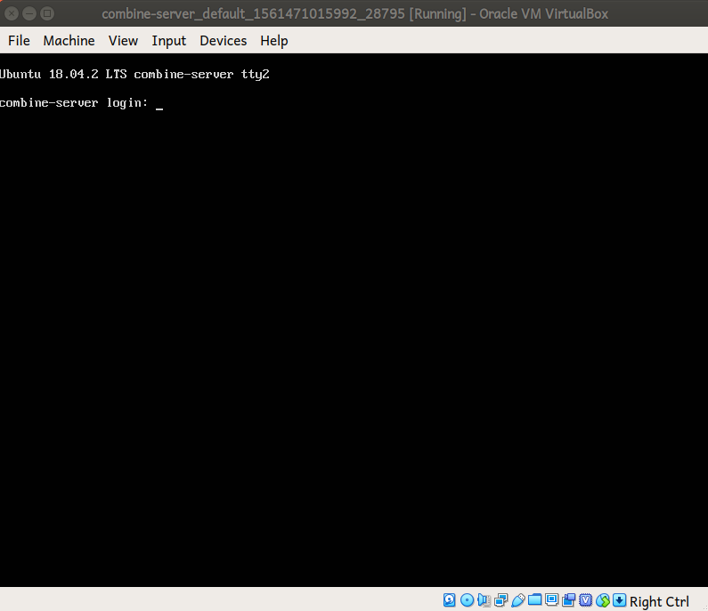

# How To Deploy TheCombine Application

This document describes how to install a build from *TheCombine* project for
development work or for production use.  There are two methods described below.
The first method, [Vagrant VM Setup](#vagrant-vm-setup), is the simplest method
and is appropriate for testing the application in an environment that CLOSELY matches the production systems.

The second method, [Stand Up a New Machine](#stand-up-a-new-machine), describes
how to install Ubuntu 18.04 Server on a new PC and then run the Ansible playbooks to install and configure *TheCombine* and its dependencies.

## Vagrant VM Setup

### System Requirements

  1. PC with a 64-bit Windows or Linux operating system.
  2. Hardware virtualization enabled
  3. At least 4 GB RAM

### Installing the Environment

  1. Install [VirtualBox](https://www.virtualbox.org/wiki/Downloads).
  2. Install [Vagrant](https://www.vagrantup.com/downloads.html).  Note that if you are installing Vagrant on an Ubuntu host, you should select the Debian package rather than the generic Linux package.
  3. Clone the project repo, https://github.com/sillsdev/TheCombine

### Creating the VM

  1. open a command prompt and change directory to deploy/vagrant sub-folder of the cloned project directory, e.g.

    cd TheCombine/deploy/vagrant

  1. create and provision the VM:

    vagrant up

Note that it may take some time for this to complete.  When finished, there will be a window displaying the console of the virtual machine:
    

### Logging Into the VM

#### At the VM Console

By default, when you run ```vagrant up```, VirtualBox will display a window showing the console for the VM.
You can login to the VM at the console window using the following credentials:

     Username: vagrant
     Password: vagrant

#### Using a Secure Shell Client

You can also connect using a secure shell client with the same credentials:
```
  ssh vagrant@10.10.0.2
```

#### Using Vagrant

Last of all, you can type
```
    vagrant ssh
```
at the command prompt where you launched the VM.

### Building and Installing TheCombine

Connect to the VM using one of the methods described in [Logging Into the VM](#logging-into-the-vm).

Consider updating your working directory by doing a ```git pull``` or by checking out your working branch.

To build the project, install and configure it, run the following command from the command prompt:
```
mkcombine.
```

*When* `mkcombine` *runs the installation scripts, you will be prompted for the* `BECOME password.`  *The BECOME password is* `vagrant`.  You will also be prompted for the Ansible vault password.  The vault password is posted on the *Rocket.Chat* discussion, `#the-combine`.

### Running TheCombine On The VM

In order to run *TheCombine*, you will need to make the following changes to your host PC:

 1. Install the Combine CA certificate in your web browser.  The Certificate is in TheCombine repo under `TheCombine/deploy/roles/the_combine_app/files/CombineCA/CombineCA.pem`.  This is the certificate that was used to sign the certificate for the Kestrel backend server.
 2. Add
    ```
    10.10.0.2   thewordcombine.org
    ```
    to your network hosts file.


Once this is done, you can test out your vm installation by connecting to https://thewordcombine.org from your web browser.  The certificate for the front end is currently self-signed.  Your web browser will complain but click on the *Advanced* button and then on the *Proceed to thewordcombine.org (unsafe)* link.

## Stand Up a New Machine

This section describes how to install Ubuntu Server and TheCombine application on a new PC.

### Host System Requirements

The following requirements are for the host system that is used to install the Combine application onto a new PC:
  * Ubuntu 18.04 Desktop, 64-bit
  * Git
  * [Ansible](https://docs.ansible.com/ansible/latest/installation_guide/intro_installation.html#latest-releases-via-apt-ubuntu)
  * [Nodejs](https://github.com/nodesource/distributions/blob/master/README.md#debinstall), install the LTS version, 10.x.
  * [.NET Core 2.1 SDK](https://dotnet.microsoft.com/download/linux-package-manager/ubuntu18-04/sdk-2.1.801)
  * [MongoDB Community Edition](https://docs.mongodb.com/manual/tutorial/install-mongodb-on-ubuntu/)
  * clone the project repo to the working folder of your choice, e.g. ```$HOME/src```

### Install Ubuntu Bionic Server

  1. Download the ISO image for Ubuntu Server from Ubuntu (currently at http://cdimage.ubuntu.com/releases/18.04.2/release/ubuntu-18.04.2-server-amd64.iso)

  1. Use the *Startup Disk Creator* to copy the .iso file to a bootable USB stick.

  1. Boot the PC from the bootable media and follow the installation instructions.  In particular,
     1. You will want the installer to format the entire (virtual) disk and use LVM (that's the default)

     1. *Make sure that you select the OpenSSH server when prompted to select the software for your server:*
  

### Build the App

To build the Combine application in the Ubuntu Environment, run the following command (assumes the repo was cloned into ```$HOME/src```):
```
cd ~/src/TheCombine
npm install
npm run build
cd Backend
dotnet publish -c Release
```

### Installing the App

The ```deploy``` folder of TheCombine project is a collection of Ansible playbooks that can be used to configure a new installation of Ubuntu Server.  Each playbook uses a set of Ansible roles to drive the configurations.

A setup script, ```setup-target.sh```, is provided to perform the installation.  Its usage is:
```
./setup-target.sh [options] user@machinename
```

### options:
Usage: ./setup-target.sh [options] user@machinename
 where:
**`-b, --build`** will build/publish the UI and Backend server before deploying The Combine

**```-c or --copyid```** causes the script to use ```ssh-copy-id``` to copy your ssh id to the target machine before running the playbook to setup the machine.  This obviates the need to enter your password every time that you connect to the machine.

**```-h or --help```** print the basic usage message.  The usage message is also printed if the script is run without a user@machine name argument.

**```-i or --install```** only run the tasks for installing TheCombine

**```-t or --test```**  only run the tasks for testing the installation of TheCombine.

*if neither the -i nor the -t options are specified, the install and the test tasks will be run.*

**`-v <vaultpasswordfile>, --vault <vaultpasswordfile>`** use <vaultpasswordfile> for the vault password. If no password file is specified, the user will be prompted for the vault password when it is needed.

### Running TheCombine On The New Machine

To run *TheCombine* on the new Ubuntu PC, you will need to:

  1. Install the Combine CA certificate in your web browser.  The Certificate is in TheCombine repo under `TheCombine/deploy/roles/the_combine_app/files/CombineCA/CombineCA.pem`.  This is the certificate that was used to sign the certificate for the Kestrel backend server.
  2. Connect to the WiFi access point created by the server.  The access point SSID is `thewordcombine_ap` and the WiFi password is `BigRed@1979`.

Once you have connected to the WiFi Access Point, you can navigate to https://thewordcombine.org using your web browser.  You may need to accept the certificate for the web site.

Note: For development purposes, the Apache server will accept connections from the WiFi or Wired connection for the NUC.  In order to connect on the wired connection, you will have to set the NUC's IP address to thewordcombine.org in your hosts file.
