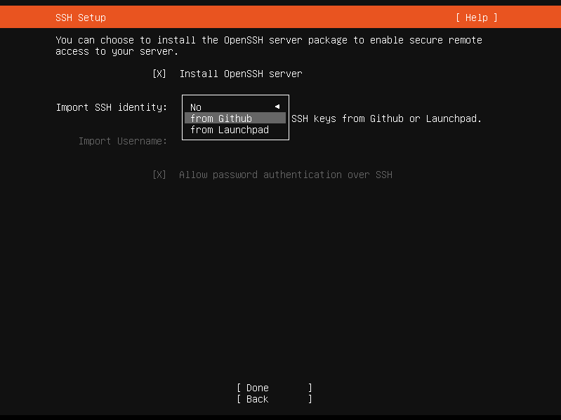

# How To Deploy _The Combine_

This document describes how to install the framework that is needed to deploy _The Combine_ to a target machine in
Docker containers.

<table>
<tr>
 <td>Author/Owner:</td><td>Jim Grady</td>
</tr>
<tr>
 <td>Email:</td><td>jimgrady.jg@gmail.com</td>
</tr>
</table>

## Conventions

- most of the commands described in this document are to be run from within the <tt>git</tt> repository for _The
  Combine_ that has been cloned on the host machine. This directory is referred to as \<COMBINE\>.
- the target machine where _The Combine_ is being installed will be referred to as _\<target\>_
- the user on the target machine that will be used for installing docker, etc. will be referred to as _\<target_user\>_.
  You must be able to login to _\<target\>_ as _\<target_user\>_ and _\<target_user\>_ must have `sudo` privileges.

## Contents

1. [Step-by-step Instructions](#step-by-step-instructions)
   1. [Prepare your host system](#prepare-your-host-system)
      1. [Linux Host](#linux-host)
      2. [Windows Host](#windows-host)
   2. [Installing and Running _The Combine_](#installing-and-running-the-combine)
      1. [Minimum System Requirements](#minimum-system-requirements)
      2. [Install Combine Pre-requisites](#install-combine-pre-requisites)
      3. [Install The Combine](#install-the-combine)
      4. [Running _The Combine_ Docker Containers](#running-the-combine-docker-containers)
      5. [Running _The Combine_ in a Kubernetes Cluster](#running-the-combine-in-a-kubernetes-cluster)
         1. [Additional Host Requirements](#additional-host-requirements)
         2. [Installing the Kubernetes Cluster](#installing-the-kubernetes-cluster)
         3. [Maintenance Scripts for Kubernetes](#maintenance-scripts-for-kubernetes)
      6. [Creating Your Own Inventory File](#creating-your-own-inventory-file)
2. [Backups](#backups)
   1. [Automated Backups](#automated-backups)
   2. [Running a Backup Manually](#running-a-backup-manually)
   3. [Restoring Database and Backend From a Previous Backup](#restoring-database-and-backend-from-a-previous-backup)
3. [Design](#design)
   1. [Docker Compose Implementation](#docker-compose-implementation)
   2. [Kubernetes Implementation](./kubernetes_design/README.md)
4. [Additional Details](#additional-details)
   1. [Install Ubuntu Bionic Server](#install-ubuntu-bionic-server)
   2. [Vault Password](#vault-password)
   3. [Updating Packages](#updating-packages)

# Step-by-step Instructions

This section gives you step-by-step instructions for installing _The Combine_ on a new NUC/PC with links to more
detailed information. The instructions assume that the target system already has Ubuntu Server 18.04 installed and is
accessible via `ssh`.

## Prepare your host system

### Linux Host

Install the following components:

- Ubuntu 20.04 (Desktop or Server), 64-bit
- Git
- [Ansible](https://docs.ansible.com/ansible/latest/installation_guide/intro_installation.html#latest-releases-via-apt-ubuntu)
- clone the project repo:
  ```
  git clone https://github.com/sillsdev/TheCombine
  ```
- if you do not have an ssh key pair, create one using:
  ```
  ssh-keygen
  ```
- copy your ssh id to the target system using:
  ```
  ssh-copy-id <target_user>@<target>
  ```

### Windows host

The scripts for installing _The Combine_ use _Ansible_ to manage an installation of _The Combine_. _Ansible_ is not
available for Windows but will run in the Windows Subsystem for Linux (WSL). Microsoft has instructions for installing
WSL on Windows 10 at
[Windows Subsystem for Linux Installation Guide for Windows 10](https://docs.microsoft.com/en-us/windows/wsl/install-win10).
At the end of the instructions there are instructions for installing various Linux images including Ubuntu 18.04.

Once Ubuntu is installed, run the Ubuntu subsystem and follow the instructions for the [Linux Host](#linux-host)

## Installing and Running _The Combine_

To install and start up _The Combine_ you will need to run the following Ansible playbooks. Each time you will be
prompted for passwords:

- `BECOME password` - enter your `sudo` password for the _\<target_user\>_ on the _\<target\>_ machine.
- `Vault password` - some of the Ansible variable files are encrypted in Ansible vaults. See the current owner (above)
  for the Vault password.

### Minimum System Requirements

The minimum system requirements for installing _The Combine_ on a target are:

- Ubuntu 20.04 Server operating system (see [Install Ubuntu Focal Server](#install-ubuntu-focal-server))
- 2 GB RAM
- 15 GB Storage

### Install Combine Pre-requisites

Run the first playbook to install all the packages that are needed by _The Combine_ and to setup the Docker
configuration files:

```bash
cd <COMBINE>/deploy
ansible-playbook playbook_target_setup.yml --limit <target> -u <target_user> -K --ask-vault-pass
```

Notes:

- Do not add the `-K` option if you do not need to enter your password to run `sudo` commands _on the target machine_.
- The _\<target\>_ must be listed in the hosts.yml file (in \<COMBINE\>/deploy). If it is not, then you need to create
  your own inventory file (see [below](#creating-your-own-inventory-file)). The _\<target\>_ can be a hostname or a
  group in the inventory file, e.g. `qa`.

### Install The Combine

To install _The Combine_ run the following command:

```
cd <COMBINE>/deploy
ansible-playbook playbook_install.yml --limit <target> -u <target_user> -K --ask-vault-pass
```

Notes:

- This is not needed for the Production server or for the QA server. _The Combine_ is installed on these systems using
  the CI/CD tools.
- You will be prompted for the version of _The Combine_ to install. The version is the Docker image tag in the AWS ECR
  image repository. The standard releases are tagged with the version number, e.g. _0.6.5_.

### Running _The Combine_ Docker Containers

_The Combine_'s docker containers are built by SIL's _TeamCity_ server. Once they are built successfully, they are
pushed to Amazon's Elastic Container Registry (AWS ECR). The production `docker-compose.yml` files will pull the images
from AWS_ECR.

### Running _The Combine_ in a Kubernetes Cluster

Note that this functionality is under development and is not complete.

#### Additional Host Requirements

In addition to the software listed in the section [Prepare your host system](#prepare-your-host-system) you will need to
install:

- [kubectl](https://kubernetes.io/docs/tasks/tools/) for examining and modifying your Kubernetes cluster; and
- [Helm](https://helm.sh/docs/intro/install/) for installing Helm Charts (Kubernetes Packages).

Both of these tools are used by the Ansible playbooks that setup the Kubernetes cluster for running _The Combine_.

#### Installing the Kubernetes Cluster

The method for installing _The Combine_ running in a kubernetes cluster varies depending on the type of target system.

##### Production or QA Server

1. Login to the Kubernetes Dashboard for the Production (or QA) server. You need to have an account on the server that
   was created by the operations group.
2. Copy your `kubectl` configuration to the clipboard and paste it into a file named `~/.kube/prod/config`
   (`~/.kube/qa/config` for the QA server).
3. Setup _The Combine_ in the Kubernetes cluster

   Run the commands:

   ```bash
   cd <COMBINE>/deploy
   ansible-playbook playbook_kube_config.yml --limit <target> --ask-vault-pass
   ```

##### NUC

Run the following _Ansible_ playbooks to install Kubernetes and setup _The Combine_:

```bash
cd <COMBINE>/deploy
ansible-playbook playbook_kube_install.yml --limit <target> -u <target_user> -K --ask-vault-pass
ansible-playbook playbook_kube_config.yml --limit <target> --ask-vault-pass
```

##### Installation Notes

- The playbooks to install the Kubernetes cluster assume that either:
  - `k8s_engine` is set to a value other than `none`; or
  - Kubernetes is already installed on the target, for example, a _Rancher_ environment that is managed by another
    group.
- Do not add the `-K` option if you do not need to enter your password to run `sudo` commands _on the target machine_.
  The `-K` should only be used for the `playbook_kube_install.yml` playbook.
- The `playbook_kube_config.yml` playbook will prompt you for the version of _The Combine_ to install. The version is
  the Docker image tag in the AWS ECR image repository. The standard releases are tagged with the version number, e.g.
  _0.7.5_.
- The _\<target\>_ must be listed in the hosts.yml file (in \<COMBINE\>/deploy). If it is not, then you need to create
  your own inventory file (see [below](#creating-your-own-inventory-file)). The _\<target\>_ can be a hostname or a
  group, such as, `qa`, in the inventory file.

#### Maintenance Scripts for Kubernetes

There is a set of maintenance scripts that can be run in the kubernetes cluster:

- `combine-backup-job.sh` - performs a backup of _The Combine_ database and backend files, pushes the backup to AWS S3
  storage and then removes old backups keeping the latest 3 backups.
- `combine_backup.py` - just performs the backup and pushes the result to AWS S3 storage.
- `combine-clean-aws.py` - removes the oldest backups, keeping up to `max_backups`. The default for `max_backups` is 3.
- `combine_restore.py` - restores _The Combine_ database and backend files from one of the backups in AWS S3 storage.

The `combine-backup-job.sh` is currently being run daily on _The Combine_ as a Kubernetes CronJob.

In addition to the daily backup, any of the scripts can be run on-demand using the `kubectl` command. Using the
`kubectl` command takes the form:

```
kubectl [--kubeconfig=<path-to-kubernetes-file] [-n thecombine] exec -it deployment/maintenance -- <maintenance script> <script options>
```

Notes:

1. The `--kubeconfig` option is not required if a. the `KUBECONFIG` environment variable is set to the path of your
   kubeconfig file, or b. if your kubeconfig file is located in `${HOME}/.kube/config`
2. You can see the script options for a script by running:
   ```
   kubectl [--kubeconfig=<path-to-kubernetes-file] [-n thecombine] exec -it deployment/maintenance -- <maintenance scripts> --help
   ```
   The only exception is `combine-backup-job.sh` which does not have any script options.
3. The `-n thecombine` option is not required if you set `thecombine` as the default namespace for your kubeconfig file
   by running:
   ```
   kubectl config set-context --current --namespace=thecombine
   ```

### Creating Your Own Inventory File

You can create your own inventory file to enable Ansible to install the combine on a target that is not listed in the
hosts.yml inventory file or if you want to override a variable that is used to configure the target.

To use your own inventory file:

- have the filename match the pattern \*.hosts.yml, e.g. dev.hosts.yml, or save it in a directory that is not in the
  combine source tree;
- use hosts.yml as a model. The host will need to be in the `server` or the `qa` group presently. Machines in the `qa`
  group will use a self-signed certificate; machines in the `server` group will get a certificate from letsencrypt and
  must be reachable from the internet.
- define the following variables:

  - combine_server_name:
  - config_captcha_required:
  - config_captcha_sitekey:

  config_captcha_required should be "true" or "false" (including the quotes); if it is "false", config_captcha_sitekey
  can be an empty string.

- add any variables whose default value you want to override.
- to use the custom inventory file, add the following option to the ansible-playbook commands above:
  `-i custom-inventory.yml` where `custom-inventory.yml` is the name of the inventory file that you created.

See the Ansible documentation,
[Build Your Inventory](https://docs.ansible.com/ansible/latest/network/getting_started/first_inventory.html) for more
information on inventory files.

# Backups

## Automated Backups

If the ansible variables `backup_hours` and `backup_minutes` are defined for a target, then `cron` will be setup to
create a backup of _The Combine_ database and backend files every day at the specified times. The hours/minutes can be
set to any string that is recognized by `cron`. The backups are stored in an Amazon S3 bucket.

## Running a Backup Manually

A backup can be initiated on demand whether or not an automatic backup has been setup. To run a backup, perform the
following steps:

1.  `ssh` to the target using your account.
2.  Switch user to `combine`, e.g. `sudo su -l combine`. Make sure you use the `-l` option.
3.  `cd /opt/combine`
4.  `bin/combine-backup`

`bin/combine-backup -h` will print the usage information.

## Restoring Database and Backend From a Previous Backup

_The Combine_ database and backend files can be restored from a previous backup by performing the following steps:

1. `ssh` to the target using your account.
2. Switch user to `combine`, e.g. `sudo su -l combine`. Make sure you use the `-l` option.
3. `cd /opt/combine`
4. `bin/combine-restore`

You may provide the backup to restore as an argument to `bin/combine-restore`; if no backup is specified,
`combine-restore` will list the backups that are available in the AWS S3 bucket and allow you to select one.

`bin/combine-restore -h` will print the usage information.

# Design

## Docker Compose Implementation

_The Combine_ is deployed to target systems using Ansible. When deploying in Docker containers, `docker-compose` is used
to manage the containers that make up _The Combine_. The following files are used to define the containers and their
dependencies:

- ./docker-compose.yml
- ./Dockerfile
- ./.env.frontend
- ./Backend/Dockerfile
- ./.env.backend
- ./certmgr/Dockerfile
- ./.env.certmgr

With these files, we can use `docker-compose` to startup _The Combine_ in the development environment (see the project
top-level README.md).

`playbook_target_setup.yml` is an Ansible playbook that is used to install docker, docker-compose, and the files to
configure the docker containers. It only needs to be run once. When running this playbook, it needs to be run as a user
on the target system that can be elevated to `root` privileges. It needs to be run once at initial setup and if ever the
playbook or its roles change.

`playbook_target_setup.yml` does the following:

1. Install Ansible dependencies to allow subsequent playbooks
2. Install the docker subsystem. This includes
   1. install docker prerequisite packages
   2. setup docker package repository
   3. install Docker Engine
   4. install Docker Compose (including a link from `/usr/bin` to the executable)
3. Create a combine user - the combine user will be used for installing, building and running _The Combine_. The default
   user name is `combine`.
   1. Create the primary group for `combine`
   2. Create the `combine` user:
      1. primary group is the group created above
      2. `combine` user is also added to the `docker` group
      3. ssh key is generated
4. Install _The Combine_ configuration files
   1. Create folders for the docker installation:
      - combine app dir (`/opt/combine`)
      - Nginx script dir (`/opt/combine/nginx/scripts`)
   2. Install the `docker-compose.yml` that defines the containers and their environment;
   3. Create the environment variable files for the frontend and backend containers, `.env.frontend`, `.env.backend`,
      and `.env.certmgr`;
   4. Create the runtime configuration for the UI;
5. Setup access to the Amazon Web Services
   1. Install the `aws-cli` package
   2. Create the AWS access profiles
6. Setup container backups
   1. Create folders for the backups and for the scripts
   2. Install the backup and the restore script
   3. Schedule daily backups if configured

## Kubernetes Implementation

Please see the Kubernetes Design document at [./kubernetes_design/README.md](./kubernetes_design/README.md)

# Additional Details

## Install Ubuntu Focal Server

To install the OS on a new target machine, such as, a new NUC, follow these steps:

1. Download the ISO image for Ubuntu Server from Ubuntu (currently at https://ubuntu.com/download/server#downloads;
   click on _Download Ubuntu Server 20.04.2 LTS_)

1. copy the .iso file to a bootable USB stick:

   1. Ubuntu host: Use the _Startup Disk Creator_, or
   2. Windows host: follow the
      [tutorial](https://ubuntu.com/tutorials/tutorial-create-a-usb-stick-on-windows#1-overview) on ubuntu.com.

1. Boot the PC from the bootable media and follow the installation instructions. In particular,

   1. You will want the installer to format the entire \[virtual\] disk. Using LVM is not recommended.

   1. Make sure that you install the OpenSSH server when prompted:
      

      In addition, you may have your SSH keys from _Github_ or _Launchpad_ preinstalled as authorized keys.

   1. You do not need to install any additional snaps; the _Ansible_ playbooks will install any needed software

1. Update all packages:
   ```
   sudo apt update && sudo apt upgrade -y
   ```
1. Reboot:
   ```
   sudo reboot
   ```

## Vault Password

The Ansible playbooks require that some of the variable files are encrypted. When running one of the playbooks, you will
need to provide the password for the encrypted files. The password can be provided by:

1. entering the password when prompted. Add the <tt>--ask-vault-pass</tt> option for <tt>ansible-playbook</tt> to be
   prompted for the password when it is required.
2. specify a file that has the password. Add the <tt>--vault-password-file</tt> option for <tt>ansible-playbook</tt>
   followed by the path of a file that holds the vault password.
3. set the environment variable <tt>ANSIBLE_VAULT_PASSWORD_FILE</tt> to the path of a file that holds the vault
   password. This prevents you from needing to provide the vault password whenever you run an ansible playbook, either
   directly or from within a script such as <tt>setup-nuc.sh</tt>.

If you use a file to hold the vault password, then:

- _Make sure that you are the only one with read permission for the password file!_
- _Make sure that the password file is not tracked in the git repository!_

For example, use hidden file in your home directory, such as <tt>\$HOME/.ansible-vault</tt>, with mode of <tt>0600</tt>.

## Updating Packages

Currently, `docker-compose` is not managed by an _Ubuntu_ software repository and the software version is specified in
the command that fetches the software from the source repository. To make managing software versions easier,
`./deploy/vars/packages.yml` has been created to specify the software version of `docker-compose` and similar packages.
To update the version of one of these packages, update the version in this file and re-run the specified playbook.
