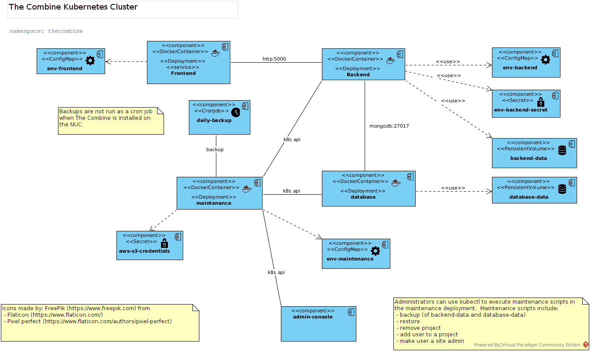
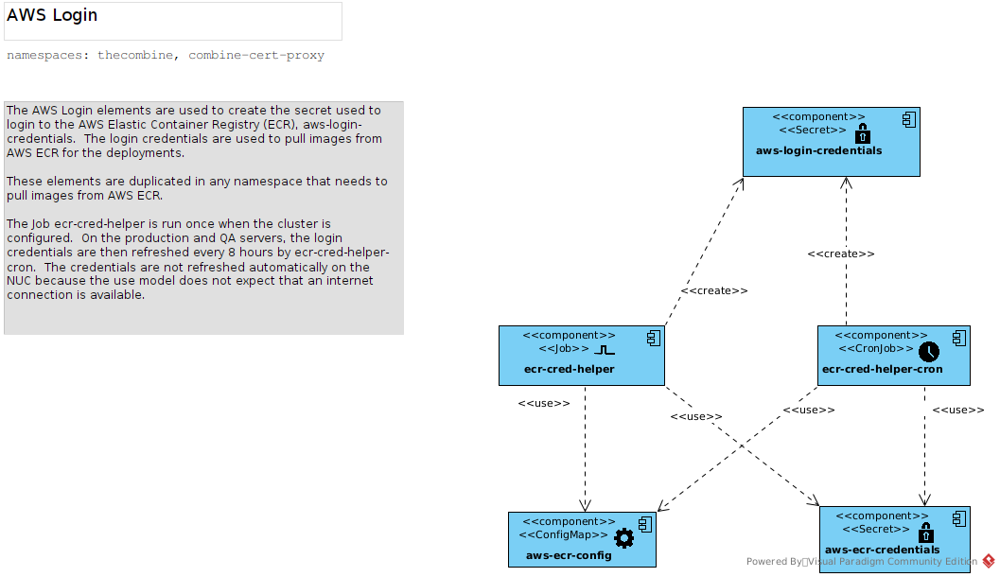
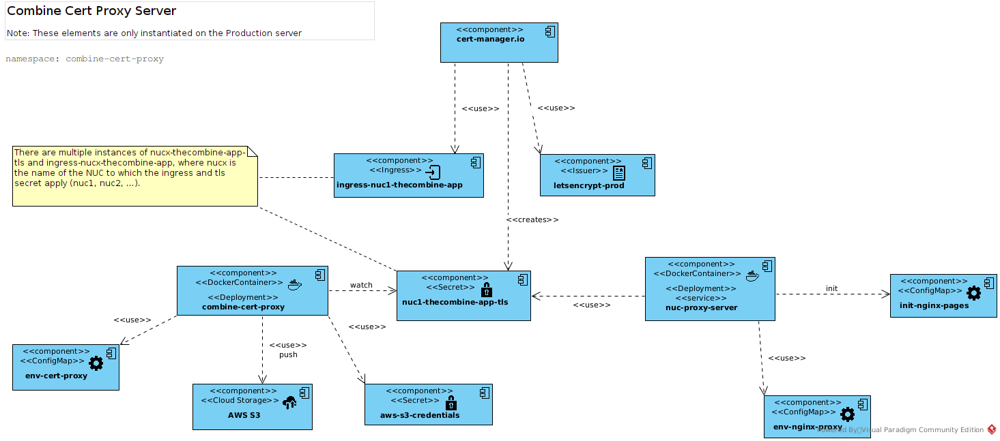
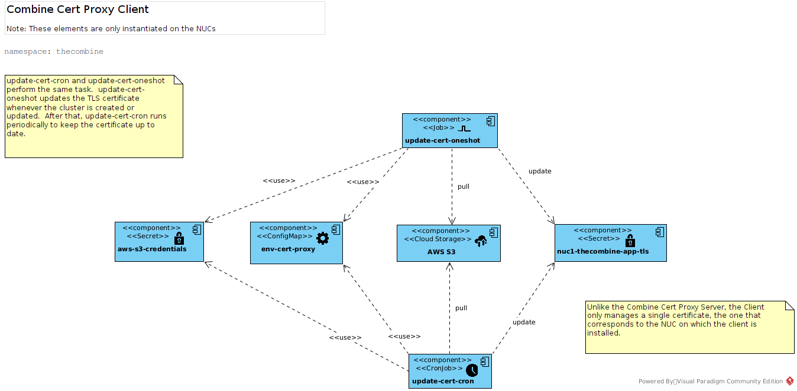

# _The Combine_ Production Cluster

## NUC Certificates in Kubernetes

This document describes the design for deploying _The Combine_ as part of a Kubernetes cluster in the following
environments:

1. Production server: _The Combine_ is run as a web application and is available to users from the Internet.
2. QA server: The latest version of _The Combine_ on the `master` branch is run on the internal network for QA testing.
3. NUC: _The Combine_ is run on an Intel NUC single-board computer so that it may be used in areas with poor or no
   internet access. _The Combine_ runs as a web application that is served over a WiFi access point created by the NUC.

## Application Architecture

The following diagram shows the architecture of _The Combine_ application when deployed in a Kubernetes cluster.

The main functionality of the application is performed by the frontend, backend, and database deployments.

### Frontend Deployment and Service

The frontend provides the static JavaScript web pages that provide the GUI for _The Combine_. There is also a Frontend
service that exposes port 80. The frontend does not accept secure connections when deployed in Kubernetes; A
[Kubernetes Ingress](https://kubernetes.io/docs/concepts/services-networking/ingress/) is created to terminate the SSL
traffic. What is not shown in the diagram is that an Ingress specification is created that uses
[Cert Manager](https://cert-manager.io/) to generate the certificate for the frontend from Let's Encrypt. The Ingress
controller uses this certificate to terminate the SSL.

The container image for the frontend is stored in AWS Elastic Container Registry (AWS ECR) in the `combine_frontend`
repository.

#### Additional Frontend Resources

| Resource     | Kind      | Description                                                         |
| ------------ | --------- | ------------------------------------------------------------------- |
| env-frontend | ConfigMap | Defines the runtime configuration for _The Combine_ User Interface. |

### Backend Deployment

The backend provides the API for the application's data model and persistent storage. It listens on port 5000 which is
not exposed outside the cluster. A Persistent Volume Claim, `backend-data`, provides the storage for files managed by
the backend such as audio recordings and avatar images.

The container image for the backend is stored in AWS Elastic Container Registry (AWS ECR) in the `combine_backend`
repository.

#### Additional Backend Resources

| Resource           | Kind                  | Description                                                                                                                                                                   |
| ------------------ | --------------------- | ----------------------------------------------------------------------------------------------------------------------------------------------------------------------------- |
| env-backend        | ConfigMap             | `env-backend` defines the runtime configuration for backend services.                                                                                                         |
| env-backend-secret | Secret                | `env-backend-secret` defines the sensitive runtime configuration items for the backend services                                                                               |
| backend-data       | PersistentVolumeClaim | `backend-data` defines the persistent storage requirements for the backend services. The persistent storage is used for the backend files stored in `/home/app/.CombineFiles` |

### Database Deployment

The database container provides _mongodb_ database services for the backend.

The container image is the official `mongo` image on _Docker Hub_.

#### Additional Database Resources

| Resource      | Kind                  | Description                                                                                                    |
| ------------- | --------------------- | -------------------------------------------------------------------------------------------------------------- |
| database-data | PersistentVolumeClaim | `database-data` defines the persistent storage required for the database services. It is mounted as `/data/db` |

### Maintenance Deployment

The maintenance deployment provides an instance of a configured `combine_maint` image that is running in the background.
This allows an administrator to use `kubectl exec` to create an interactive session to perform tasks such as
backup/restore _The Combine_ data, remove projects, add a user to a project, and make a user a site admin.

#### Additional Maintenance Resources

| Resource           | Kind      | Description                                                                                                                |
| ------------------ | --------- | -------------------------------------------------------------------------------------------------------------------------- |
| env-maintenance    | ConfigMap | `env-maintenance` defines the runtime configuration for maintenance tasks, such as which AWS S3 bucket to use for backups. |
| aws-s3-credentials | Secret    | `aws-s3-credentials` defines the access accounts and credentials to access the configures AWS S3 resources.                |

#### `combine_maint` Image

The `combine_maint` container image is stored in AWS ECR. It provides a number of utility and administrative functions
and is used in multiple scenarios. `combine_maint` is built off of `sillsdev/aws-kubectl` and has the following
features:

- _aws-cli ver. 2_ - version 2 of the AWS Command Line Interface (from `sillsdev/aws-kubectl`)
- _kubectl_ - a command line tool used by maintenance scripts to manage Kubernetes resources (from
  `sillsdev/aws-kubectl`)
- _Python 3_ - the maintenance scripts included in `combine_maint` are written in _Python_
- A collection of Maintenance Scripts:
  - `combine_backup.py` - create a compressed tarball of the backend files and database contents and push it to AWS S3
    storage
  - `combine_restore.py` - pull a backup from AWS S3 storage and replace the database and backend files with the
    contents of the backup
  - `combine-clean-aws.sh` - a `bash` script to cleanup old backups from AWS S3 storage
  - `combine-backup-job.sh` - a `bash` script to run the backup and then cleanup the S3 storage
  - `monitor.py` - monitor a set of TLS secrets for updates; when a secret is updated, it is pushed to AWS S3 storage
  - `update_cert.py` - a script to be used by the cert proxy clients on the NUCs. `update_cert.py` will update a TLS
    certificate if the NUC is connected to the internet and if the certificate is ready for renewal. If these conditions
    are met, it will update the certificate from AWS S3 storage.

### Daily Backup CronJob

On the production and QA servers, a `CronJob` is created to periodically backup _The Combine_ database and backend files
and push them to AWS S3 storage. The `daily-backup` cron job uses the `combine_maint` image and runs the
`combine-backup-job.sh` script when triggered.

#### Additional Daily Backup Resources

Although not explicitly shown in the diagram, the `daily-backup` uses the same `env-maintenance` and
`aws-s3-credentials` as the maintenance deployment.

## AWS Image Pull Secrets

The specialized Docker images that are used to deploy the combine, `combine_frontend`, `combine_backend`, and
`combine_maint`, are stored in AWS ECR. AWS ECR requires users/applications to generate login credentials to pull images
from AWS ECR; the credentials are valid for 12 hours. In order to accomodate this requirement, when the Kubernetes
resources are installed or reconfigured, the following jobs are created:

- `ecr-cred-helper` is a one-time Job that is run to create the `aws-login-credentials` Secret. The Secret type is
  `kubernetes.io/dockerconfigjson` and can be used by the deployments to pull the required images from AWS ECR.
- `ecr-cred-helper-cron` refreshes the `aws-logon-credentials` periodically. The current configuration refreshes them
  every 8 hours.

The reason that both a one-time Job and a CronJob is so that when the cluster is first created, the pull secrets are
available in start the deployments. If this were not the case, it may take up to 8 hours before the image can be pulled.

### AWS Image Pull Components

The following diagram shows the Kubernetes resources used to create the image pull secret for _The Combine_:

### Additional AWS Login Resources

| Resource            | Kind      | Description                                                                                                                                                                    |
| ------------------- | --------- | ------------------------------------------------------------------------------------------------------------------------------------------------------------------------------ |
| aws-ecr-config      | ConfigMap | `aws-ecr-config` defines the runtime configuration for AWS ECR logins.                                                                                                         |
| aws-ecr-credentials | Secret    | `aws-ecr-credentials` defines the access accounts and credentials to log in to the AWS ECR service. Note that these credentials may be different than the `aws-s3-credentials` |

## SSL Termination

In Kubernetes, an _Ingress_ and its _Ingress Controller_ manage traffic into the Cluster. In general, the Ingress is
used to terminate the SSL so that the application does not need to manage its own web certificates; all traffic to the
application is sent as `http` to port 80.

### SSL Termination for the NUC

When _The Combine_ is running on a NUC, it is not expected to have access to the internet and, if it is connected, it
will usually not be accessible from the internet. This means that it cannot reply to an HTTP01 challenge from the ACME
server. To solve this problem, there are two additional functions that are added:

- _Cert Proxy Server_ runs on a Kubernetes cluster that is accessible from the internet and it generates certificates on
  behalf of the NUCs. It runs in a separate namespace from _The Combine_ and runs independently. The _Cert Proxy Server_
  will generate the TLS Secrets for each of the configured NUCs and then push the secrets to an AWS S3 bucket where they
  can be retrieved by the NUCs
- _Cert Proxy Client_ runs on each NUC in the `thecombine` namespace. Like the _AWS Login_, there is a one-time job,
  `update-cert-oneshot`, and a cron job, `update-cert-cron` that keep the TLS secret up to date when the NUC has
  internet access.

### Cert Proxy Server

The design of the _Cert Proxy Server_ is shown in the following diagram:

The _Cert Proxy Server_ uses the Cert Manager from [cert-manager.io](https://cert-manager.io/) to generate the
certificates for the NUCs. The following resources are required to generate the certificates:

| Resource                    | Kind                | Description                                                                                                                                                                                                                                                                                             |
| --------------------------- | ------------------- | ------------------------------------------------------------------------------------------------------------------------------------------------------------------------------------------------------------------------------------------------------------------------------------------------------- |
| ingress-nuc1-thecombine-app | Ingress             | `ingress-nuc1-thecombine-app` is an Ingress that specifies the certificate issuer and the webserver to use for the HTTP01 challenges                                                                                                                                                                    |
| letsencrypt-prod            | Issuer              | `letsencrypt-prod` specifies that a certificate is to be issued by the Let's Encrypt production server and to enable the HTTP01 challenge provider.                                                                                                                                                     |
| nuc-proxy-server            | Deployment, Service | The `nuc-proxy-server` deployment runs the `nginx:1.21` image and provides the response for the HTTP01 challenge. In addition, it provides a web page to redirect the user when he/she attempts to navigate to a NUC's home page when connected to the internet instead of the NUC's WiFi Access Point. |
| env-nginx-proxy             | ConfigMap           | `env-nginx-proxy` provides configuration variables for the web server running in `nuc-proxy-server`.                                                                                                                                                                                                    |
| init-nginx-pages            | ConfigMap           | `init-nginx-pages` provides the web page content for the `nuc-proxy-server`.                                                                                                                                                                                                                            |
| nuc1-thecombine-app-tls     | Secret              | `nuc1-thecombine-app-tls` is the Secret (type `kubernetes.io/tls`) created by the _Cert Manager_.                                                                                                                                                                                                       |
| combine-cert-proxy          | Deployment          | The `combine-cert-proxy` deployment runs the `monitor.py` script in the `combine_maint` image. The `monitor.py` script watches all of the NUC secrets and if any secret changes, the new secret is pushed to AWS S3 storage.                                                                            |
| env-cert-proxy              | ConfigMap           | `env-cert-proxy` ConfigMap configures the certificate server for which certificates to create and the AWS S3 bucket where they are to be stored.                                                                                                                                                        |
| aws-s3-credentials          | Secret              | `aws-s3-credentials` defines the access accounts and credentials to access the configures AWS S3 resources.                                                                                                                                                                                             |

Note:

Only the resources for `nuc1` are listed (`ingress-nuc1-thecombine-app` and `nuc1-thecombine-app-tls`). There are
actually multiple Ingress and TLS Secret resources that are created, one for each NUC specified in `env-cert-proxy`

### Cert Proxy Client

The design of the _Cert Proxy Client_ is shown in the following diagram:

The _Cert Proxy Client_ uses the following resources to update the NUCs SSL Certificate from AWS S3 storage:

| Resource                | Kind      | Description                                                                                                                                                                                                                                                     |
| ----------------------- | --------- | --------------------------------------------------------------------------------------------------------------------------------------------------------------------------------------------------------------------------------------------------------------- |
| update-cert-oneshot     | Job       | A one-time job to create/update the TLS secret when the Cluster is created or updated. The job uses the `combine_maint` image and runs the `update_cert.py` script. (see the [combine_maint Image](#combine_maint-image) section)                               |
| update-cert-cron        | CronJob   | Performs the same task as `update-cert-oneshot` on a regular schedule.                                                                                                                                                                                          |
| env-cert-proxy          | ConfigMap | `env-cert-proxy` defines the configuration environment variables for the `update-cert-oneshot` and `update-cert-cron`. They include the location of the AWS S3 bucket where the certificates are stored as well as details about the certificate to be checked. |
| aws-s3-credentials      | Secret    | `aws-s3-credentials` defines the access accounts and credentials to access the configures AWS S3 resources.                                                                                                                                                     |
| nuc1-thecombine-app-tls | Secret    | `nuc1-thecombine-app-tls` is a `kubernetes.io/tls` secret that is created by `update-cert-oneshot` and `update-cert-cron` from the data stored in the AWS S3 bucket.                                                                                            |

## Service Accounts

Three specialized service accounts are created to control the access to Kubernetes resources. Resources that are not
listed here use the default service account for the namespace where they run.

### Service Account: `account-ecr-login`

The `account-ecr-login` account is used by the `ecr-cred-helper` and `ecr-cred-helper-cron` resources. The
`account-ecr-login` has the following access to Kubernetes resources:

| Resources                             | Abilities                                       |
| ------------------------------------- | ----------------------------------------------- |
| pods, pods/attach                     | list, get, watch, create, update, patch         |
| secrets, jobs, cronjobs, namespaces\* | list, get, watch, create, update, patch, delete |
| serviceaccounts                       | list, get, update, patch                        |

[*] - abilities to access `namespaces` are not allowed on the Production server.

### Service Account: `account-maintenance`

The `account-maintenance` account is used by the `maintenance`, `daily-backup`, `update-cert-oneshot`,
`update-cert-cron` resources. The `account-maintenance` has the following access to Kubernetes resources:

| Resource        | Permissions                                     |
| --------------- | ----------------------------------------------- |
| pods, pods/exec | list, get, watch, create, update, patch, delete |
| secrets         | list, get, watch                                |
| deployments     | list, get, watch, update                        |

### Service Account: `account-tls-secret`

The `account-tls-secret` account is used by the `combine-cert-proxy` resource. The `account-tls-secret` has the
following access to Kubernetes resources:

| Resource                 | Permissions                                     |
| ------------------------ | ----------------------------------------------- |
| pods, pods/exec, secrets | list, get, watch, create, update, patch, delete |
