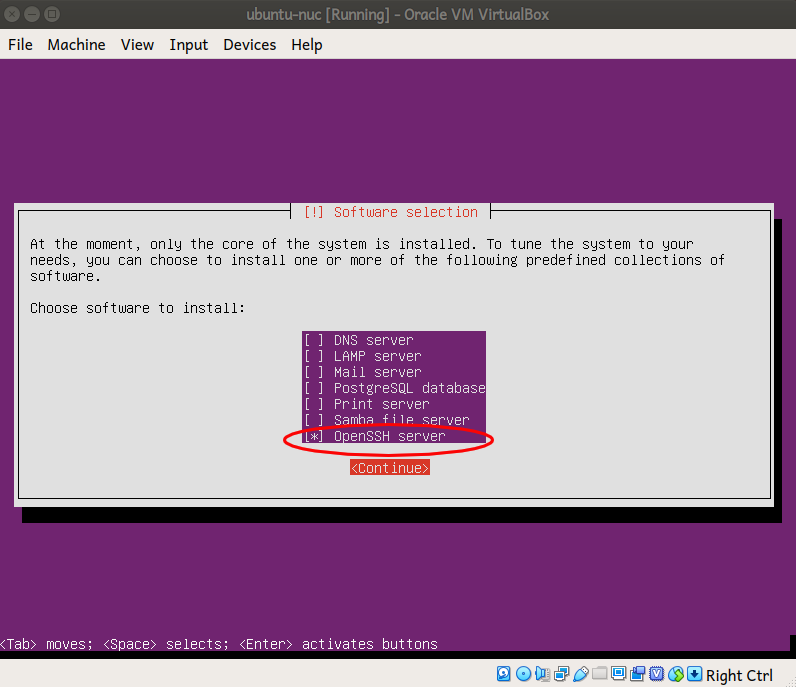

# Deploy *TheCombine* In Docker Containers

This document describes how to deploy *TheCombine* to a target machine in Docker
containers.  This method will replace the initial method of installing
*TheCombine* directly on the target machine.

## Contact Information

<table>
<tr>
 <td>Process Owner:</td><td>Jim Grady</td>
</tr>
<tr>
 <td>Email:</td><td>jimgrady.jg@gmail.com</td>
</tr>
</table>

## Conventions

  * most of the commands described in this document are to be run from within
    the <tt>git</tt> repository for *TheCombine* that has been cloned on the
    host machine.  This directory shall referred to as \<COMBINE\>.
  * the target machine where *TheCombine* is being installed will be referred
    to as *\<target\>*
  * the user on the target machine that will be used for installing docker, etc.
    will be referred to as *\<target_user\>*.  You must be able to login to
    *\<target\>* as *\<target_user\>* and *\<target_user\>* must have `sudo`
    privileges.

## Contents
1. [Step-by-step Instructions](#step-by-step-instructions)
   1. [Prepare your host system](#prepare-your-host-system)
      1. [Linux Host](#linux-host)
      2. [Windows Host](#windows-host)
   2. [Installing and Running *TheCombine*](#installing-and-running-thecombine)
      1. [Creating Your Own Inventory File](#creating-your-own-inventory-file)

## Step-by-step Instructions
This section gives you step-by-step instructions for installing *The Combine*
on a new NUC/PC with links to more detailed information.  The instructions
assume that the target system already has Ubuntu Server 18.04 installed and
is accessible via `ssh`.

### Prepare your host system
#### Linux Host

Install the following components:
 * Ubuntu 18.04 (Desktop or Server), 64-bit
 * Git
 * [Ansible](https://docs.ansible.com/ansible/latest/installation_guide/intro_installation.html#latest-releases-via-apt-ubuntu)
 * clone the project  repo:
   ```
   git clone --recurse-submodules https://github.com/sillsdev/TheCombine
   ```
 * if you do not have an ssh key pair, create one using:
   ```
   ssh-keygen
   ```
 * copy your ssh id to the target system using:
   ```
   ssh-copy-id <target_user>@<target>
   ```

#### Windows host
The scripts for installing TheCombine use *Ansible* to manage an installation of
*TheCombine*.  *Ansible* is not available for Windows but will run in the
Windows Subsystem for Linux (WSL).  Microsoft has instructions for installing
WSL on Windows 10 at [Windows Subsystem for Linux Installation Guide for Windows
10](https://docs.microsoft.com/en-us/windows/wsl/install-win10).  At the end of
the instructions there are instructions for installing various Linux images
including Ubuntu 18.04.

Once Ubuntu is installed, run the Ubuntu subsystem and follow the instructions
for the [Linux Host](#linux-host)

### Installing and Running *TheCombine*

To install and start up *TheCombine* you will need to run the following Ansible
playbooks.  Each time you will be prompted for passwords:
 * `BECOME password` - enter your `sudo` password for the *\<target_user\>*
   on the *\<target\>* machine.
 * `Vault password` - some of the Ansible variable files are encrypted in
   Ansible vaults.  See the current process owner (above) for the Vault password.

#### Install Combine Pre-requisites

Run the first playbook to install all the packages that are needed by *TheCombine*:
```
cd <COMBINE>/docker_deploy
ansible-playbook playbook_docker.yml --limit <target> -u <target_user> -K --ask-vault-pass
```

Notes:
- Do not add the `-K` option if you do not need to enter your password to
  run `sudo` commands
- The *\<target\>* must be listed in the hosts.yml file (in
  \<COMBINE\>/docker_deploy).  If it is not, then you need to create your
  own inventory file (see [below](#creating-your-own-inventory-file)).

#### Install *TheCombine*

Run the second playbook to configure the docker containers and start them up:
```
ansible-playbook playbook_publish.yml --limit <target> -u combine --ask-vault-pass
```

 #### Creating Your Own Inventory File

 You can create your own inventory file to enable Ansible to install the combine
 on a target that is not listed in the hosts.yml inventory file or if you want
 to override a variable that is used to configure the target.

 To use your own inventory file:
  * have the filename match the pattern *.hosts.yml, e.g. dev.hosts.yml, or save
    it in a directory that is not in the combine source tree;
  * use hosts.yml as a model.  The host will need to be in the `server` or the
    `qa` group presently.  Machines in the `qa` group will use a self-signed
    certificate; machines in the `server` group will get a certificate from
    letsencrypt and must be reachable from the internet.
  * define the following variables:
     - combine_server_name:
     - config_captcha_required:
     - config_captcha_sitekey:

    config_captcha_required should be "true" or "false" (including the quotes);
    if it is "false", config_captcha_sitekey can be an empty string.
  * add any variables whose default value you want to override.  In particular,
    `combine_source_version` specifies the branch in the git repository to be
    checked out when the project is deployed.
  * to use the custom inventory file, add the following option to the
    ansible-playbook commands above: `-i custom-inventory.yml` where
    `custom-inventory.yml` is the name of the inventory file that you created.

  See the Ansible documentation,
  [Build Your Inventory](https://docs.ansible.com/ansible/latest/network/getting_started/first_inventory.html)
  for more information on inventory files.

# Design
*TheCombine* is deployed to target systems using Ansible.  When deploying in
Docker containers, `docker-compose` is used to manage the containers that make
up *TheCombine*.  The following files are used to define the containers and
their dependencies:
  * ./docker-compose.yml
  * ./Dockerfile
  * ./Backend/Dockerfile
  * ./.env.backend
With these files, we can use `docker-compose` to startup *TheCombine* in the
development environment (see the project top-level README.md).

For production, we take advantage of the `docker-compose` feature that lets us
specify multiple docker-compose files.  In this case, the development
`./docker-compose.yml` is the first docker-compose file and the subsequent files
override or augment the configurations in the base file.  Ansible is used to
generate the override docker-compose files that are tailored to the specific
target.

There are two Ansible playbooks that are used to perform this task.

## playbook_docker.yml

`playbook_docker.yml` is the first playbook that needs to be run.  It sets up
the docker environment and it only needs to be run once.  When running this
playbook, it needs to be run as a user on the target system that can be elevated
to `root` privileges.  It needs to be run once at initial setup and if ever the
playbook or its roles change.

`playbook_docker.yml` does the following:
  1. Install Ansible dependencies to allow subsequent playbooks
  2. Install the docker subsystem.  This includes
     1. install docker prerequisite packages
     2. setup docker package repository
     3. install Docker Engine
     4. install Docker Compose (including a link from `/usr/bin` to the
        executable)
  3. Create a combine user - the combine user will be used for installing,
     building and running *TheCombine*.  The default user name is `combine`.
     1. Create the primary group for `combine`
     2. Create the `combine` user:
        1. primary group is the group created above
        2. `combine` user is also added to the `docker` group
        3. ssh key is generated
     3. current user, that is, the host user running the playbook, is added as
        an authorized user for `combine`.  This will allow running the next
        playbook as `combine`.

## playbook_publish.yml

`playbook_publish.yml` publishes *TheCombine* on the machine that was prepared
with the `playbook_docker.yml` playbook.  This playbook needs to be run whenever
*TheCombine* software is updated.  It will be run as the `combine` user.

`playbook_publish.yml` does the following:
  1. install *TheCombine* source files from the *GitHub* repository.  It will
     install the `master` branch unless the `combine_source_version` variable
     specifies a different branch.  The source files are installed in `/home/combine/src/combine`.
  2. configure the docker containers for the *\<target\>* system:
     1. creates the `docker-compose.prod.yml` file to override specific
        defaults in `docker-compose.yml`.
     2. creates the `.env.backend` file that specifies the environment variables
        needed by the backend container.
     3. builds the containers using `docker-compose`
  3. installs the admin user for the `TheCombine`
     1. creates the `docker-compose.init.yml` file which sets the backend
        initialization entry point and adds an environment variable file to
        include the admin password specification
     2. creates `.env.backend.init` to specify required initialization
        environment variables
     3. runs the initialization using `docker-compose`
  4. starts the containers using `docker-compose`
  5. installs shortcuts to make management of the containers easier.
     The shortcuts are bash aliases:
     <table>
       <tr><th>Alias Name</th><th>Function</th></tr>
       <tr><td>combine-build</td><td>rebuild the containers</td></tr>
       <tr><td>combine-down</td><td>stop and remove running containers</td></tr>
       <tr><td>combine-logs</td><td>show the log files from the containers</td></tr>
       <tr><td>combine-up</td><td>start <i>TheCombine</i></td></tr>
     </table>
     The shortcuts are useful for managing the production containers because
     for each command, you must specify the same docker compose files so that
     the correct containers are affected.

# Additional Details

## Install Ubuntu Bionic Server

To install the OS on a new target machine, such as, a new NUC, follow these steps:

  1. Download the ISO image for Ubuntu Server from Ubuntu (currently at
     http://cdimage.ubuntu.com/releases/18.04.4/release/ubuntu-18.04.4-server-amd64.iso)

  1. copy the .iso file to a bootable USB stick:
     1. Ubuntu host: Use the *Startup Disk Creator*, or
     2. Windows host: follow the [tutorial](https://ubuntu.com/tutorials/tutorial-create-a-usb-stick-on-windows#1-overview)
        on ubuntu.com.

  1. Boot the PC from the bootable media and follow the installation instructions.
     In particular,
     1. You will want the installer to format the entire \[virtual\] disk.
        Using LVM is not recommended.

     1. *Make sure that you select the OpenSSH server when prompted to select the software for your server:*
  

  1. Update all packages:
     ```
     sudo apt update && sudo apt upgrade -y
     ```
  1. Reboot:
     ```
     sudo reboot
     ```

## Vault Password
The Ansible playbooks require that some of the variable files are encrypted.
When running one of the playbooks, you will need to provide the password for
the encrypted files.  The password can be provided by:
  1. entering the password when prompted.  Add the <tt>--ask-vault-pass</tt>
     option for <tt>ansible-playbook</tt> to be prompted for the password when
     it is required.
  2. specify a file that has the password.  Add the <tt>--vault-password-file</tt>
     option for <tt>ansible-playbook</tt> followed by the path of a file that holds
     the vault password.
  3. set the environment variable <tt>ANSIBLE_VAULT_PASSWORD_FILE</tt> to the
     path of a file that holds the vault password.  This prevents you from
     needing to provide the vault password whenever you run an ansible playbook,
     either directly or from within a script such as <tt>setup-nuc.sh</tt>.

  If you use a file to hold the vault password, then:
  - *Make sure that you are the only one with read permission for the password file!*
  - *Make sure that the password file is not tracked in the git repository!*

  For example, use hidden file in your home directory, such as
  <tt>$HOME/.ansible-vault</tt>, with mode of <tt>0600</tt>.

## Updating Packages
Currently, `docker-compose` is not managed by an *Ubuntu* software repository and
the software version is specified in the command that fetches the software from
the source repository.  To make managing software versions easier,
`./docker_deploy/vars/packages.yml` has been created to specify the software
version of `docker-compose` and similar packages.  To update the version of
one of these packages, update the version in this file and re-run the specified
playbook.
