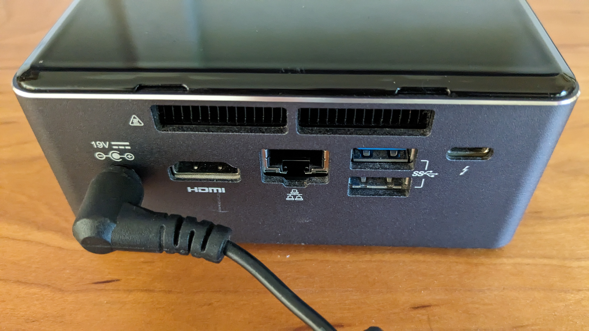
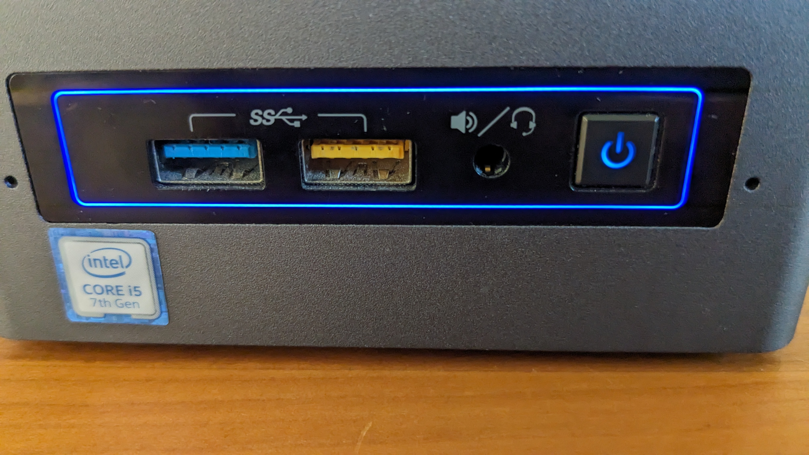
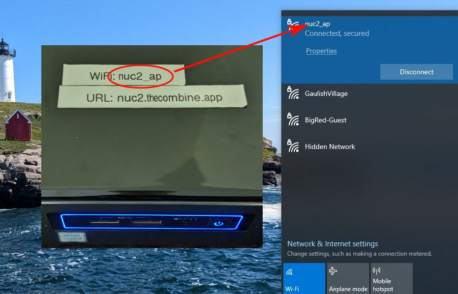
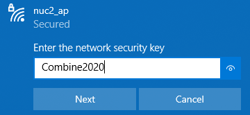

# Instructions For Using _The Combine_ on an Intel NUC

_The Combine_ can be installed on a small, portable computer, such as an _Intel NUC_, for use in areas with poor or no
internet connection. The NUC is configured to create a WiFi Access Point for access to _The Combine_ that is installed
on the NUC. This document provides instructions for how to connect to the NUC and start using _The Combine_.

## 1. Power On

### Connect Power

Connect the NUC to AC power by plugging the AC adapter into your power source and into the connector on the back of the
NUC. 

### Turn on Power

Press the Power On button on the top (or front on some models) of the NUC. The light in the power button will turn blue
as the device starts up. Start up will be complete in approximately 30 seconds and you will be ready to connect to _The
Combine_ (next step). 

Note that while the NUC is running, the yellow "disk activity light" will flash. This is normal.

## 2. Connect to WiFi Access Point

When the NUC powers up, it creates a WiFi access point. The name of the access point is labeled "WiFi" on the top of the
NUC. Setup the WiFi network for your PC/Phone/Tablet to connect to this wireless network:

When prompted, enter the WiFi Passphrase, `Combine2020`:

## 3. Open _The Combine_

Open a web browser and navigate to the URL printed on the label on the top of the NUC:

The opening page for _The Combine_ will be displayed with a link to the _User Guide_ which explains how to use _The
Combine_ 

## 4. Power Off

When all the users are done using _The Combine_, power off the NUC by pressing the power button once. **_When the power
button is pressed, the NUC will start to shutdown immediately. There will be no request for confirmation._** When the
shutdown is complete, the light in the power button will turn off or turn orange, depending on the model of NUC being
used. At this point, you may unplug the NUC from the AC power.

Note that while you are using _The Combine_ your data are automatically stored in the database; there is no need to save
your work before shutting down the NUC.
