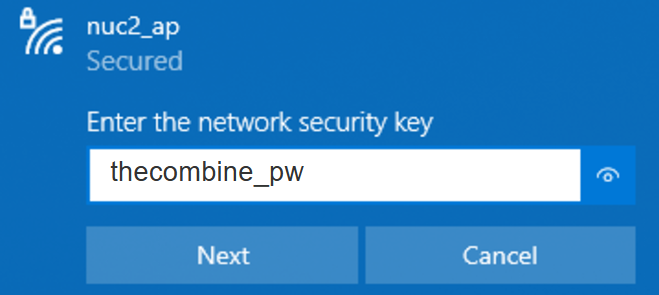

# Instructions For Using _The Combine_ on an Intel NUC

_The Combine_ can be installed on a small, portable computer, such as an _Intel NUC_, for use in areas with poor or no
internet connection. The NUC is configured to create a WiFi Access Point for access to _The Combine_ that is installed
on the NUC. This documents provides instructions for how to connect to the NUC and start using _The Combine_.

## 1. Power On

### Connect Power

Connect the AC adapter to the connect on the back of the NUC. 

### Turn on Power

Press the Power On button on the top (or front on some models) of the NUC. The light in the power button will turn blue
and _The Combine_ will be up in approximately 30 seconds. 

## 3. Connect to WiFi Access Point

When the NUC powers up, it creates a WiFi access point. The name of the access point is labeled "WiFi" on the top of the
NUC. Setup the WiFi network for your PC/Phone/Tablet to connect to this wireless network:

When prompted, enter the WiFi Passphrase, `Combine2020`:

## 4. Open _The Combine_

Open a web browser and navigate to the URL printed on the label on the top of the NUC:

The opening page for _The Combine_ will be displayed with a for the _User Guide_ which explains how to use _The Combine_

## 5. Power Off

When all the users are done using _The Combine_, you can power off the NUC by pressing the power button again. The light
in the power button will turn off or turn orange, depending on the model of NUC being used.

**_When the power button is pressed, the NUC will shutdown immediately. There will be no request for confirmation._**
