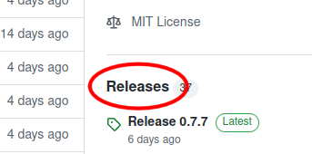
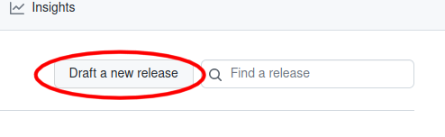
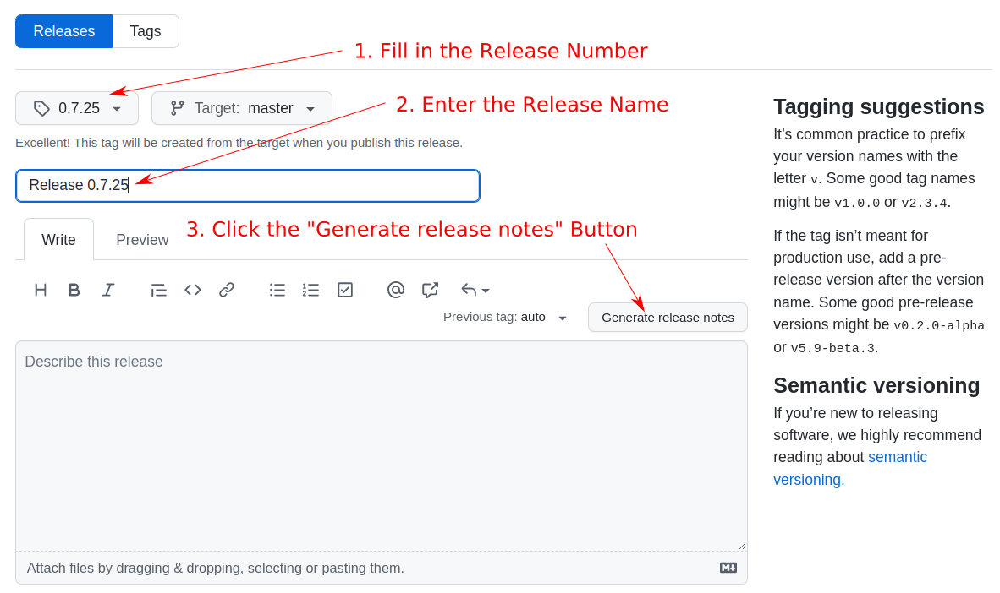
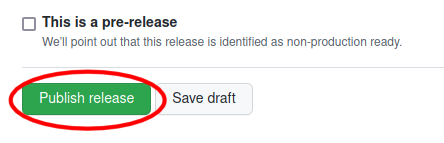

# Combine Release Process

This document defines the process for releasing a new software version of _The Combine_.

## Assumptions

The release process has the following assumptions:

- release versions follow [semantic versioning](https://semver.org/); that is, they have the form major.minor.patch
  version numbers where `major`, `minor`, and `patch` are all integer values. See the page on semantic versioning for
  instructions on when the major, minor, and patch version number should be incremented when a new version is released.
- the user has setup his/her Python environment according to the directions in the project
  [README](https://github.com/sillsdev/TheCombine/blob/master/README.md#python) file.
- the user has write permissions for _The Combine_ project on _GitHub_.

## Release Steps

### 1. Create a PR to Set the Release Version

1. Clone the project.
2. Edit `./package.json` and update the project version number to the version to be released.
3. Save the file and run `npm install`.
4. Commit the new versions of `./package.json` and `./package-lock.json` to a new branch.
5. Publish the new branch to _GitHub_ and create a PR to merge the changes to the `master` branch.

### 2. Tag The `master` Branch With The New Release

Once the PR has been approved and merged into `master`, you can create the release on _GitHub_ as follows:

1. Click on the _Releases_ link on the project home page. The link is in the right side-pane:

   

2. Click the _Draft a new release_ button at the top right of the _Releases_ page:

   

3. Fill out the form for the new release:

   

   1. Click the _Choose a tag_ dropdown menu; select _Find or create a new tag_; and enter the new release version, e.g.
      `0.7.9`
   2. Fill in the _Release title_ with the title `Release` followed by the release number, e.g. `Release 0.7.9`.
   3. Fill in the release description.
      1. Add the line `Release x.y.z contains the following PRs:` substituting the release number for `x.y.z`, of
         course;
      2. Paste the list of PRs that have been commited since the last release. To get the list of PRs, do the following:
         1. Open a terminal window;
         2. `cd` to the project directory;
         3. Make sure that `master` is checked out and that the most recent changes have been pulled from _GitHub_;
         4. Start the Python virtual environment;
         5. Run `python scripts/mk_release.py`;
         6. Copy the script output to the clipboard (except for the _Bump Version_ PRs) and paste into the release
            description.

4. Press the _Publish Release_ button at the bottom of the page:

   

### 3. Merge the Release into `live`

When the release has been tagged:

1. checkout the `live` branch;
2. merge the release into the `live` branch - merge from the tagged version instead of the `master` branch to avoid
   including PRs that have been merged since the release was created;
3. commit the merge; and
4. push the changes to _GitHub_.

When the changes are pushed to _GitHub_, _TeamCity_ will build the new release and deploy it to the Live server.

### 4. Create a PR to Set the Next Development Version

Follow the steps in [Create a PR to Set the Release Version](#1-create-a-pr-to-set-the-release-version) to set the
version to the next development version. For example, if `0.7.9` was just released, the next development version will be
`0.7.10-alpha.0`.
