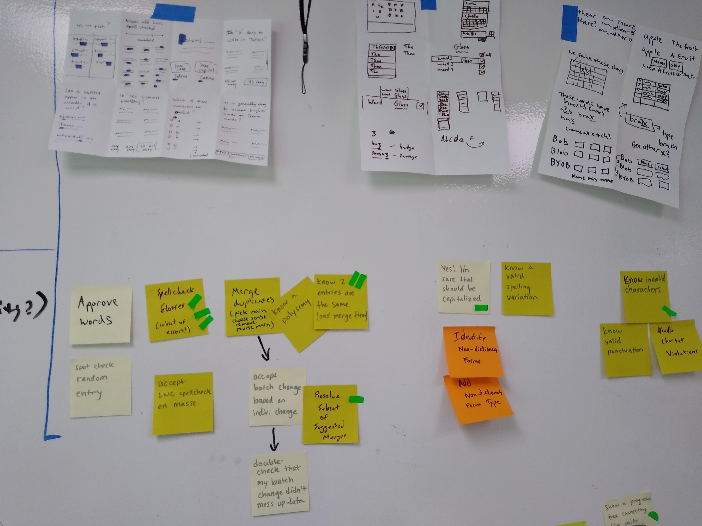
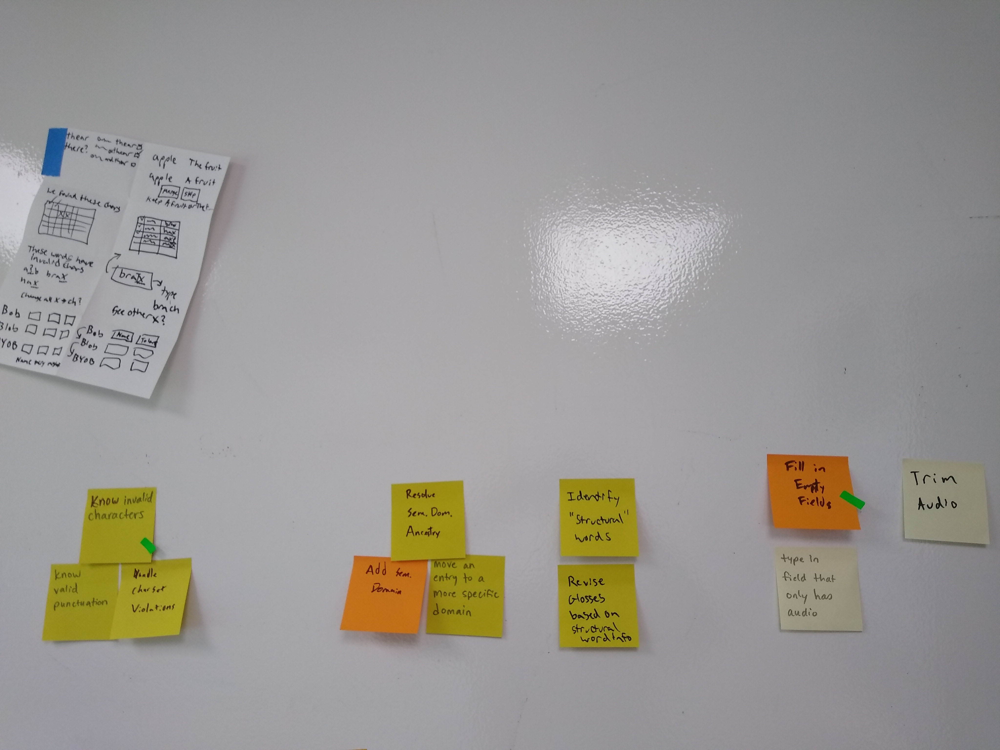
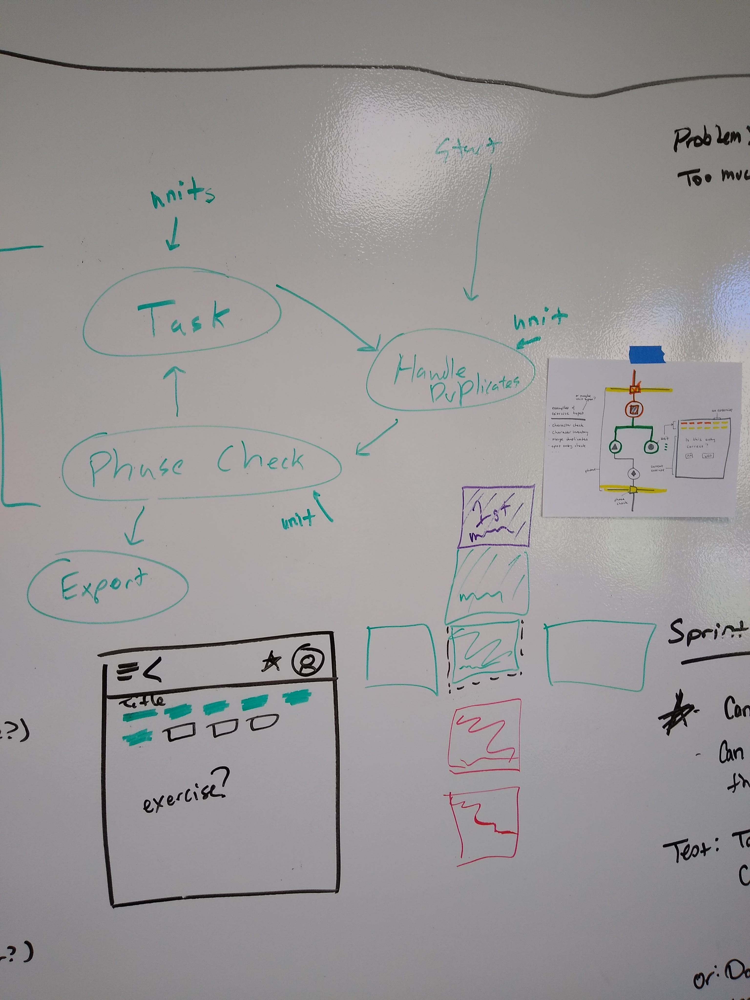
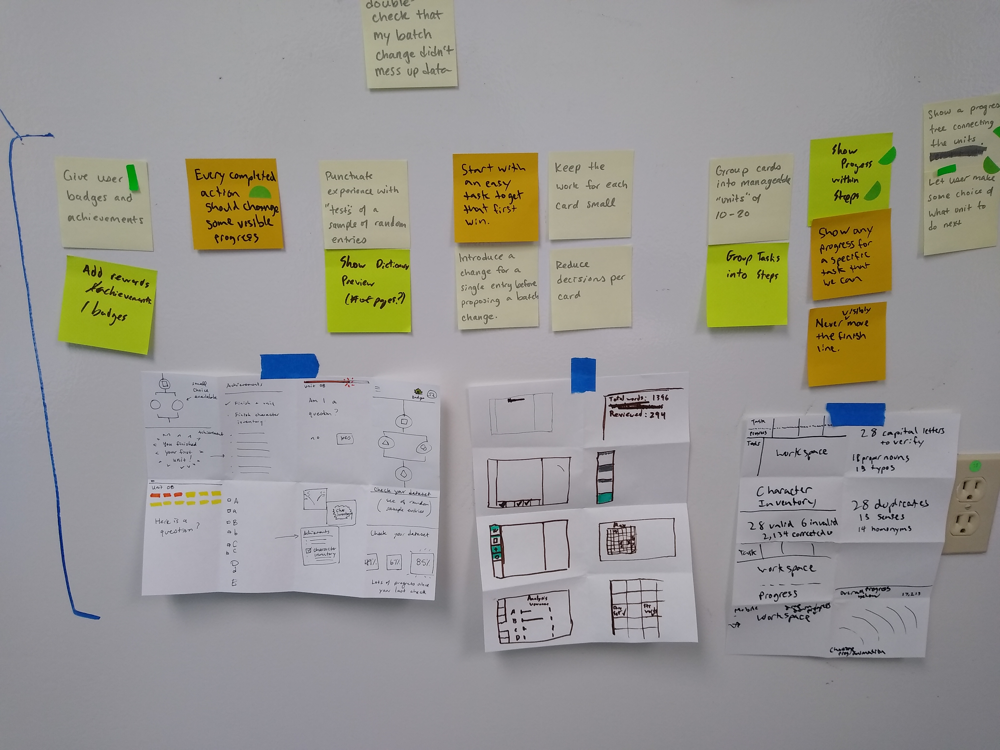
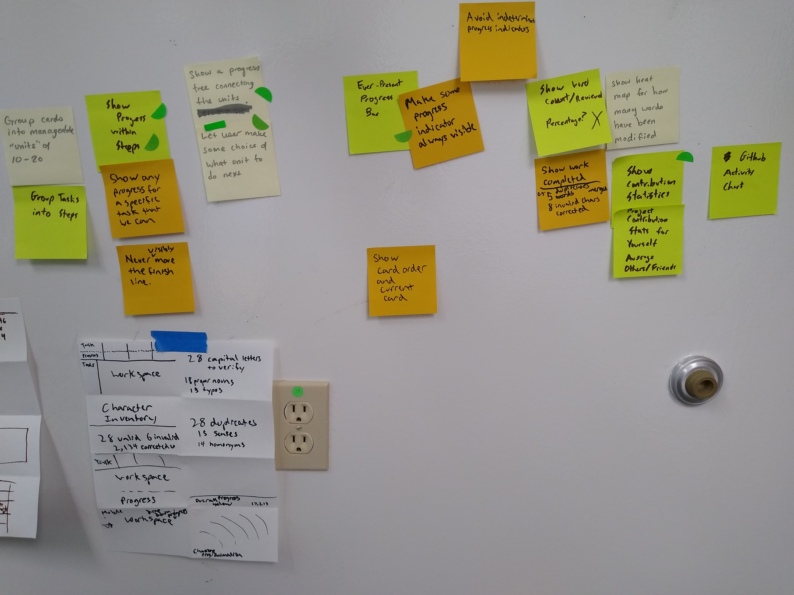

Questions:

- [Kinds of Cards](#units-and-exercises)
- [Order of Cards](#card-ordering)
- [Get More out of Each Card](#get-more-from-each-card)
- [Show Progress](#show-progress)
- [When to Stop](#when-to-stop)

## Tasks, Units and Exercises

The following cards are discrete actions we came up with. Included are some crazy-8s sketches we did.

 

We have broken cards into a hierarchy which helps facilitate workflow:

- `Tasks` represent broad, complex changes which affect the entire dataset.
- `Units` break tasks into discrete actions.
- `Exercises` accomplish tasks on manageable subsets of the complete dataset.

> As of 5-31, these categories have been renamed to `Tools`, `Goals` and `Steps`.

## Card Ordering

Our basic consensus for card ordering was this:

We break the workflow into distinct `tasks` that the cleaner may want to use the app to accomplish. At any point the
user can break out of the current task and switch into a new one, but we orient the UI to suggest they follow our
ordering and finish each task before moving on to the next.

Each `task` is broken down into `units`. The units are ordered within a task as such:

- An optional training unit to familiarize the user with the work they will do in that unit.
- The body of units which effect the desired change.
- Optionally merging any duplicates found in the database.
- An optional spot testing unit to evaluate the quality of the data corpus.

Within each `unit` are one or more `exercises` which break up the `unit` into manageably sized chunks of work.

The ordering within this structure will be simple to begin. If we have enough time, we can devote time to making more
complex orders based on:

- Better Workflow
- Qualitative Productivity
- Quantitative Productivity

Here is a collection of sketches that we took to get to that point. 

## Get More from Each Card

> Left for future consideration

## Show Progress

Below are the results of brainstorming for ways of showing progress to the user. These eventually led to the UI sketches
shown above.

 

## When to Stop

If a spot testing unit returns a score above a certain threshold, prompt the user to export his data.

Beyond that, the user has access to the export function at all times, but will never have it suggested.

<!-- TODO: (set export as final suggested task?) -->
