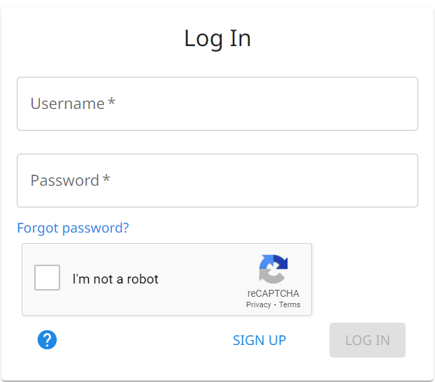
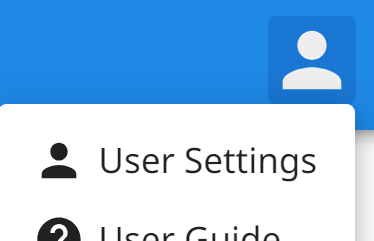

# Akun

Cara mendaftar, masuk, dan menyunting akun Anda.

{.center}

## Mendaftar

Untuk membuat akun baru, klik tombol [Daftar](../../signup) pada halaman Masuk.

!!! note "Catatan"

    Alamat email digunakan untuk mengatur ulang kata sandi Anda, sehingga hanya diperbolehkan satu akun per alamat email.

## Masuk

[Masuk](../../login) ke The Combine dengan nama pengguna dan kata sandi yang diberikan saat pendaftaran.

Jika Anda ingin mengubah kata sandi Anda, klik tautan "Lupa kata sandi?". Ikuti petunjuknya dan tautan pengaturan ulang
kata sandi akan dikirim ke alamat email yang terkait dengan akun Anda.

!!! warning "Penting"

    Nama pengguna dan alamat email **tidak** peka huruf besar-kecil. Kata sandi **peka** huruf besar-kecil.

## Pengaturan

Setelah masuk, terdapat Bilah Aplikasi berwarna biru di bagian atas The Combine. Klik ikon avatar di ujung kanan Bilah
Aplikasi untuk membuka Menu Pengguna. Pilih "Pengaturan Pengguna" untuk mengubah pengaturan akun/profil.

{.center}

Anda dapat menambahkan atau memperbarui:

- gambar avatar Anda;
- nama;
- nomor telepon;
- alamat email;
- bahasa antarmuka pengguna;
- saran ejaan arti singkat (tombol Hidup/Mati yang mengontrol saran ejaan pada bidang arti singkat di Pemasukan Data);
- persetujuan analitik.

!!! note "Catatan"

    Nama pengguna yang dipilih saat pendaftaran bersifat permanen dan tidak dapat diubah.
