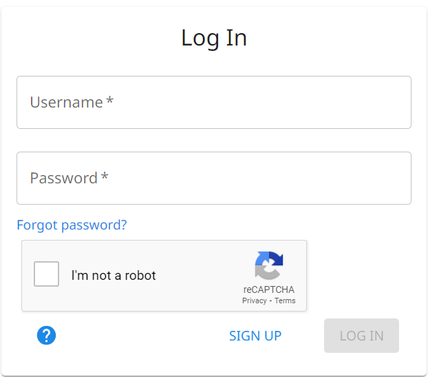
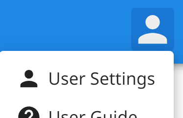

# Account

How to sign up, log in, and edit your account.

{.center}

## Sign Up

To create a new account, click the [Sign Up](../signup) button on the Login page.

!!! note "Note"

    The email address is used to reset your password, so there is only one account allowed per email address.

## Log In

[Log in](../login) to The Combine with the username and password given at registration.

If you want to change your password, click the "Forgot password?" link. Follow the instructions and a password-reset
will be sent to the email address associated with your account.

!!! warning "Important"

    The username and email address are **not** case-sensitive. The password **is** case-sensitive.

## Settings

After login, there is a blue App Bar along the top of The Combine. Click on the avatar icon at the right end of the App
Bar to open the User Menu. The User Menu contains links to "User Settings" and the "User Guide", and displays the
current version number at the bottom. Select "User Settings" to change account/profile settings.

{.center}

You can add or update your:

- avatar image;
- name;
- phone number;
- email address;
- user-interface language;
- gloss spelling suggestions (On/Off toggle that controls spelling suggestions in the Data Entry gloss field);
- analytics consent.

!!! note "Note"

    The username chosen at registration is permanent and cannot be changed.
