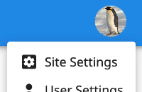
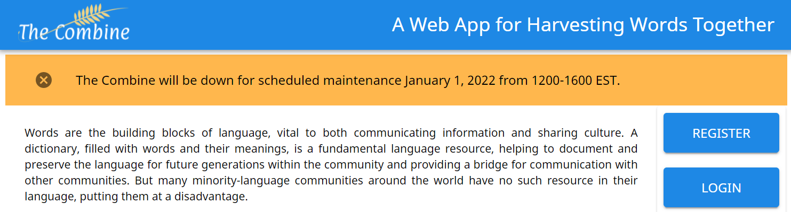
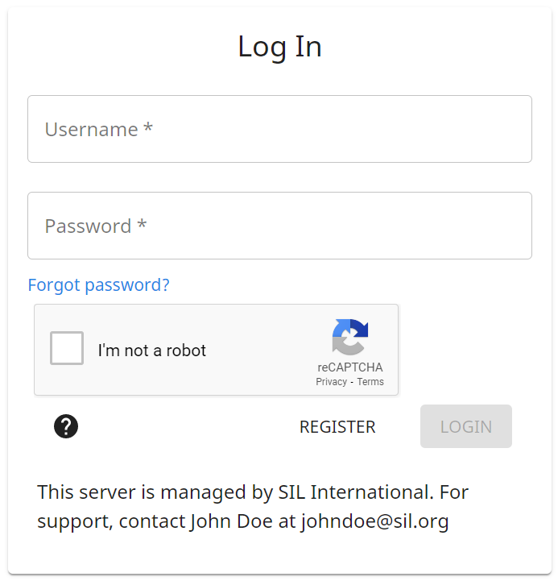

# Administrasi / Pengaturan Situs

Administrator situs memiliki satu opsi tambahan di Menu Pengguna: "Pengaturan Situs".

{.center}

## Manajemen Proyek

Administrator dapat mengekspor, mengarsipkan/memulihkan, atau mengelola pengguna untuk proyek mana pun.
Mengarsipkan proyek membuatnya tidak terlihat dan tidak dapat diakses oleh semua pengguna, bahkan pembuat proyek, tetapi administrator mana pun dapat memulihkan proyek tersebut.
Saat ini tidak ada cara untuk menghapus proyek secara permanen.
Tombol "Peran proyek" untuk setiap proyek membuka tampilan yang memungkinkan administrator mengelola peran pengguna proyek tersebut.

## Manajemen Pengguna

Administrator dapat menghapus akun pengguna non-administrator mana pun.
Untuk menambahkan atau menghapus pengguna administrator, silakan hubungi pemilik situs.

## Banner

Administrator dapat menyesuaikan instansi The Combine mereka melalui banner konfigurasi.

### Banner Pengumuman

Banner pengumuman menempatkan banner yang mencolok di bagian atas halaman ketika pengguna mengunjungi The Combine.
Banner ini dimaksudkan untuk menampilkan pesan penting jangka pendek kepada pengguna yang terkait dengan instansi The Combine.
Penggunaannya dapat mencakup peningkatan terjadwal, waktu henti yang direncanakan, atau perubahan peladen yang akan datang.

{.center}

### Banner Halaman Log Masuk

Banner halaman log masuk menempatkan pesan di bagian bawah halaman log masuk.
Banner ini dimaksudkan untuk memuat informasi khusus tentang instansi The Combine yang mungkin perlu diketahui pengguna, seperti siapa yang harus dihubungi terkait dukungan, peningkatan versi, atau kebijakan pencadangan basis data.

{width=400 .center}
