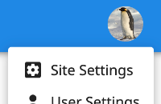
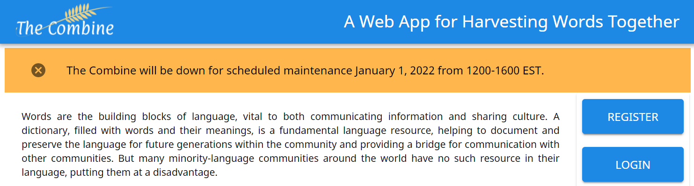
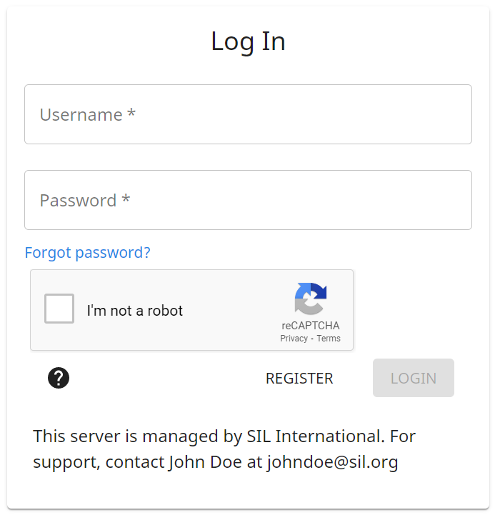

# Administration / Site Settings

Site administrators have one more option in the User Menu: "Site Settings".

{ .center }

## Project Managements

Administrators can export or archive/restore any project. Archiving a project makes it invisible and inaccessible to all
users, even the project creator, but any admin can restore the project. There is at present no way to permanently delete
a project.

## User Management

Administrators can delete any non-admin user account. To add or remove admin users, please contact the site owner.

## Banners

Administrators can customize their instance of The Combine by configuration banners.

### Announcement Banner

The announcement banner places a bright banner across the top of the page when users visit The Combine. These banners
are intended for displaying important, short-term messages to users related to the instance of The Combine. Uses could
include scheduled upgrades, planned down time, or upcoming server changes.

{ .center }

### Login Banner

The login banner places a message at the bottom of the login page. This banner is intended for including specific
information about an instance of The Combine that users may need to know, such as who to contact regarding support,
version upgrades, or database backup policies.

{ width=400 .center }
