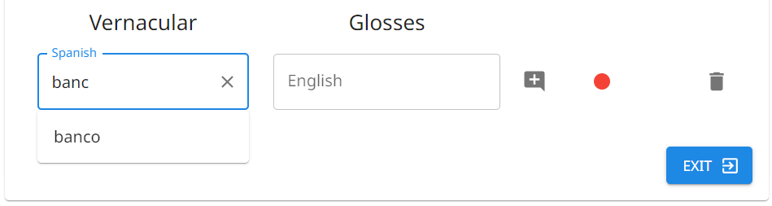
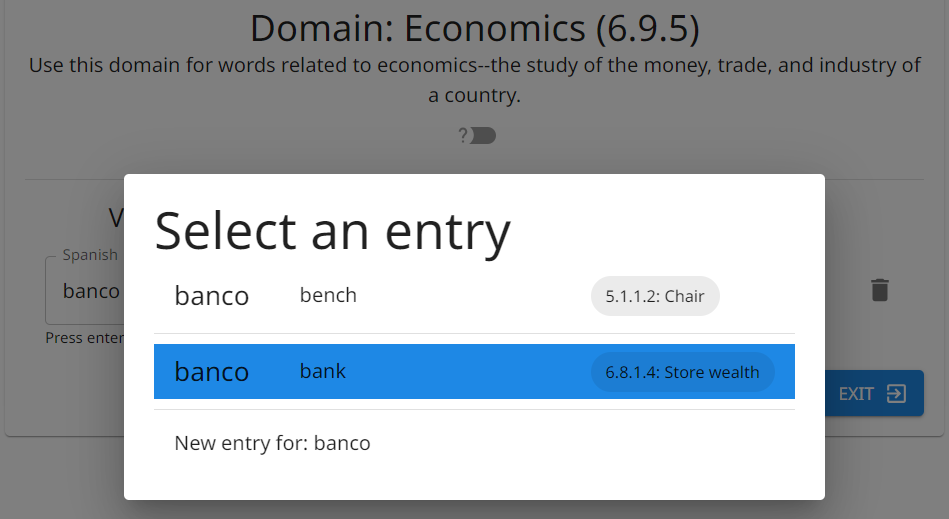

# Pemasukan Data

## Diagram Pohon Medan Makna

Ramban atau cari medan yang diminati.

!!! tip "Tips"

    Untuk mempercepat pencarian medan, The Combine akan secara otomatis menyisipkan `.` di antara digit-digit berurutan saat Anda mengetik.
    Contohnya, `1234` akan otomatis menjadi `1.2.3.4`.
    Perilaku ini tidak terjadi jika ada karakter non-numerik yang dimasukkan.

## Entri Baru

### Kata

Sebuah kata sebagaimana ditemukan dalam bahasa daerah, biasanya dieja secara fonetis atau dengan ortografi setempat.

### Arti Singkat

Meskipun sebuah entri dapat memiliki beberapa pengertian/arti singkat, hanya satu yang dapat ditambahkan saat entri pertama kali dibuat.

### Catatan

Anda dapat memiliki satu catatan pada setiap entri.
Setiap anotasi untuk pengertian, arti singkat, medan makna, dan lain-lain pada suatu entri dapat ditambahkan ke catatan entri tersebut.

### Perekaman

Anda dapat menambahkan beberapa rekaman pada satu entri (misalnya, suara pria dan suara wanita).
Seperti catatan, rekaman audio dikaitkan dengan entri dan bukan dengan pengertian individual.

Untuk merekam audio, terdapat tombol lingkaran merah.
Untuk setiap audio yang direkam, terdapat tombol segitiga hijau.

**Dengan tetikus:** Klik dan tahan lingkaran merah untuk merekam.
Klik segitiga hijau untuk memutar audionya, atau shift klik untuk menghapus rekamannya.

**Pada layar sentuh:** Tekan dan tahan lingkaran merah untuk merekam.
Ketuk segitiga hijau untuk memutar audionya, atau tekan dan tahan untuk memunculkan menu dengan opsi.

#### Menambahkan penutur pada rekaman audio

Klik ikon penutur pada batang atas untuk melihat daftar semua penutur yang tersedia dan pilih penutur saat ini.
Penutur ini akan secara otomatis dikaitkan dengan setiap rekaman audio sampai Anda log keluar atau memilih penutur yang berbeda.

Penutur yang dikaitkan dengan sebuah rekaman dapat dilihat dengan mengarahkan kursor ke atas ikon pemutarnya, yaitu segitiga hijau.
Untuk mengubah penutur suatu rekaman, klik kanan pada segitiga hijau (atau tekan dan tahan pada layar sentuh).

!!! note "Catatan"

    Audio yang diimpor tidak dapat dihapus atau ditambahkan penutur.

## Entri Baru dengan Bentuk Kata Duplikat {#new-entry-with-duplicate-vernacular-form}

Jika Anda mengirimkan entri baru dengan bentuk kata dan arti singkat yang identik dengan entri yang sudah ada, entri tersebut akan diperbarui alih-alih membuat entri baru.
Contohnya, jika Anda mengirimkan [Kata: dedo; Arti Singkat: finger] pada medan 2.1.3.1 (Lengan) dan lagi pada medan 2.1.3.3 (Jari, Jari Kaki), hasilnya adalah satu entri untuk "dedo" dengan satu pengertian yang memiliki arti singkat "finger" dan dua medan.

The Combine memiliki fitur opsional untuk memudahkan pemasukan kata yang sudah ada dalam proyek tetapi dikumpulkan kembali dalam medan makna baru.
Fitur ini dapat diaktifkan atau dinonaktifkan di [Pengaturan Proyek > Lengkapi otomatis](project.md#autocomplete).
Ketika pengaturan diaktifkan, saat Anda mengetik kata di Pemasukan Data, menu tarik-turun akan muncul dengan kata yang identik/mirip yang sudah ada sebagai entri dalam proyek.
Jika Anda melihat bahwa kata yang sedang Anda ketik sudah ada dalam proyek, Anda dapat mengklik kata tersebut pada daftar saran, alih-alih harus mengetik sisa kata itu.
Ketika pengaturan dinonaktifkan, kata harus diketik secara utuh; tidak ada potensi kecocokan yang akan disarankan.

{.center}

Baik Anda mengetik bentuk yang cocok dengan entri yang sudah ada dalam proyek maupun memilih salah satu saran yang ditawarkan The Combine, sebuah kotak akan muncul dengan pilihan.
(Kotak ini tidak akan muncul jika pengaturan Lengkapi otomatis dinonaktifkan atau jika Anda mengetik bentuk kata yang belum ada dalam proyek.)
Pada kotak sembul tersebut, Anda akan diperlihatkan semua entri yang sudah ada dengan bentuk kata tersebut dan dapat memilih apakah akan memperbarui salah satu dari entri tersebut atau membuat entri baru.

{.center}

Jika Anda memilih untuk membuat entri baru, kotak sembul akan ditutup, dan Anda kemudian dapat mengetik arti singkat untuk entri baru Anda.

!!! note "Catatan"

    Bahkan jika Anda memilih untuk membuat entri baru, jika arti singkat yang Anda ketik identik dengan arti singkat entri lain dengan bentuk kata yang sama, entri baru tidak akan dibuat, melainkan entri tersebut yang akan diperbarui.

Jika sebaliknya Anda memilih untuk memperbarui salah satu entri yang sudah ada, akan muncul opsi lebih lanjut untuk memperbarui pengertian yang sudah ada pada entri yang dipilih atau untuk menambahkan pengertian baru pada entri tersebut.
