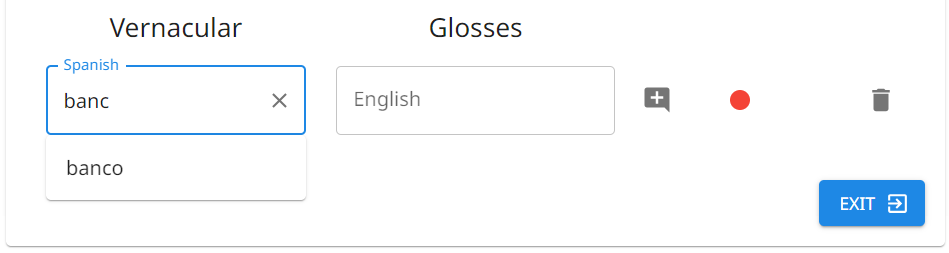
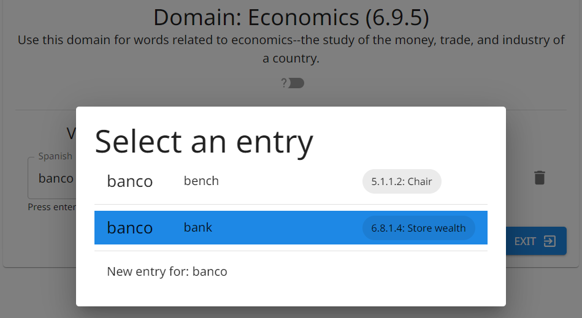
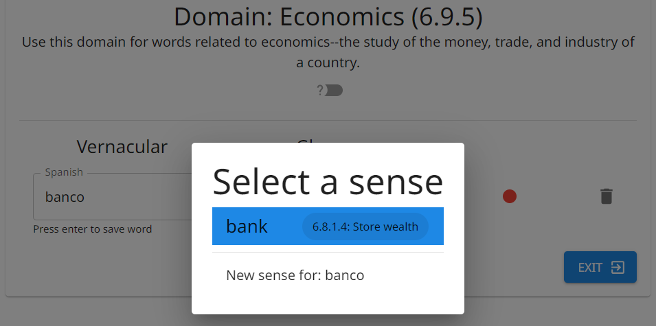

# Data Entry

## Semantic Domain Tree

Browse or search for the domain of interest.

!!! tip "Tip"

    To make searching for a domain quicker, The Combine will automatically insert `.` between consecutive digits as you
    type. For example, `1234` will automatically become `1.2.3.4`. This behavior does not happen if any non-numeric
    characters are entered.

## New Entry

### Vernacular

A word as found in the vernacular language, usually spelled either phonetically or with the local orthography.

### Gloss

While an entry can have multiple senses/glosses, only one can be added when the entry is first created.

### Note

You can have one note on each entry. Any annotation for an entry's senses, glosses, semantic domains, etc. can be added
to the entry's note.

### Recording

You can add multiple recordings to an entry (e.g., a male voice and a female voice). As with the note, audio recordings
are associated with the entry and not individual senses.

To record audio, there is a red circle button. For each recorded audio, there is a green triangle button.

**With a mouse:** Click-and-hold the red circle to record. Click a green triangle to play its audio, or shift click to
delete its recording.

**On a touch screen:** Press-and-hold the red circle to record. Tap a green triangle to play its audio, or
press-and-hold to bring up a menu with options.

#### Add a speaker to audio recordings

Click the speaker icon in the top bar to see a list of all available speakers and select the current speaker. This
speaker will be automatically associated with every audio recording until you log out or select a different speaker.

The speaker associated with a recording can be seen by hovering over its play icon, the green triangle. To change a
recording's speaker, right click the green triangle (or press-and-hold on a touch screen).

!!! note "Note"

    Imported audio cannot be deleted or have a speaker added.

## New Entry with Duplicate Vernacular Form {#new-entry-with-duplicate-vernacular-form}

If you submit a new entry with identical vernacular form and gloss to an existing entry, that entry will be updated
instead of a new entry created. For example, if you submit [Vernacular: dedo; Gloss: finger] in domain 2.1.3.1 (Arm) and
again in domain 2.1.3.3 (Finger, Toe), the result will be a single entry for "dedo" with a single sense that has gloss "finger"
and two domains.

The Combine has an optional feature to facilitate entry of words that already exist in the project but which are
collected again in a new semantic domain. This feature can be turned on or off in
[Project Settings > Autocomplete](project.md#autocomplete). When the setting is on, as you type the vernacular form in
Data Entry, a drop-down menu appears with identical/similar vernacular forms that already exist as entries in the
project. If you see that the word you are typing is already in the project, you can click on the word in the list of
suggestions, instead of having to typing the remainder of the word. When the setting is off, the vernacular word must be
typed in its entirety; no existing potential matches will be suggested.

{.center}

Whether you type a form that matches an existing entry in the project or select one of the suggestions offered by The
Combine, a box will pop up with options. (This box will not pop up if the Autocomplete setting is off or if you type a
vernacular form that does not yet exist in the project.) In the pop-up box, you will be shown all existing entries with
that vernacular form and can to choose whether to update one of those entries or create a new entry.

{.center}

If you choose to create a new entry, the pop-up box will close, and you can then type the gloss for your new entry.

!!! note "Note"

    Even if you selected to create a new entry, if the gloss you type is identical to a gloss of another entry with the same vernacular form, a new entry will not be created, but rather that entry will be updated.

If you instead choose to update one of the existing entries, more options will appear to update an existing sense on the
selected entry or to add a new sense to that entry.

{.center}
