# Pembersihan Data / Tujuan

## Tinjau Entri {#review-entries}

Tabel Tinjau Entri menampilkan semua entri dalam proyek yang dipilih.

### Kolom

Kolom-kolomnya adalah: Sunting (tanpa tajuk), Kata, Jumlah Pengertian (#), Arti Singkat, Medan, Ucapan
({width=28}), Catatan, Tanda
({width=16}), dan Hapus (tanpa tajuk).

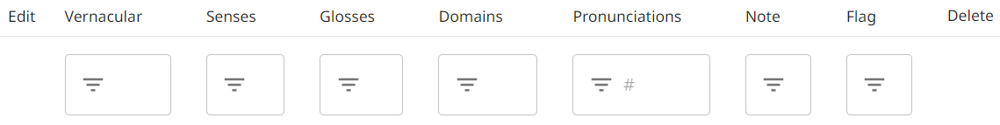

Untuk menampilkan/menyembunyikan kolom atau mengatur ulang urutannya, klik ikon
{width=25} di sudut atas.

Karena sifat Pengumpulan Kata Cepat (Rapid Word Collection), [Pemasukan Data](dataEntry.md) di The Combine tidak
mendukung penambahan definisi atau jenis kata. Namun, jika proyek telah mengimpor data yang di dalamnya sudah terdapat
definisi atau jenis kata, kolom tambahan akan tersedia dalam tabel Tinjau Entri.

#### Mengurutkan dan Menyaring

Terdapat ikon di bagian atas setiap kolom untuk
{width=20} menyaring dan
{width=20} mengurutkan data.

Pada kolom yang sebagian besar berisi teks (Kata, Arti Singkat, Catatan, atau Tanda), Anda dapat mengurutkan secara
alfabet atau menyaring dengan pencarian teks. Secara bawaan, pencarian teks bersifat pencocokan lunak: tidak membedakan
huruf besar-kecil dan mengizinkan satu atau dua kesalahan ketik. Jika Anda menginginkan pencocokan teks yang tepat,
gunakan tanda kutip di sekitar saringan Anda. Untuk menampilkan semua entri dengan teks tidak kosong di kolom tersebut,
ketik spasi sebagai saringan Anda.

Pada kolom Jumlah Pengertian atau kolom Ucapan, Anda dapat mengurutkan atau menyaring berdasarkan jumlah pengertian atau
rekaman yang dimiliki entri. Pada kolom Ucapan, Anda juga dapat menyaring berdasarkan nama penutur.

Pada kolom Medan, pengurutan dilakukan secara numerik berdasarkan id medan terkecil dari setiap entri. Untuk menyaring
berdasarkan medan, ketik id medan dengan atau tanpa titik. Sebagai contoh, "8111" dan "8.1.1.1" keduanya menampilkan
semua entri dengan pengertian pada medan 8.1.1.1. Untuk juga menyertakan submedan, tambahkan titik akhir pada saringan
Anda. Sebagai contoh, "8111." mencakup medan "8.1.1.1", "8.1.1.1.1", dan "8.1.1.1.2". Saring hanya dengan titik (".")
untuk menampilkan semua entri dengan medan makna apa pun.

### Menyunting Baris Entri

Anda dapat merekam, memutar, atau menghapus rekaman audio suatu entri menggunakan ikon di kolom Ucapan
({width=28}).

Anda dapat mengubah tanda pada entri dengan mengklik ikon
{width=16} di kolom Tanda.

Untuk menyunting bagian lain dari entri, klik ikon
{width=20} sunting di kolom awal.

Anda dapat menghapus seluruh entri dengan mengklik ikon
{width=20} hapus di kolom akhir.

!!! note "Catatan"

    Jika seorang Administrator proyek telah mengaktifkan pengaturan [Harvester Review Entries](project.md#harvester-review-entries), Pengumpul juga dapat menggunakan Tinjau Entri.
    Pengumpul dapat memperbarui rekaman audio dan tanda, tetapi kolom Sunting dan Hapus tidak tersedia untuk mereka.

## Gabungkan Duplikat {#merge-duplicates}

Alat ini secara otomatis menemukan kumpulan entri yang berpotensi duplikat (hingga 5 entri dalam setiap kumpulan, dan
hingga 12 kumpulan dalam setiap putaran). Pertama-tama, alat ini menyajikan kumpulan kata dengan bentuk bahasa daerah
yang identik. Kemudian menyajikan kumpulan dengan bentuk bahasa daerah yang mirip atau arti singkat (atau definisi) yang
identik.

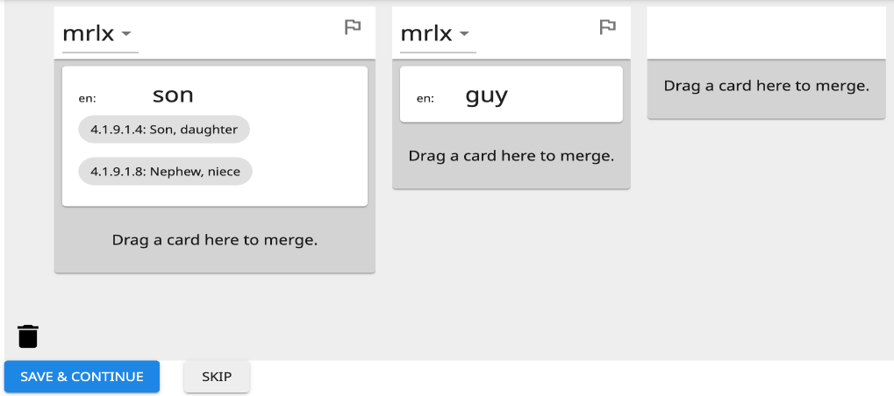

Setiap entri ditampilkan dalam satu kolom, dan setiap pengertian dari entri tersebut ditampilkan sebagai kartu yang
dapat Anda klik-dan-seret. Ada tiga hal dasar yang dapat Anda lakukan dengan pengertian: memindahkannya,
menggabungkannya dengan pengertian lain, atau menghapusnya.

### Memindahkan Pengertian

Ketika Anda mengklik-dan-menahan kartu pengertian, kartu tersebut berubah menjadi hijau. Anda dapat menyeret-dan-melepas
kartu pengertian ke tempat yang berbeda dalam kolom yang sama untuk mengatur ulang pengertian dari entri tersebut. Atau
Anda dapat menyeret-dan-melepas kartu pengertian ke kolom yang berbeda untuk memindahkan pengertian ke entri lain
tersebut.

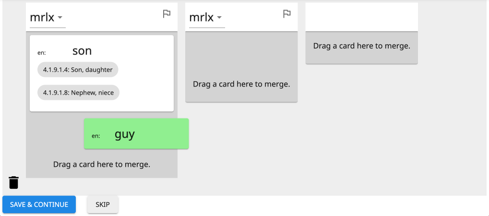

Jika Anda ingin memecah entri dengan banyak pengertian menjadi beberapa entri, Anda dapat menyeret salah satu kartu
pengertian ke dalam kolom tambahan kosong di sebelah kanan.

### Menggabungkan Pengertian

Jika Anda menyeret kartu pengertian di atas kartu pengertian lain, kartu pengertian yang lain juga berubah menjadi
hijau.

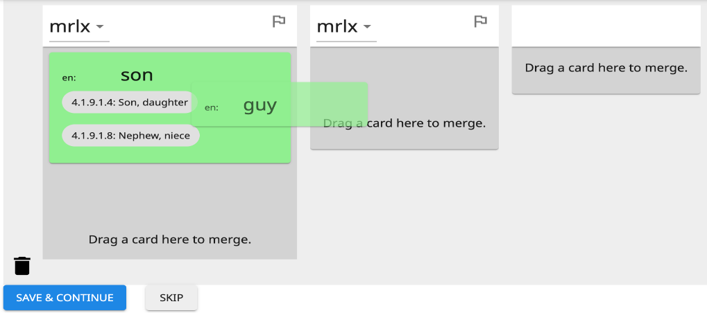

Melepaskan kartu pengertian ke atas kartu pengertian lain (ketika keduanya hijau) akan menggabungkan pengertian.
Tindakan ini menyebabkan bilah sisi biru muncul di sebelah kanan, yang menunjukkan pengertian mana yang sedang
digabungkan.

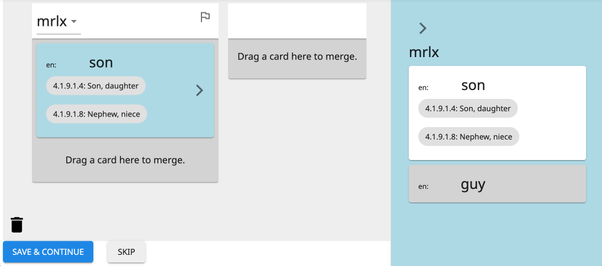

Anda dapat menyeret-dan-melepas kartu pengertian ke atau dari bilah sisi untuk mengubah pengertian mana yang
digabungkan. Atau di dalam bilah sisi, Anda dapat memindahkan pengertian yang berbeda ke bagian atas (untuk
mempertahankan arti singkatnya).

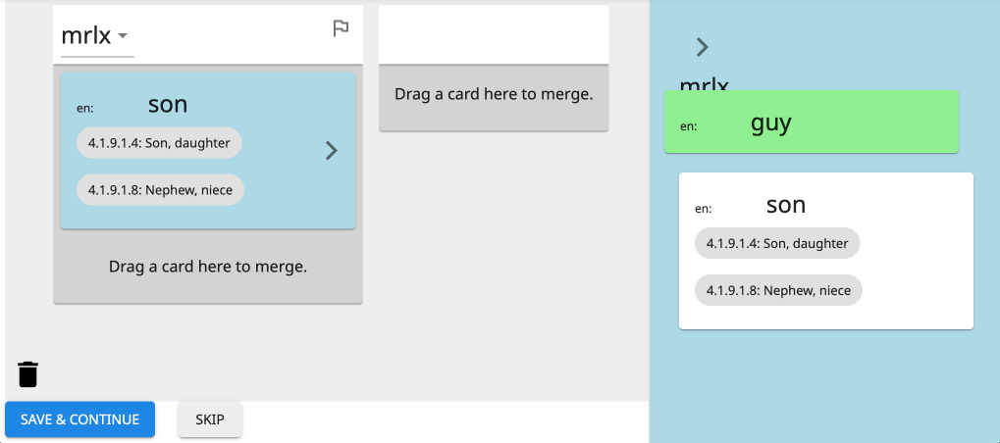

Klik pada tanda kurung sudut kanan (>) untuk menutup atau membuka bilah sisi biru.

### Menghapus Pengertian

Untuk menghapus pengertian sepenuhnya, seret kartunya ke ikon tong sampah di sudut kiri bawah. Ketika kartu pengertian
berubah menjadi merah, lepaskan.

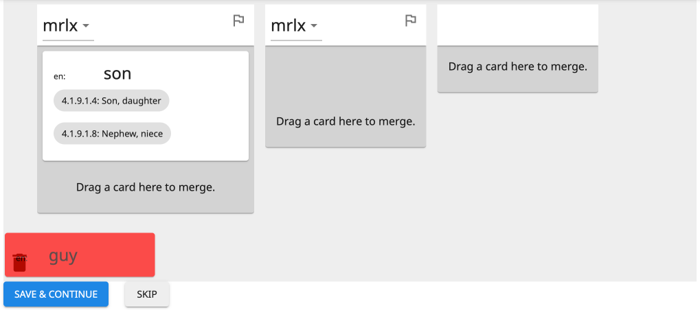

Jika Anda menghapus satu-satunya pengertian yang tersisa dari sebuah kolom, seluruh kolom akan menghilang, dan seluruh
entri tersebut akan dihapus ketika Anda menekan Simpan & Lanjutkan.

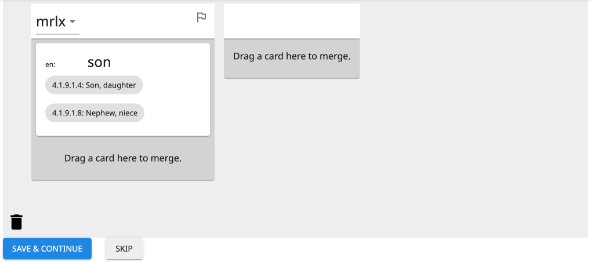

### Menandai Entri

Ada ikon tanda di sudut kanan atas setiap kolom (di sebelah kanan bentuk bahasa daerah).

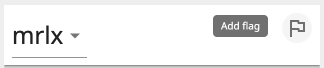{.center}

Anda dapat mengklik ikon tanda untuk menandai entri untuk pemeriksaan atau penyuntingan di masa mendatang. (Anda dapat
mengurutkan entri yang ditandai di [Tinjau Entri](#review-entries).) Ketika Anda menandai entri, Anda diberi opsi untuk
menambahkan teks pada tanda tersebut.

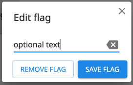{.center}

Terlepas dari apakah ada teks yang diketik atau tidak, Anda akan tahu bahwa entri telah ditandai karena ikon tanda akan
berwarna merah penuh. Jika Anda menambahkan teks, Anda dapat mengarahkan kursor ke atas tanda untuk melihat teksnya.

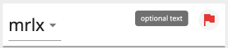{.center}

Klik ikon tanda merah untuk menyunting teks atau menghapus tanda.

### Menyelesaikan Kumpulan

Ada dua tombol di bagian bawah untuk menyelesaikan pekerjaan pada kumpulan duplikat potensial saat ini dan berlanjut ke
kumpulan berikutnya: "Simpan & Lanjutkan" dan "Tangguhkan".

#### Simpan & Lanjutkan

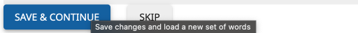

Tombol biru "Simpan & Lanjutkan" melakukan dua hal. Pertama, tombol ini menyimpan semua perubahan yang dibuat (yaitu,
semua pengertian yang dipindahkan, digabungkan, atau dihapus), memperbarui kata-kata dalam basis data. Kedua, tombol ini
menyimpan kumpulan kata yang dihasilkan sebagai non-duplikat.

!!! tip "Tips"

    Apakah duplikat potensial tersebut ternyata bukan duplikat?
    Cukup klik Simpan & Lanjutkan untuk memberi tahu The Combine agar tidak menampilkan kumpulan tersebut lagi kepada Anda.

!!! note "Catatan"

    Jika salah satu kata dalam kumpulan yang sengaja tidak digabungkan disunting (misalnya, pada Tinjau Entri), kumpulan tersebut mungkin akan muncul kembali sebagai duplikat potensial.

!!! warning "Penting"

    Hindari beberapa pengguna menggabungkan duplikat pada proyek yang sama secara bersamaan.
    Jika pengguna yang berbeda menggabungkan kumpulan duplikat yang sama secara bersamaan, ini akan menghasilkan pembuatan duplikat baru (bahkan jika para pengguna membuat keputusan penggabungan yang sama).

#### Tangguhkan

Tombol abu-abu "Tangguhkan" mengatur ulang setiap perubahan yang dibuat pada kumpulan duplikat potensial. Kumpulan yang
ditangguhkan dapat ditinjau kembali melalui Tinjau Duplikat yang Ditangguhkan.

#### Kembalikan Kumpulan

Tombol "Kembalikan Kumpulan" mengatur ulang semua perubahan yang dibuat pada kumpulan duplikat saat ini (pengertian yang
dipindahkan, digabungkan, atau dihapus) tanpa menangguhkannya. Tombol ini hanya aktif ketika perubahan telah dibuat pada
kumpulan saat ini.

### Menggabungkan dengan Data yang Diimpor

#### Definisi dan Jenis Kata

Meskipun definisi dan jenis kata tidak dapat ditambahkan selama Pemasukan Data, keduanya dapat hadir pada entri yang
diimpor. Informasi ini akan muncul pada kartu pengertian Gabungkan Duplikat sebagai berikut:

- Setiap definisi dalam bahasa analisis ditampilkan di bawah arti singkat dalam bahasa tersebut.
- Setiap jenis kata ditunjukkan oleh heksagon berwarna di sudut kiri atas. Warna tersebut sesuai dengan kategori umumnya
  (misalnya, nomina atau verba). Arahkan kursor Anda ke atas heksagon untuk melihat kategori tata bahasa yang spesifik
  (misalnya, nomina proper atau verba transitif).

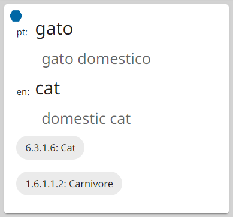{.center}

!!! note "Catatan"

    Suatu pengertian hanya dapat memiliki satu jenis kata.
    Jika dua pengertian yang memiliki jenis kata berbeda dalam kategori umum yang sama digabungkan, jenis kata tersebut akan digabungkan, dipisahkan dengan titik koma (;).
    Namun, jika keduanya memiliki kategori umum yang berbeda, hanya yang pertama yang dipertahankan.

#### Entri dan Pengertian yang Terlindungi {#protected-entries-and-senses}

Jika entri atau pengertian yang diimpor mengandung data yang tidak didukung di The Combine (misalnya, etimologi atau
pembalikan pengertian), entri atau pengertian tersebut dilindungi untuk mencegah penghapusannya. Jika suatu pengertian
terlindungi, kartunya akan memiliki latar belakang kuning—tidak dapat dihapus atau dilepaskan ke (yaitu, digabungkan ke)
kartu pengertian lain. Jika seluruh entri terlindungi, kolomnya akan memiliki tajuk kuning (di mana kata dan tanda
berada). Ketika entri terlindungi hanya memiliki satu pengertian, kartu pengertian tersebut tidak dapat dipindahkan.

## Tinjau Duplikat yang Ditangguhkan {#review-deferred-duplicates}

Ini membuka [Gabungkan Duplikat](#merge-duplicates) dengan semua kumpulan duplikat potensial yang sebelumnya
ditangguhkan dengan _Gabungkan Duplikat_. Fitur ini hanya tersedia jika ada setidaknya satu kumpulan yang ditangguhkan.

## Periksa Ortografi

Alat ini hanya tersedia untuk administrator proyek.

_Periksa Ortografi_ memberikan gambaran umum tentang setiap karakter unicode yang muncul dalam bentuk bahasa daerah dari
entri-entri proyek. Ini memungkinkan Anda mengidentifikasi karakter mana yang umum digunakan dalam bahasa tersebut, dan
"menerima" karakter tersebut sebagai bagian dari inventaris karakter bahasa. Inventaris karakter merupakan bagian dari
berkas LDML untuk bahasa daerah proyek yang disertakan ketika proyek [diekspor](project.md#export). Menerima karakter
akan menghasilkan representasi yang akurat dari bahasa tersebut dalam Unicode, Ethnologue, dan standar serta sumber daya
bahasa lainnya.

Kegunaan lain dari _Periksa Ortografi_ adalah untuk mengidentifikasi dan mengganti karakter yang telah digunakan secara
tidak benar dalam mengetik bentuk bahasa daerah kata-kata.

Ada satu ubin untuk setiap karakter unicode yang muncul dalam bentuk bahasa daerah dari setiap entri. Setiap ubin
menampilkan karakter tersebut, nilai Unicode "U+"-nya, jumlah kemunculannya dalam bentuk bahasa daerah entri, dan
penetapannya (bawaan: Belum diputuskan).

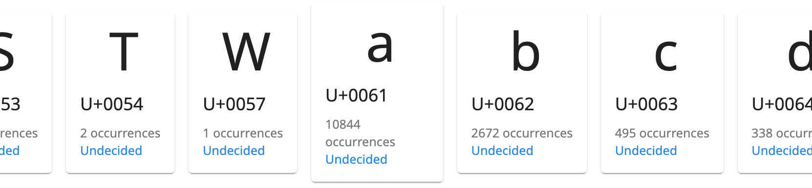

### Mengelola Karakter Tunggal

Klik pada ubin karakter untuk membuka panel bagi karakter tersebut.

!!! tip "Tips"

    Anda mungkin perlu menggulir untuk melihat panelnya.
    Jika jendela Anda cukup lebar, akan ada margin kosong di sebelah kanan; panel akan berada di bagian atas margin ini.
    Jika jendela Anda sempit, ubin memenuhi hingga ke sisi kanan jendela; panel akan berada di bagian bawah, di bawah semua ubin.

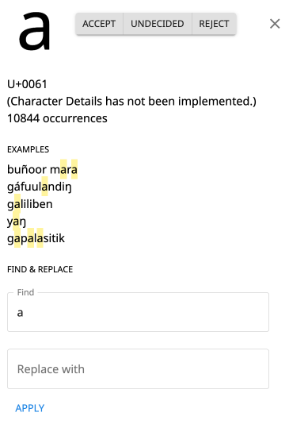{.center}

Bagian tengah panel menampilkan hingga 5 contoh bentuk bahasa daerah tempat karakter tersebut muncul, dengan menyoroti
karakter tersebut pada setiap kemunculan.

Di bagian atas panel terdapat tiga tombol untuk menetapkan apakah karakter tersebut harus dimasukkan dalam inventaris
karakter bahasa daerah: "Terima", "Belum diputuskan", dan "Tolak". Menekan salah satu tombol ini akan memperbarui
penetapan di bagian bawah ubin karakter. (Pembaruan pada inventaris karakter ini tidak disimpan ke proyek sampai Anda
mengklik tombol Simpan di bagian bawah halaman.)

Di bagian bawah panel terdapat alat Cari-dan-Ganti. Jika _setiap_ kemunculan karakter tersebut harus diganti dengan
sesuatu yang lain, ketik karakter atau string pengganti pada kotak "Ganti dengan" dan klik tombol Terapkan.

!!! warning "Penting"

    Operasi cari-dan-ganti membuat perubahan pada entri, bukan pada inventaris karakter.
