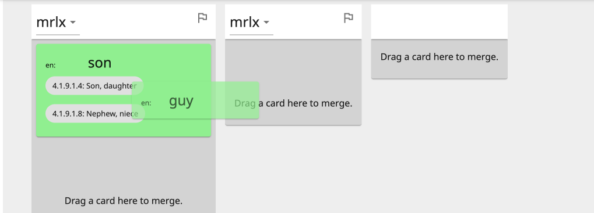
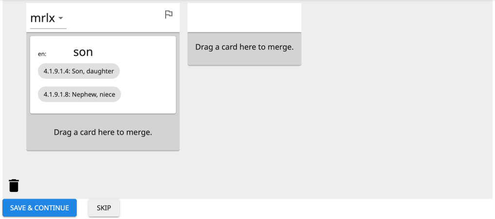

# Data Cleanup / Goals

## Review Entries

The Review Entries table shows all entries in a project.

### Sorting and Filtering Columns

The columns are: Actions, Vernacular, Senses, Glosses, Domains, Pronunciations, Note, Flag, and Delete.

At the top of columns with predominantly text content (Vernacular, Glosses, Domains, Note, or Flag), you can sort
alphabetically or filter with a text search.

At the top of the Senses and Pronunciations columns, you can sort or filter by the number of senses or recordings that
entries have.

There is also a Definitions column that can be turned on or off in [Project Settings](project.md#definitions).

### Editing Entry Rows

You can record, play, or delete an entry's audio recordings with the icons in the Pronunciations column. You can delete
an entire entry with the icon in the Delete column.

To edit an entry's vernacular form, senses (including glosses and domains), note, or flag, click the icon in the Actions
column.

## Merge Duplicates

This tool automatically finds sets of potential duplicate entries. First it presents sets of words with identical
vernacular forms. Then it presents sets with similar vernacular forms or identical glosses (or definitions).

Each entry is displayed in one column, and each sense of that entry is displayed as a card that you can click-and-drag.
There are three basic things you can do with a sense: move it, merge it with another sense, or delete it.

### Move a Sense

When you click-and-hold a sense card, it turns green. You can drag-and-drop the sense card to a different place in the
same column to reorder the senses of that entry. Or you can drag-and-drop the sense card to a different column to move
the sense into that other entry.

If you want to split an entry with multiple senses into multiple entries, you can drag one of the sense cards into the
empty extra column on the right.

### Merge a Sense

If you drag a sense card over another sense card, the other sense card also turns green.

Dropping a sense card onto another sense card (when they are both green) merges the senses. This causes a blue sidebar
to appear on the right, showing what senses are being merged.

!!! important

    When multiple senses are merged, all semantic domains are preserved, but **only the top sense in the sidebar** has its glosses (and definitions) preserved.

You can drag-and-drop sense cards to or from the sidebar to change which senses are being merged. Or within the sidebar,
you can move a different sense to the top (to preserve its glosses).

Click on the right angle bracket (>) to close or open the blue sidebar.

### Delete a Sense

To delete a sense entirely, drag its card to the garbage can icon in the lower-left corner. When the sense card turns
red, release.

If you delete the only remaining sense of a column, the whole column will disappear, and that entire entry will be
deleted when you save.

### Flag an Entry

There is a flag icon at the top-right corner of every column (to the right of the vernacular form).

{ .center }

You can click on the flag icon to flag the entry for future inspection or editing. (You can sort flagged entries in
[Review Entries](#review-entries).) When you flag an entry, you are given the option to add text.

{ .center }

Whether or not any text is typed, you will know that the entry is flagged because the flag icon will be solid red. If
you added text, you can hover your cursor over the flag to see the text.

{ .center }

Click on the red flag icon to edit the text or remove the flag.

### Finishing a Set

There are two buttons at the bottom for wrapping up work on the current set of potential duplicates and moving on to the
next set: "Save & Continue" and "Skip".

#### Save & Continue

The blue "Save and Continue" button does two things. First, it saves all changes made (i.e., all moved, merged, or
deleted senses), updating the words in the database. Second, it saves any unmerged words as non-duplicates.

!!! tip

    Are the potential duplicates not duplicates? Just click Save & Continue to tell The Combine not to show you that set again.

!!! note

    If one of the words in an intentionally unmerged set is edited (e.g., in Review Entries), then the set can appear again as potential duplicates.

#### Skip

The grey "Skip" button resets any changes made to the set of potential duplicates. The same set will be suggested again
the next time Merge Duplicates is opened.

## Create Character Inventory

Character Inventory tools are only available to project admins.

_Create Character Inventory_ provides an overview of every unicode character that appears in the vernacular forms of the
project's entries. This allows you to identify which characters are commonly used in the language, and to "accept" them
as part of the language's character inventory. The character inventory is part of the LDML file for a project's
vernacular language that is included when the project is [exported](project.md#import-and-export). Accepting characters
will lead to accurate representation of the language in Unicode, the Ethnologue, and other language standards and
resources.

Another use of _Create Character Inventory_ is to identify and replace characters that have incorrectly been used in
typing vernacular forms of words.

There is a tile for each unicode character that appears in the vernacular form of any entry. Each tile shows the
character, its Unicode "U+" value, the number of times it occurs in entry vernacular forms, and its designation
(default: Undecided).

### Manage a Single Character

Click on a character tile to open a panel for that character.

!!! tip

    You may have to scroll to see the panel. If your window is wide enough, there will be a blank margin on the
    right; the panel will be at the top of this. If your window is narrow, tiles fill all the way to the right side of the
    window; the panel will be at the bottom, below all the tiles.

{ .center }

The middle of the panel shows up to 5 example vernacular forms in which the character occurs, highlighting the character
in each occurrence.

At the top of the panel are three buttons for designating whether the character should be included in the vernacular
language's character inventory: "ACCEPT", "UNDECIDED", and "REJECT". Pressing any of these buttons will update the
designation at the bottom of the character tile. (These updates to the character inventory are not saved to the project
until you click the SAVE button at the bottom of the page.)

At the bottom of the panel is a Find-and-Replace tool. If _every_ occurrence of the character should be replaced with
something else, type the replacement character or string in the "Replace with" box and click the APPLY button.

!!! important

    The find-and-replace operation makes changes to entries, not to the character inventory. It **cannot be undone!**
