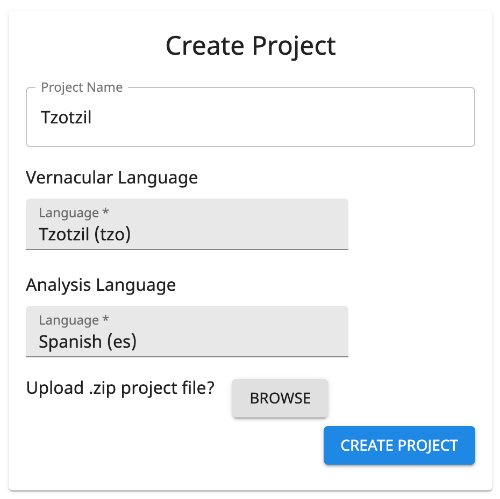
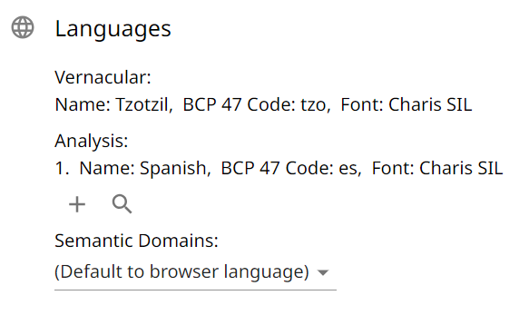
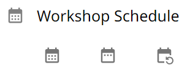
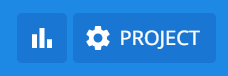

# Proyek

Sebuah proyek diperuntukkan bagi satu bahasa daerah.

## Membuat Proyek

Saat membuat proyek, Anda memiliki pilihan untuk memulai dengan proyek kosong atau mengimpor data leksikal yang sudah
ada.

{.center}

### Mengimpor Data yang Sudah Ada

Jika Anda memiliki data leksikal dalam berkas [LIFT](https://software.sil.org/lifttools) (kemungkinan diekspor dari The
Combine, [FieldWorks](https://software.sil.org/fieldworks), [WeSay](https://software.sil.org/wesay), atau
[Lexique Pro](https://software.sil.org/lexiquepro)), Anda dapat mengklik tombol Meramban di samping "Unggah data yang
ada?" untuk mengimpor data ke dalam proyek Anda.

Jika Anda memilih untuk tidak mengimpor data saat pembuatan proyek, Anda tetap dapat melakukannya nanti (lihat
[di bawah](#import)).

### Bahasa Daerah

_Bahasa daerah_ adalah bahasa yang untuknya kata-kata sedang dikumpulkan. Ini biasanya merupakan bahasa atau dialek
lokal, pribumi, minoritas, autokton, warisan, atau bahasa atau dialek yang terancam punah. Setelah proyek dibuat, bahasa
daerah tidak dapat diubah.

Jika Anda memilih berkas LIFT untuk diimpor saat pembuatan proyek, menu tarik-turun akan muncul yang memungkinkan Anda
memilih bahasa daerah proyek dari semua bahasa dalam berkas LDML dari impor tersebut.

### Bahasa Analisis

_Bahasa analisis_ adalah bahasa utama yang menjadi tujuan penerjemahan bahasa daerah. Ini biasanya merupakan bahasa
regional, nasional, resmi, atau bahasa mayoritas di lokasi tempat bahasa daerah tersebut digunakan. Bahasa analisis
tambahan dapat ditambahkan setelah pembuatan proyek (lihat [di bawah](#project-languages)).

Jika Anda memilih berkas LIFT untuk diimpor saat pembuatan proyek, setiap bahasa yang digunakan dalam definisi atau arti
singkat akan secara otomatis ditambahkan ke proyek sebagai bahasa analisis.

## Mengelola Proyek

Ketika sebuah proyek telah dibuat atau dipilih, proyek tersebut menjadi proyek aktif—Anda akan melihat ikon roda gigi
dan/atau nama proyek di tengah App Bar di bagian atas The Combine. Mengklik ikon roda gigi atau nama proyek akan
menampilkan Pengaturan Proyek untuk mengelola proyek. Pengaturan berikut tersedia bagi pengguna proyek dengan izin yang
memadai.

### Pengaturan Dasar

#### Nama Proyek

Nama yang berbeda dan deskriptif dianjurkan. Nama proyek merupakan bagian dari nama berkas ketika Anda
[mengekspor](#export) proyek Anda.

#### Lengkapi otomatis {#autocomplete}

Pengaturan bawaan adalah Aktif: Ketika pengguna sedang memasukkan bentuk daerah dari entri baru pada Pemasukan Data,
pengaturan ini memberikan saran entri serupa yang sudah ada, sehingga pengguna dapat memilih entri yang sudah ada dan
menambahkan pengertian baru pada entri tersebut, alih-alih membuat duplikat (yang hampir mirip) dari sesuatu yang telah
dimasukkan sebelumnya. Lihat [Pemasukan Data](dataEntry.md#new-entry-with-duplicate-vernacular-form) untuk detail lebih
lanjut.

(Ini tidak memengaruhi saran ejaan untuk arti singkat, karena saran tersebut didasarkan pada kamus yang terpisah dari
data proyek yang sudah ada.)

#### Manajemen Data Terlindungi

Bagian ini memiliki dua tombol pengaturan Mati/Aktif yang berkaitan dengan
[perlindungan](goals.md#protected-entries-and-senses) kata dan pengertian yang diimpor dengan data yang tidak ditangani
oleh The Combine. Kedua pengaturan dimatikan secara bawaan.

Aktifkan "Hindari kumpulan terlindungi pada Gabungkan Duplikat" agar alat Gabungkan Duplikat hanya menampilkan kumpulan
potensi duplikat dengan setidaknya satu kata yang tidak terlindungi. Ini akan menghindari kumpulan entri matang yang
diimpor dari FieldWorks dan mendorong penggabungan entri yang dikumpulkan di The Combine.

Aktifkan "Izinkan penimpaan perlindungan data pada Gabungkan Duplikat" untuk memungkinkan pengguna proyek pada Gabungkan
Duplikat menimpa perlindungan kata dan pengertian secara manual. Jika seseorang mencoba menggabungkan atau menghapus
entri atau pengertian yang terlindungi, The Combine akan memberi peringatan mengenai bidang yang akan hilang.

#### Tinjau Entri untuk Pengumpul {#harvester-review-entries}

Pengaturan Mati/Aktif ini (bawaan Mati) memungkinkan Pengumpul mengakses [Tinjau Entri](goals.md#review-entries). Ketika
diaktifkan, Pengumpul akan melihat tombol Pembersihan Data di bilah navigasi dan dapat menggunakan Tinjau Entri untuk
memperbarui rekaman audio dan tanda pada entri. Namun, Pengumpul tidak dapat menyunting atau menghapus entri dari tabel
Tinjau Entri.

#### Arsipkan Proyek

Ini hanya tersedia bagi Pemilik proyek. Mengarsipkan proyek menjadikannya tidak dapat diakses oleh semua pengguna.
Tindakan ini hanya dapat dibatalkan oleh administrator situs. Silakan hubungi administrator situs jika Anda ingin proyek
dihapus sepenuhnya dari server.

### Bahasa Proyek {#project-languages}

{.center}

_Bahasa daerah_ yang ditentukan saat pembuatan proyek bersifat tetap.

Mungkin ada beberapa _bahasa analisis_ yang terkait dengan proyek, tetapi hanya bahasa yang berada di posisi teratas
dalam daftar yang terkait dengan entri data baru.

!!! note "Catatan"

    Jika proyek memiliki arti singkat dalam beberapa bahasa, bahasa-bahasa tersebut harus ditambahkan di sini agar semua arti singkat muncul dalam [Pembersihan Data](goals.md).
    Klik ikon kaca pembesar untuk melihat semua kode bahasa yang ada dalam proyek.

_Bahasa medan makna_ mengendalikan bahasa yang digunakan untuk menampilkan judul dan deskripsi medan makna pada
[Pemasukan Data](./dataEntry.md).

### Pengguna Proyek

#### Pengguna Saat Ini

Di samping setiap pengguna proyek terdapat ikon dengan tiga titik vertikal. Jika Anda adalah Pemilik proyek atau
Administrator, Anda dapat mengklik ini untuk membuka menu manajemen pengguna dengan opsi berikut:

<pre>
    Keluarkan dari proyek
    Ubah peran proyek:
        Pengumpul
        Editor
        Administrator
    Jadikan Pemilik proyek
        [hanya tersedia bagi Pemilik yang memodifikasi Administrator]
</pre>

_Pengumpul_ dapat melakukan [Pemasukan Data](./dataEntry.md) tetapi tidak [Pembersihan Data](./goals.md). Pada
pengaturan proyek, mereka dapat melihat bahasa proyek dan jadwal lokakarya, tetapi tidak dapat melakukan perubahan apa
pun. Namun, jika seorang Administrator proyek mengaktifkan pengaturan
[Tinjau Entri untuk Pengumpul](#harvester-review-entries), Pengumpul juga dapat mengakses
[Tinjau Entri](./goals.md#review-entries) dengan fungsi terbatas: mereka dapat memperbarui ucapan dan tanda, tetapi
tidak dapat menyunting atau menghapus entri.

_Editor_ memiliki izin untuk melakukan semua yang dapat dilakukan _Pengumpul_, ditambah
[Tinjau Entri](./goals.md#review-entries), [Gabungkan Duplikat](./goals.md#merge-duplicates), dan [Ekspor](#export).

_Administrator_ memiliki izin untuk melakukan semua yang dapat dilakukan _Editor_, serta memodifikasi sebagian besar
pengaturan proyek dan pengguna.

!!! warning "Penting"

    Hanya ada satu Pemilik per proyek.
    Jika Anda menjadikan pengguna lain sebagai "Pemilik proyek", Anda akan otomatis berubah dari Pemilik menjadi Administrator untuk proyek tersebut, dan Anda tidak lagi dapat mengarsipkan proyek atau menjadikan/menghapus Administrator pada pengguna lain.

#### Tambahkan Pengguna

Cari pengguna yang sudah ada (menampilkan semua pengguna dengan istilah pencarian pada nama, nama pengguna, atau alamat
email mereka), atau undang pengguna baru melalui alamat email (mereka akan otomatis ditambahkan ke proyek ketika mereka
membuat akun melalui undangan).

#### Kelola Penutur

Penutur berbeda dari pengguna. Seorang penutur dapat dikaitkan dengan rekaman audio kata-kata. Gunakan ikon + di bagian
bawah bagian ini untuk menambahkan penutur. Di samping setiap penutur yang ditambahkan terdapat tombol untuk menghapus,
menyunting nama, dan menambahkan persetujuan penggunaan suara terekam mereka. Metode yang didukung untuk menambahkan
persetujuan adalah dengan (1) merekam berkas audio atau (2) mengunggah berkas gambar.

Ketika pengguna proyek berada di Pemasukan Data atau Tinjau Entri, ikon penutur akan tersedia di bilah atas. Pengguna
dapat mengklik tombol itu untuk melihat daftar semua penutur yang tersedia dan memilih penutur saat ini, penutur ini
akan otomatis dikaitkan dengan setiap rekaman audio yang dibuat oleh pengguna hingga mereka log keluar atau memilih
penutur yang berbeda.

Penutur yang terkait dengan rekaman dapat dilihat dengan mengarahkan tetikus ke ikon putar. Untuk mengubah penutur
rekaman, klik kanan ikon putar (atau tekan dan tahan pada layar sentuh untuk memunculkan menu).

Ketika proyek diekspor dari The Combine, nama (dan id) penutur akan ditambahkan sebagai label ucapan dalam berkas LIFT.
Semua berkas persetujuan bagi penutur proyek akan ditambahkan ke subfolder "consent" dari ekspor (dengan id penutur
digunakan sebagai nama berkas).

### Impor/Ekspor

#### Impor {#import}

!!! note "Catatan"

    Saat ini, ukuran maksimum berkas LIFT yang didukung untuk impor adalah 100MB.

Ketika Anda mengimpor berkas LIFT ke The Combine, akan diimpor setiap entri dengan bentuk leksem atau bentuk kutipan
yang sesuai dengan bahasa daerah proyek.

Pertama kali Anda mengimpor ke dalam sebuah proyek, kata-kata yang diimpor akan ditambahkan di samping kata-kata yang
telah dikumpulkan di The Combine. Tidak akan dilakukan deduplikasi, penggabungan, atau sinkronisasi otomatis.

Jika Anda melakukan impor kedua, semua kata di The Combine akan otomatis dihapus sebelum kata-kata baru diimpor. Jangan
lakukan impor kedua kecuali Anda sudah mengekspor proyek Anda dan mengimpornya ke FieldWorks. Kemudian, jika Anda ingin
melakukan pengumpulan kata lebih lanjut di The Combine, Anda dapat mengekspor dari FieldWorks dan mengimpor ke The
Combine. Kata-kata sebelumnya akan dihapus untuk memungkinkan permulaan yang bersih dengan data terbaru dari FieldWorks.

#### Ekspor {#export}

Setelah mengklik tombol Ekspor, Anda dapat menavigasi ke bagian lain dari situs web sementara data disiapkan untuk
diunduh. Ketika data telah dikumpulkan, unduhan akan dimulai secara otomatis. Nama berkas adalah id proyek.

!!! warning "Penting"

    Sebuah proyek yang telah mencapai ukuran ratusan MB mungkin memerlukan beberapa menit untuk diekspor.

!!! note "Catatan"

    Pengaturan proyek, pengguna proyek, tanda kata, dan pertanyaan medan makna buatan sendiri tidak diekspor.

#### Ekspor penutur ucapan

Ketika sebuah proyek diekspor dari The Combine dan diimpor ke FieldWorks, jika suatu ucapan memiliki penutur yang
terkait, nama penutur akan ditambahkan sebagai label ucapan. Berkas persetujuan dapat ditemukan pada berkas ekspor
terkompresi, tetapi tidak akan diimpor ke FieldWorks.

### Jadwal {#schedule}

Ini hanya tersedia untuk disunting oleh Pemilik atau Administrator proyek, memungkinkan penetapan jadwal untuk lokakarya
Pengumpulan Kata Cepat. Klik tombol pertama untuk memilih rentang tanggal untuk lokakarya. Klik tombol tengah untuk
menambah atau menghapus tanggal tertentu. Klik tombol terakhir untuk menghapus jadwal.

{.center}

### Medan Makna {#semantic-domains}

Pada tab pengaturan ini, Anda dapat mengubah bahasa medan makna dan mengelola medan makna buatan sendiri.

_Bahasa medan makna_ mengendalikan bahasa yang digunakan untuk menampilkan judul dan deskripsi medan makna pada
[Pemasukan Data](./dataEntry.md).

Saat ini, The Combine hanya mendukung _medan makna buatan sendiri_ yang memperluas
[medan yang telah ada](https://semdom.org/). Untuk setiap medan yang telah ada, satu submedan buatan sendiri dapat
dibuat, yang akan memiliki tambahan `.0` di akhir id medan. Sebagai contoh, medan _6.2.1.1: Menanam biji-bijian_
memiliki tiga submedan standar, untuk Padi, Gandum, dan Jagung. Jika biji-bijian lain, seperti Jelai, dominan di antara
kelompok orang yang mengumpulkan kata-kata, biji-bijian tersebut dapat ditambahkan sebagai medan _6.2.1.1.0_.

{.center}

Untuk setiap medan buatan sendiri, Anda dapat menambahkan deskripsi dan pertanyaan untuk membantu pengumpulan kata dalam
medan tersebut.

{.center}

!!! note "Catatan"

    Medan makna buatan sendiri disertakan dalam ekspor proyek dan dapat diimpor ke FieldWorks.
    Namun, pertanyaan tidak disertakan.

Medan makna buatan sendiri akan tersedia bagi semua pengguna proyek yang melakukan Pemasukan Data.

{.center}

!!! note "Catatan"

    Medan makna buatan sendiri bersifat khusus bahasa.
    Jika Anda menambahkan medan buatan sendiri dalam satu bahasa kemudian mengubah bahasa medan makna, medan tersebut tidak akan terlihat kecuali Anda kembali ke bahasa aslinya.

## Statistik Proyek

Jika Anda adalah Pemilik atau Administrator proyek, akan ada ikon lain di samping ikon roda gigi pada App Bar di bagian
atas The Combine. Ini membuka statistik tentang kata-kata dalam proyek.

{.center}

Dalam konteks statistik ini, _kata_ mengacu pada pasangan pengertian-medan: contohnya, sebuah entri dengan 3 pengertian,
masing-masing dengan 2 medan makna, akan dihitung sebagai 6 kata.

### Kata per Pengguna

Sebuah tabel yang mencantumkan hal-hal berikut untuk setiap pengguna proyek: jumlah kata yang dikumpulkan, jumlah medan
makna yang berbeda, dan medan makna yang paling baru digunakan. Kata-kata yang diimpor tidak memiliki pengguna terkait
dan akan dihitung dalam baris "unknownUser".

### Kata per Medan

Tabel yang mencantumkan jumlah kata di setiap medan makna.

### Kata per Hari

Grafik garis yang menampilkan kata-kata yang dikumpulkan selama hari-hari yang ditetapkan dalam [Jadwal](#schedule)
lokakarya.

### Kemajuan Lokakarya

Grafik garis yang menampilkan akumulasi kata yang dikumpulkan sepanjang hari-hari dalam [Jadwal](#schedule) lokakarya,
serta proyeksi untuk sisa lokakarya.
