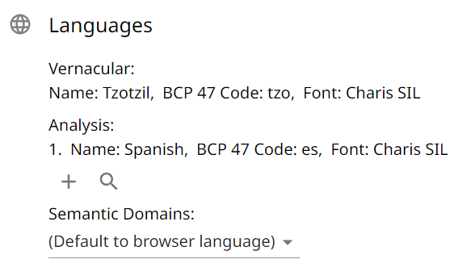
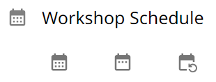
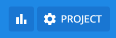

# Projects

A project is for a single vernacular language.

## Create a Project

When creating a project, you have the option to start with an empty project or to import existing lexical data.

{.center}

### Import Existing Data

If you have lexical data in a [LIFT](https://software.sil.org/lifttools) file (likely exported from The Combine,
[WeSay](https://software.sil.org/wesay), [FLEx](https://software.sil.org/fieldworks), or
[Lexique Pro](https://software.sil.org/lexiquepro)), you can click the Browse button next to "Upload existing data?" to
import the data into your project.

If you choose not to import data during project creation, you may still do so later (see [below](#import)).

### Vernacular Language

The _vernacular language_ is the language for which words are being collected. This is usually a local, indigenous,
minority, autochthonous, heritage, or endangered language or dialect. Once a project is created, the vernacular language
cannot be changed.

If you select a LIFT file to import during project creation, a drop-down menu will appear that lets you choose the
project vernacular language from all the languages in the import's LDML files.

### Analysis Language

The _analysis language_ is the primary language into which the vernacular language is being translated. This is usually
a regional, national, official, or majority language of the location where the vernacular is spoken. Additional analysis
languages can be added after project creation (see [below](#project-languages)).

If you select a LIFT file to import during project creation, every language used in a definition or gloss will
automatically be added to the project as an analysis language.

## Manage a Project

When a project has been created or selected, it becomes the active project—you should see a gear icon and/or the project
name in the middle of the App Bar at the top of The Combine. Clicking on the gear icon or project name brings up Project
Settings for managing the project. The following settings are available for project users with sufficient permissions.

### Basic Settings

#### Project Name

A distinguishing and descriptive name is recommended. The project name is part of the filename when you
[export](#export) your project.

#### Autocomplete {#autocomplete}

The default setting is On: When a user is entering the vernacular form of a new entry in Data Entry, this setting gives
suggestions of similar existing entries, allowing the user to select an existing entry and add a new sense to that
entry, rather than creating a (mostly) duplicate to something previously entered. See
[Data Entry](dataEntry.md#new-entry-with-duplicate-vernacular-form) for more details.

(This does not affect spelling suggestions for the gloss, since those suggestions are based on a dictionary independent
of existing project data.)

#### Protected Data Management

This section has two Off/On setting toggles related to the [protection](goals.md#protected-entries-and-senses) of words
and senses that were imported with data not handled by The Combine. Both settings are off by default.

Turn on "Avoid protected sets in Merge Duplicates" to make the Merge Duplicates tool only show sets of potential
duplicates with at least one word that isn't protected. This will avoid sets of mature entries imported from FieldWorks
and promote merging entries collected in The Combine.

Turn on "Allow data protection override in Merge Duplicates" to allow project users in Merge Duplicates to manually
override protection of words and senses. If anybody tries to merge or delete a protected entry or sense, The Combine
warns them of the fields that will be lost.

#### Archive Project

This is only available to the project Owner. Archiving a project makes it inaccessible to all users. This can only be
undone by a site administrator. Please contact a site administrator if you wish for the project to be entirely deleted
from the servers.

### Project Languages {#project-languages}

{.center}

The _vernacular language_ specified at project creation is fixed.

There may be multiple _analysis languages_ associated with the project, but only the top one in the list is associated
with new data entries.

!!! note "Note"

    If the project has glosses in multiple languages, those languages must be added here for all the glosses to show up
    in [Data Cleanup](goals.md). Click the magnifying glass icon to see all language codes present in the project.

The _semantic domains language_ controls the language in which semantic domain titles and descriptions are displayed in
[Data Entry](./dataEntry.md).

### Project Users

#### Current Users

Beside each project user is an icon with three vertical dots. If you are the project Owner or an Administrator, you can
click this to open a user management menu with the following options:

<pre>
    Remove from project
    Change project role:
        Harvester
        Editor
        Administrator
    Make project Owner
        [only available to the Owner modifying an Administrator]
</pre>

A _Harvester_ can do [Data Entry](./dataEntry.md) but not [Data Cleanup](./goals.md). In project settings, they can see
the project languages and workshop schedule, but cannot make any changes.

An _Editor_ has permission to do everything that a _Harvester_ can do, as well as
[Review Entries](./goals.md#review-entries), [Merge Duplicates](./goals.md#merge-duplicates), and [Export](#export).

An _Administrator_ has permission to do everything that an _Editor_ can do, as well as modify most project settings and
users.

!!! warning "Important"

    There is only one Owner per project. If you "Make project Owner" another user, you will automatically change from Owner to
    Administrator for the project, and you will no longer be able to archive the project or make/remove Administrator on other users.

#### Add Users

Either search existing users (shows all users with the search term in their name, username, or email address), or invite
new users by email address (they will be automatically added to the project when they make an account via the
invitation).

#### Manage Speakers

Speakers are distinct from users. A speaker can be associate with audio recording of words. Use the + icon at the bottom
of this section to add a speaker. Beside each added speaker are buttons to delete them, edit their name, and add a
consent for use of their recorded voice. The supported methods for adding consent are to (1) record an audio file or (2)
upload an image file.

When project users are in Data Entry or Review Entries, a speaker icon will be available in the top bar. Users can click
that button to see a list of all available speakers and select the current speaker, this speaker will be automatically
associated with every audio recording made by the user until they log out or select a different speaker.

The speaker associated with a recording can be seen by hovering over its play icon. To change a recording's speaker,
right click the play icon (or press and hold on a touch screen to bring up a menu).

When the project is exported from The Combine, speaker names (and ids) will be added as a pronunciation labels in the
LIFT file. All consent files for project speakers will be added to a "consent" subfolder of the export (with speaker ids
used for the file names).

### Import/Export

#### Import {#import}

!!! note "Note"

    Currently, the maximum size of LIFT files supported for import is 100MB.

When you import a LIFT file into The Combine, it will import every entry with lexeme form or citation form that matches
the project's vernacular language.

The first time you import into a project, the imported words will be added alongside any words collected in The Combine.
No automatic deduplication, merging, or syncing will be performed.

If you do a second import, all words in The Combine will be automatically deleted before the new words are imported. Do
not do a second import unless you have already exported your project and imported it into FieldWorks. Then, if you want
to do more word collection in The Combine, you can export from FieldWorks and import into the Combine. The previous
words will be deleted to allow for a clean start with the up-to-date data from FieldWorks.

#### Export {#export}

After clicking the Export button, you can navigate to other parts of the website while the data is being prepared for
download. When the data is gathered, the download will begin automatically. The filename is the project id.

!!! warning "Important"

    A project that has reached hundreds of MB in size may take multiple minutes to export.

!!! note "Note"

    Project settings, project users, word flags, and custom semantic domain questions are not exported.

#### Export pronunciation speakers

When a project is exported from The Combine and imported into FieldWorks, if a pronunciation has an associated speaker,
the speaker name will be added as a pronunciation label. The consent files can be found in the zipped export, but will
not be imported into FieldWorks.

### Schedule {#schedule}

This is only available for editing by the project Owner, allowing a schedule to be set for a Rapid Word Collection
workshop. Click the first button to select a date range for the workshop. Click the middle button to add or remove
specific dates. Click the last button to clear the schedule.

{.center}

### Semantic Domains {#semantic-domains}

In this settings tab, you can change the semantic domain language and manage custom semantic domains.

The _semantic domains language_ controls the language in which semantic domain titles and descriptions are displayed in
[Data Entry](./dataEntry.md).

At this time, The Combine only supports _custom semantic domains_ that extend the
[established domains](https://semdom.org/). For each established domain, one custom subdomain can be created, which will
have `.0` added to the end of the domain id. For example, domain _6.2.1.1: Growing Grain_ has three standard subdomains,
for Rice, Wheat, and Maize. If another grain, such as Barley, is dominant among the people group gathering words, it can
be added as domain _6.2.1.1.0_.

{.center}

For each custom domain, you can add a description and questions to help with word collection in that domain.

{.center}

!!! note "Note"

    Custom semantic domains are included in the project export and can be imported into FieldWorks. However, the
    questions are not included.

Custom semantic domains will be available to all project users doing Data Entry.

{.center}

!!! note "Note"

    Custom semantic domains are language-specific. If you add a custom domain in one language then change the semantic
    domains language, that domain will not be visible unless you change back to its language.

## Project Statistics

If you are the project Owner, there will be another icon alongside the gear icon in App Bar at the top of The Combine.
This opens statistics about words in the project.

{.center}

In the context of these statistics, _word_ refers to a sense-domain pair: e.g., an entry with 3 senses, each with 2
semantic domains, will be counted as 6 words.

### Words per User

A table listing number of words and distinct semantic domains for each project user. Imported words have no associated
user and will be counted in an "unknownUser" row.

### Words per Domain

A table listing number of words in each semantic domain.

### Words per Day

Line graphs showing words collected during the days specified in the workshop [Schedule](#schedule).

### Workshop Progress

Line graphs showing cumulative words collected across the days of the workshop [Schedule](#schedule), as well as
projections for remainder of the workshop.
