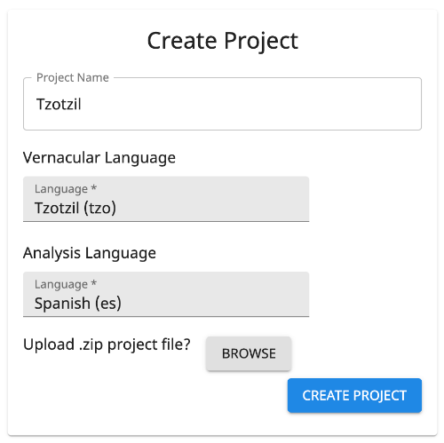

# Projects

A project is for a single vernacular language.

## Create a Project

{ .center }

### Import Existing Data

If you have linguistics data in a [LIFT](https://software.sil.org/lifttools) file (likely exported from The Combine,
[WeSay](https://software.sil.org/wesay), [FLEx](https://software.sil.org/fieldworks), or
[Lexique Pro](https://software.sil.org/lexiquepro)), you can hit the BROWSE button next to "Upload existing data?" to
import the data into your project.

### Vernacular and Analysis Language

The _vernacular language_ is the language for which words are being collected. This is usually a local, indigenous,
minority, autochthonous, heritage, or endangered language or dialect.

The _analysis language_ is the primary language into which the vernacular language is being translated. This is usually
a regional, national, official, or majority language of the location where the vernacular is used. Alternate vernacular
languages can be added after project creation (see [below](#project-languages)).

## Manage a Project

When a project has been created or selected, it becomes the active project—you should see a gear icon and/or the project
name in the middle of the App Bar at the top of The Combine. Clicking on the gear icon or project name brings up Project
Settings for managing the project. The following settings are available for project users with sufficient permissions.

### Project Name

A distinguishing and descriptive name is recommended. The project name is part of the filename when you
[export](#import-and-export) your project.

### Project Languages

The _vernacular language_ specified at project creation is fixed.

There may be multiple _analysis languages_ associated with the project, but only the top one in the list is associated
with new data entries.

!!! note

    If the project has glosses in multiple languages, those languages must be added here for all the glosses to show up
    in [data cleanup](goals.md). Click the magnifying glass icon to see all language codes present in the project.

The _semantic domains language_ controls the language in which semantic domain titles and descriptions are displayed in
[Data Entry](./dataEntry.md).

### Import and Export

!!! note

    Currently, the maximum size of Lift files supported for import is 250MB.

!!! note

    Currently, only one LIFT file can be imported per project.

After clicking the Export button, you can navigate to other parts of the website. A download icon will appear in the App
Bar when the export is ready for download. The default filename is the [project name](#project-name) with a timestamp
affixed.

!!! important

    A project that has reached hundreds of MB in size may take multiple minutes to export.

### Autocomplete

The default setting is On: When a user is entering the [vernacular form](dataEntry.md#vernacular) of a new entry in Data
Entry, this setting gives suggestions of similar existing entries, allowing the user to select an existing entry and add
a new sense to that entry, rather than creating a (mostly) duplicate to something previously entered.

(This does not effect the [gloss](dataEntry.md#gloss) spelling suggestions, which are based on a dictionary independent
of existing project data.)

### Definitions

Due to the nature of Rapid Word Collection, [Data Entry](dataEntry.md) in The Combine supports glosses instead of
definitions. However, if you have imported a project in which senses also have definitions, this setting can enable
definition support in [Data Cleanup](goals.md).

### Project Users

#### Current Users

Beside each project user is an icon with three vertical dots. If you are the project owner, you can click this to open a
user management menu with the following options:

- Remove from Project;
- Make/Remove Admin;
- Make Owner (if they are a project admin).

!!! important

    There is only one Owner per project. If you "Make Owner" another user, you will move from Owner to Admin for the
    project and no longer be able to make/remove Admin on other users or archive the project.

#### Add Users

Either search existing users (shows all users with the search term in their name, username, or email address), or invite
new users by email address (they will be automatically added to the project when they make an account via the
invitation).

### Archive Project

This is only available to the project Owner. Archiving a project makes it inaccessible to all users. This can only be
undone by a site administrator. Please contact a site administrator if you wish for the project to be entirely deleted
from the servers.
