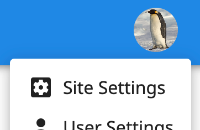

# Administration / Site Settings

Site administrators have one more option in the User Menu: "Site Settings".

## Project Managements

Administrators can export or archive/restore any project. Archiving a project makes it invisible and unaccessible to all
users, even the project creator, but any admin can restore the project. There is at present no way to permanently delete
a project.

## User Management

Administrators can delete any non-admin user account. To add or remove admin users, please contact the site owner.
