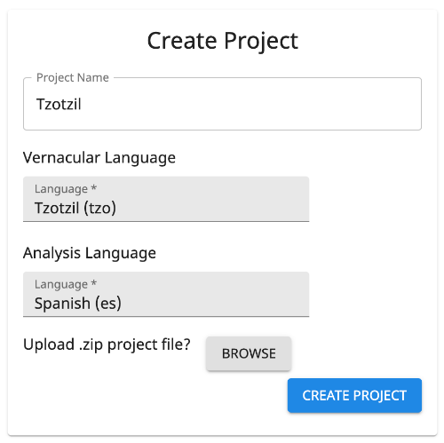

# Projects

A project is for a single vernacular language.

## Create a Project

### Vernacular and Analysis Languages

The _vernacular language_ is the language for which words are being collected. This is usually a local, indigenous,
minority, autochthonous, heritage, or endangered langauge or dialect.

The _analysis language_ is the language into which the vernacular language is being translated. This is usually a
regional, national, official, or majority language of the location where the vernacular is used.

### Import Existing Data

If you have linguistics data in a [LIFT](https://software.sil.org/lifttools) file (likely exported from The Combine,
[WeSay](https://software.sil.org/wesay), [FLEx](https://software.sil.org/fieldworks), or
[Lexique Pro](software.sil.org/lexiquepro)), you can hit the BROWSE button next to "Upload .zip project file?" to import
the data into your project.

## Manage a Project

When a project has been created or selected, it becomes the active project, and the project name appears in the middle
of the App Bar at the top of The Combine. Clicking on the project name brings up Project Settings for managing the
project. The following settings are available for project users with sufficient permissions.

### Project Name

### Vernacular and Analysis Languages

The vernacular language specified at project creation is fixed.

There may be multiple analysis languages associated with the project, but only the top one on the list here is active
and associated with new data entries.

### Import and Export

!!! note

    Currently, the maximum size of Lift files supported for import is 250MB.

!!! note

    Currently, only one LIFT file can be imported per project.

After clicking the Export button, you can navigate to other parts of the website. A download icon will appear in the App
Bar when the export is ready for download. A project that has reached hundreds of MB in size may take tens of minutes to
export.

### Autocomplete

The default setting is On: When a user is entering the [vernacular](dataEntry.md#vernacular) of a new entry in Data
Entry, this setting gives suggestions of similar existing entries, allowing the user to select an existing entry and add
a new sense to that entry, rather than creating a (mostly) duplicate to something previously entered.

(This does not effect the [gloss](dataEntry.md#gloss) spelling suggestions, which are based on a dictionary independent
of existing project data.)

### Project Users

List of users on the project.

Tool to add users to the project.
